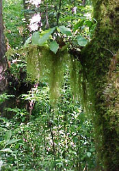
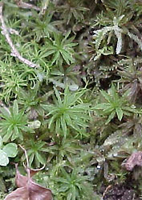
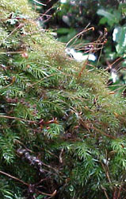
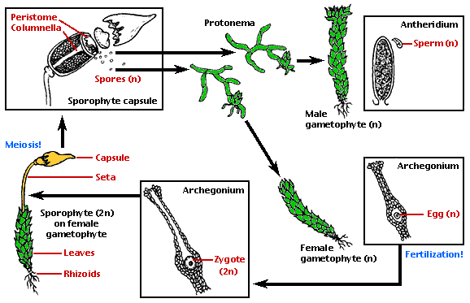
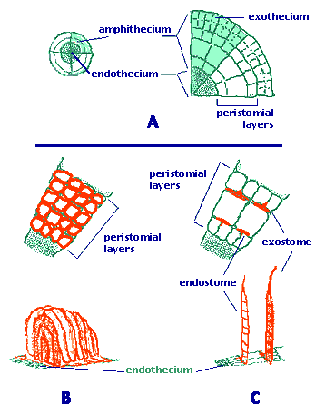
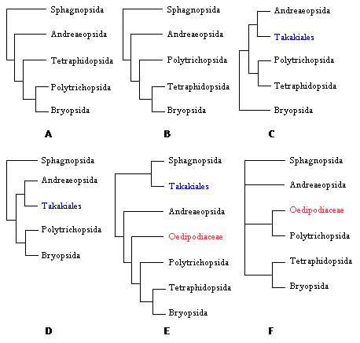

---
aliases:
  - Bryophyta
  - Moss
  - Mosses
has_id_wikidata: Q25347
title: Bryophyta
parent_taxon:
  - '[[_Standards/WikiData/WD~Embryophytes,192154]]'
  - '[[_Standards/WikiData/WD~Bryobiotina,106976267]]'
  - '[[_Standards/WikiData/WD~Setaphyta,113130160]]'
taxon_rank: '[[_Standards/WikiData/WD~division,334460]]'
described_by_source:
  - "[[_Standards/WikiData/WD~Otto's_encyclopedia,2041543]]"
  - '[[_Standards/WikiData/WD~Granat_Encyclopedic_Dictionary,4532138]]'
  - '[[_Standards/WikiData/WD~Great_Soviet_Encyclopedia_(1926_1947),20078554]]'
  - '[[_Standards/WikiData/WD~The_Domestic_Encyclopædia;_Or,_A_Dictionary_Of_Facts,_And_Useful_Knowledge,56441911]]'
  - '[[_Standards/WikiData/WD~Q75188101,75188101]]'
  - '[[_Standards/WikiData/WD~Introduction_to_Bryology,75192879]]'
instance_of: '[[_Standards/WikiData/WD~taxon,16521]]'
different_from: '[[_Standards/WikiData/WD~bryophyte,29993]]'
ITIS_TSN: 14189
OmegaWiki_Defined_Meaning: 2413
PAEnflowered_taxon_URL: https://www.paenflowered.org/catalog/lichens-mosses/mosses
start_time: -340000000-01-01T00:00:00Z
image: http://commons.wikimedia.org/wiki/Special:FilePath/Haeckel%20Muscinae.jpg
EPPO_Code: 1BRYP
MeSH_tree_code: B01.875.800.575.137
Commons_category: Bryophyta
taxon_name: Bryophyta
UMLS_CUI: C0282635
Krugosvet_article_archived_: nauka_i_tehnika/biologiya/MHI.html
Gujarati_Vishwakosh_entry: શેવાળ-બ્રાયૉપ્સિડા
---

# [[Moss]] 

#is_/same_as :: [[../../../../../WikiData/WD~Moss,25347|WD~Moss,25347]] 

## #has_/text_of_/abstract 

> **Moss**es are small, non-vascular flowerless plants in the taxonomic division Bryophyta sensu stricto. 
> Bryophyta (sensu lato, Schimp. 1879) may also refer to the parent group bryophytes, 
> which comprise liverworts, mosses, and hornworts. 
> 
> Mosses typically form dense green clumps or mats, often in damp or shady locations. 
> The individual plants are usually composed of simple leaves that are generally only one cell thick, 
> attached to a stem that may be branched or unbranched 
> and has only a limited role in conducting water and nutrients. 
> 
> Although some species have conducting tissues, these are generally poorly developed 
> and structurally different from similar tissue found in vascular plants. 
> 
> Mosses do not have seeds and after fertilisation develop sporophytes with unbranched stalks 
> topped with single capsules containing spores. 
> They are typically 0.2–10 cm (0.1–3.9 in) tall, though some species are much larger. 
> Dawsonia, the tallest moss in the world, can grow to 50 cm (20 in) in height. 
> There are approximately 12,000 species.
>
> Mosses are commonly confused with liverworts, hornworts and lichens. 
> Although often described as non-vascular plants, many mosses have advanced vascular systems. 
> Like liverworts and hornworts, 
> the haploid gametophyte generation of mosses is the dominant phase of the life cycle. 
> 
> This contrasts with the pattern in all vascular plants (seed plants and pteridophytes), 
> where the diploid sporophyte generation is dominant. 
> 
> Lichens may superficially resemble mosses, and sometimes have 
> common names that include the word "moss" (e.g., "reindeer moss" or "Iceland moss"), 
> but they are fungal symbioses and not related to mosses. 
>
> The main commercial significance of mosses is as the main constituent of peat 
> (mostly the genus Sphagnum), although they are also used for decorative purposes, 
> such as in gardens and in the florist trade. 
> 
> Traditional uses of mosses included as insulation 
> and for the ability to absorb liquids up to 20 times their weight. 
> Mosses are keystone species and benefit habitat restoration and reforestation.
>
> [Wikipedia](https://en.wikipedia.org/wiki/Moss) 

## Phylogeny 

-   « Ancestral Groups  
    -   [Land_Plant](../Land_Plant.md)
    -  [Green plants](../../Plant.md) 
    -  [Eukarya](../../../Eukarya.md) 
    -   [Tree of Life](../../../Tree_of_Life.md)

-   ◊ Sibling Groups of  Embryophytes
    -   [Hornwort](Hornwort.md)
    -   Bryophyta
    -   [Fern](Fern.md)
    -   [Seed_Plant](Seed_Plant.md)

-   » Sub-Groups
    -   [Bryopsida](Moss/Bryopsida.md)

# [[Moss]]

Mosses 

    

## Introduction

[Efrain De Luna, Angela E. Newton, and Brent D. Mishler]()

Diversity of mosses has been classified in approximately 10,000 species,
700 genera, and about 110-120 families. This places the mosses as the
third most diverse group of land plants, only after the angiosperms and
ferns. Mosses are small plants requiring stereoscopes and compound
microscopes for routine examination. The conspicuous green leafy shoots
are the gametophytes, haploid organisms, on which the diploid embryo
develops into a mature sporophyte (Figure 1). The sporophyte is
chlorophyllose and photosynthetic only in early stages of development,
and it is mostly dependent on the gametophyte. Moss colonies are a very
important element in many ecosystems, from the tundra to the tropical
rain forest, reducing soil erosion, capturing water and nutrients,
providing shelter for microfauna, and nurseries for seedlings in
succession or regeneration processes.

As a lineage, mosses are a historically crucial group in the
understanding of the transition to life on land. The green leafy shoots
(gametophytes) retain some features of the green algal ancestors
(chlorophylls a and b, starch, sperm with two forward undulipodia), but
the needle-like shoots that produce the spores (sporophytes) display key
innovations for the life outside water, such as stomates, a simple
strand of conductive cells \[in an unbranched sporophyte\], and airborne
spores produced in a single apical capsule (sporangium). This is the
simplest structural level among all land plants. The next organizational
level is found in two fossil groups: Horneophythopsida and Aglaophyton
(Rhynia) major, where the sporophyte is branched and produces several
sporangia. The sporophyte shows the most complex structural organization
in the tracheophytes.

### Characteristics

There is no controversy that the mosses are monophyletic. Synapomorphies
for the mosses are: i) leaves in the gametophyte; these green laminar
organs are attached densely along the shoot. ii) multicellular rhizoids;
these branched filaments composed of a series of multiple cells develop
from the surface of the gametophyte axis at the point of contact with
the substrate. iii) columnella; this is a cylinder of sterile cells
located in the center of the capsule. (Mishler & Churchill, 1984). Other
possible synapomorphies are features of male gamete \[spermatozoid\]
ultrastructure (Mishler, Lewis & et al 1994).

------------------------

**Figure 1**. Life cycle of a dioicous moss.\
Modified from original drawings by Ivy Livingstone. Copyright © 1997
[BIODIDAC](http://biodidac.bio.uottawa.ca/index.htm).

------------------------

The life cycle of a moss alternates a conspicuous gametophyte generation
and a dependent sporophyte generation. Some of the salient features of
the different life cycle stages are outlined below.

**Protonema**. Spores germinate and produce a protonema. This is usually
filamentous and branched, but in some groups it is tallose or massive.
At several places in the protonema, apical cells differentiate and
produce the foliose shoots.

**Gametophore**. An apical cell produces a stem and leaves spirally
arranged. The stems produce branches in several combinations of
monopodial and sympodial architectures. Leaves are sessile, unlobed, and
often with a thickened midrib. Other appendages to the stem are
multicellular rhizoids, axillary hairs, paraphyllia, pseudoparaphyllia,
and various types of asexual propagules. The patterns of the leaf cell
network and leaf cell papillae provide numerous characters for the
systematic arrangement of genera and species.

**Gametangia**. Archegonia and antheridia are produced in groups, with
paraphyses among them, and surrounded by perichaetial or perigonial
leaves. Autoicous, synoicous, paroicous, heteroicous, and dioicous
sexual conditions are found in many taxa.

**Seta**. The sporophyte consists of the foot, a seta and an apical
sporangium. The foot is embedded within the apex of a stem or branch.
Ultrastructural details of the transfer zone provide important
similarities with other land plants. The seta is short or elongate. It
has an internal conductive system that connects the foot and the capsule
at both extremes.

**Sporangium**. A single sporangium or capsule develops distally from an
unbranched sporophyte. The sporangium opens by an apical pore,
longitudinal splits or most commonly by an operculum. The external cell
layer (exothecium) often has stomata, especially in the neck.
Underlaying the exothecium there are parenchymatose cells. Both
concentric layers constitute the amphithecium (Figure 2A). Internally,
the endothecium consists of a cylinder of sporogenous tissue,
surrounding a columnella of sterile cells. Moss spores are unicellular,
sometimes retaining tetrad marks.

------------------------

**Figure 2**. The two basic peristome types of mosses.\
**A.** Cross section of an embryonic sporophyte capsule.\
**B.** Nematodontous peristome (e.g., Polytrichum).\
**C.** Arthrodontous peristome (e.g., Funaria or Bryum).\
Drawings copyright © 2000 Efrain de Luna.

------------------------

**Peristome**. In the majority of mosses, the apex of the capsule
(operculum) falls off at maturity and reveals a structure called the
peristome (Figure 1). This is a ring of narrow triangular segments
surrounding the mouth of the capsule. Changes in moisture conditions
cause movements of the peristome and facilitate the dispersion of spores
in favorable dry conditions. Two basic types of peristomes are found in
mosses: arthrodontous and nematodontous. In **arthrodontous**
peristomes, at the level of the capsule mouth and above, three innermost
rings of cells of the amphithecium are involved in the formation of
teeth in most taxa. These three concentric rows are known as the
\"outer\", \"primary\" and \"inner\" peristomial layers (OPL, PPL, IPL).
Most peristomate mosses have the arthrodontous type, in which each tooth
is composed of periclinal (tangential) cell wall remnants between two of
the three concentric peristomial cell layers (Figure 2C). If the teeth
are formed by the tangential walls between the OPL and PPL, the row of
teeth is collectively known as the exostome. In the second case, the
cell wall remnants are located between the cell rings of the PPL and
IPL, therefore the row of segments is known as endostome. A second
fundamental type of peristome is **nematodontous**, structured by narrow
columns of entire cell wall remnants. Each tooth consists of
agglomerated cylinders formed by the periclinal and anticlinal thickened
cell walls (Figure 2B). As in arthrodontous peristomes, peristomial
cells derive from the innermost amphithecium, but multiple concentric
peristomial layers (four to seven) contribute to the formation of a
nematodontous tooth.

### Discussion of Phylogenetic Relationships

Early proposals of phylogenetic relationships within the mosses (e.g.,
Vitt 1984) interpreted three fundamental levels of structural
organization, largely based on the morphology of the capsules. In the
most basal lineage, the Sphagnopsida, capsules open through an apical
pore. In the Andreaeopsida, a very small intermediate group, capsules
open through longitudinal valves. In the most derived and diverse
lineage, the \"true mosses\" (commonly classified as the Bryopsida), the
capsules are operculate and differentiate a peristome. Characters from
the exostome and endostome provided a basis for classification of major
groups at the ordinal level and above.

Modern explicit hypotheses for moss relationships are based on several
cladistic analyses based on morphological, ultrastructural, and
molecular data. A recent issue of the journal \"The Bryologist\" (Vol
103, issue 2, 2000) includes a number of new phylogenetic analyses that
incorporate exemplars from nearly all families of mosses. Each paper was
a major collaborative effort by researchers from many countries who
brought together sequence data from rbcL, rps4, trnL-F, and 18S rRNA.
Newton et al. (2000, Fig. 3E) presented a cladistic analysis of all
orders of mosses based on morphological characters and four DNA sequence
data sets for 33 exemplar taxa and ten outgroups. Results include the
monophyly of the mosses, the inclusion of Takakia as a moss sister to
Sphagnum, and the monophyly of the peristomate mosses. In combination,
these recent higher level analyses provide the first cladistic framework
for the major lineages of mosses.

Five main lineages are currently recognized (Mishler & Churchill 1984,
Newton et al., 2000), although their taxonomic ranking as classes or
subclasses is still controversial. In most cases, higher-level
classification of the mosses is not fully settled because there are
different names used for the same major clades. Here we use names for
these five lineages considered at the rank of class. A basal split
divides the Sphagnopsida (1) sister to a large clade in which the
Andreaeopsida (2) is the most basal lineage (Figure 3A, B). Peristomate
mosses include three main lineages: Polytrichopsida (3) with
nematodontous peristomes are basal to a clade of arthrodontous mosses
that includes the Tetraphidopsida (4) and Bryopsida (5) (Figure 3B).

------------------------

**Figure 3**. Alternative placements of Polytrichopsida,
Tetraphidopsida, Takakiales, and Oedipodiaceae.\
**A.** Tree from Mishler & Churchill (1984, p. 412). **B.** Tree from
Beckert et al. (1999, p. 185). **C.** Tree from Hedderson et al. (1996,
p. 217). **D.** Tree from Mishler et al. (1994, p. 466). **E.** Tree
from Newton et al. (2000, p. 195). **F.** Tree from Hyvonen et al.
(1998, p. 498).

------------------------

Early schemes of relationships within mosses have not changed
substantially, but they have been expanded to accommodate a few groups
now recognized at higher taxonomic rankings. Ambuchania, a separate
genus closely related to Sphagnum, is now classified in its own order
and placed as sister to the Sphagnales (Shaw 2000). Andreaeobryum, a
genus related to Andreaea, is also classified in its own order and
placed as sister to the Andreaeales (Newton et al. 2000).

Ideas about the relationships within the peristomate clade have
oscillated between two views. In some systems, the Polytrichopsida were
considered as the most advanced because of the complexity of the
gametophyte (Brotherus 1925). In contrast, other arrangements
interpreted this group as the most ancestral due to the simplicity of
the nematodontous peristome (Vitt 1984). Modern cladistic analyses
corroborated the basal position of the nematodontous mosses
(Polytrichum) relative to the more recent origin of the diplolepidous
mosses (Bryum). However, the phylogenetic positions of certain groups
are still controversial. The Tetraphidopsida, for example, has been
placed as sister to the Bryopsida or sister to the Polytrichopsida and
Bryopsida together (Figure 3A, B, C). Another example of controversial
phylogenetic position is the Oedipodiaceae. This family is alternatively
placed as sister to the large clade of peristomate mosses
(Polytrichopsida, Tetraphidopsida and Bryopsida) or as sister to just
the Polytrichales (Figure 3E, F).

The fascinating bryophyte Takakia deserves a special note. Initially it
was interpreted as a liverwort, and until recently it was classified in
the Calobryales (Schofield 1985). After the discovery of plants with
sporophytes, now it is undoubtedly classified as a moss. This placement
within the mosses was confirmed with recent cladistic analyses based on
morphology and several genes, although it remains uncertain if it should
be sister to Andreaeaopsida or Sphagnopsida (Figs. 3C, D, E).

Several factors have made possible such new insight on higher level
relationships within mosses. New empirical data have accumulated on
morphology, anatomy, ontogeny, ultrastructure, and DNA sequences.
Although most of the recent studies at higher levels are based on
molecular data, the most important element of the recent progress has
been the use of cladistic methodology for the interpretation of such
types of evidence. A formal framework of higher-level moss phylogeny is
now available, which replaces former intuitive estimates of
relationships founded largely on concepts of overall similarity and ad
hoc evolutionary scenarios.

## Title Illustrations

--------------------------------------------------------------------------------

Scientific Name ::     Barbella, Hypnales
Location ::           cloud forest near Xalapa, Veracruz, Mexico
Comments             an epiphyte moss hanging on a tree branch
Specimen Condition   Live Specimen
Copyright ::            © 2000 [Efrain De Luna](http://www.ecologia.edu.mx/academicos/deluna.htm) 

--------------------------------------------------------------------------------

Scientific Name ::     Pogonatum, Polytrichopsida
Location ::           cloud forest near Xalapa, Veracruz, Mexico
Comments             a moss growing on soil
Specimen Condition   Live Specimen
Copyright ::            © 2000 [Efrain De Luna](http://www.ecologia.edu.mx/academicos/deluna.htm) 

--------------------------------------------------------------------------------

Scientific Name ::     Pyrrhobryum, Rhizogoniales
Location ::           cloud forest near Xalapa, Veracruz, Mexico
Comments             an epiphyte moss
Specimen Condition   Live Specimen
Copyright ::            © 2000 [Efrain De Luna](http://www.ecologia.edu.mx/academicos/deluna.htm) 

## Confidential Links & Embeds: 

### #is_/same_as :: [[/_Standards/bio/bio~Domain/Eukarya/Plant/Land_Plant/Moss|Moss]] 

### #is_/same_as :: [[/_public/bio/bio~Domain/Eukarya/Plant/Land_Plant/Moss.public|Moss.public]] 

### #is_/same_as :: [[/_internal/bio/bio~Domain/Eukarya/Plant/Land_Plant/Moss.internal|Moss.internal]] 

### #is_/same_as :: [[/_protect/bio/bio~Domain/Eukarya/Plant/Land_Plant/Moss.protect|Moss.protect]] 

### #is_/same_as :: [[/_private/bio/bio~Domain/Eukarya/Plant/Land_Plant/Moss.private|Moss.private]] 

### #is_/same_as :: [[/_personal/bio/bio~Domain/Eukarya/Plant/Land_Plant/Moss.personal|Moss.personal]] 

### #is_/same_as :: [[/_secret/bio/bio~Domain/Eukarya/Plant/Land_Plant/Moss.secret|Moss.secret]] 

