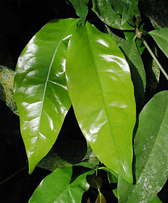

---
aliases:
- Spermatopsida
- "Seed Plant"
- spermatophyte
- phanerogam
- phaenogam
title: Spermatopsida
---

# [[Seed_Plant]]

Seed Plants 

     

## #has_/text_of_/abstract 

> A seed plant or spermatophyte (lit. 'seed plant'; New Latin spermat- and Greek φυτόν (phytón)|plant), 
> also known as a phanerogam (taxon Phanerogamae) or a phaenogam (taxon Phaenogamae), 
> is any plant that produces seeds. 
> 
> It is a category of embryophyte (i.e. land plant) that includes most of the familiar land plants, 
> including the flowering plants and the gymnosperms, but not ferns, mosses, or algae.
>
> The term phanerogam or phanerogamae 
> is derived from the Greek φανερός (phanerós), meaning "visible", 
> in contrast to the term "cryptogam" or "cryptogamae" 
> (from Ancient Greek  κρυπτός (kruptós) 'hidden', and γαμέω (gaméō), 'to marry'). 
> 
> These terms distinguish those plants with hidden sexual organs (cryptogamae) 
> from those with visible ones (phanerogamae).
>
> [Wikipedia](https://en.wikipedia.org/wiki/Seed%20plant) 

## Phylogeny 

-   « Ancestral Groups  
    -   [Land_Plant](../Land_Plant.md)
    -  [Green plants](../../Plant.md))
    -  [Eukarya](../../../Eukarya.md))
    -   [Tree of Life](../../../Tree_of_Life.md)

-   ◊ Sibling Groups of  Embryophytes
    -   [Hornwort](Hornwort.md)
    -   [Moss](Moss.md)
    -   [Fern](Fern.md)
    -   Spermatopsida

-   » Sub-Groups
    -   [Conifers](Seed_Plant/Conifers.md)
    -   [Gnetales](Seed_Plant/Gnetales.md)
    -   [Flowering_Plant](Seed_Plant/Flowering_Plant.md)

## Title Illustrations

----------------------------------------------------------------------
  
Scientific Name ::     Cycas circinalis
Location ::           Cultivated at the Botanical Garden, Basel, Switzerland
Acknowledgements     courtesy [Botanical Image Database](http://www.unibas.ch/botimage/)
Specimen Condition   Live Specimen
Sex ::                Male
Body Part            flower
Copyright ::            © University of Basel, Basel, Switzerland 

---------------------------------------------------------------------
 
Scientific Name ::  Stachys monnieri 
Comments          Eudicots, Lamiaceae
Copyright ::         © [Kurt Stüber](http://www.biolib.de/) 

----------------------------------------------------------------------
 
Scientific Name ::     Gnetum gnemon 
Location ::           cultivated at the Botanical Garden Basel, Switzerland
Acknowledgements     courtesy [Botanical Image Database](http://www.unibas.ch/botimage/)
Specimen Condition   Live Specimen
Body Part            new and old leaves
Copyright ::            © University of Basel, Basel, Switzerland 

## Confidential Links & Embeds: 

### #is_/same_as ::[Seed_Plant](Seed_Plant.md)) 

### #is_/same_as :: [Seed_Plant.public](/_public/bio/bio~Domain/Eukarya/Plants/Land_Plant/Seed_Plant.public.md) 

### #is_/same_as :: [Seed_Plant.internal](/_internal/bio/bio~Domain/Eukarya/Plants/Land_Plant/Seed_Plant.internal.md) 

### #is_/same_as :: [Seed_Plant.protect](/_protect/bio/bio~Domain/Eukarya/Plants/Land_Plant/Seed_Plant.protect.md) 

### #is_/same_as :: [Seed_Plant.private](/_private/bio/bio~Domain/Eukarya/Plants/Land_Plant/Seed_Plant.private.md) 

### #is_/same_as :: [Seed_Plant.personal](/_personal/bio/bio~Domain/Eukarya/Plants/Land_Plant/Seed_Plant.personal.md) 

### #is_/same_as :: [Seed_Plant.secret](/_secret/bio/bio~Domain/Eukarya/Plants/Land_Plant/Seed_Plant.secret.md)

