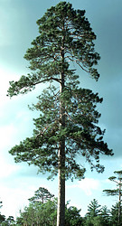
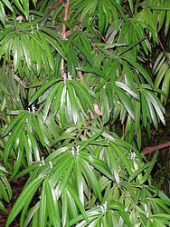
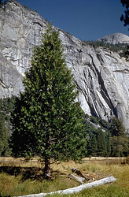

---
aliases:
  - Pinales
  - Conifer
  - Coniferophyta
  - Coniferae
  - Pinophyta
  - Conifers
title: Conifers
---

# [[Conifers]] 

     

## #has_/text_of_/abstract 

> **Conifers** (ˈkɒnɪfər) are a group of cone-bearing seed plants, a subset of gymnosperms. 
> 
> Scientifically, they make up the division Pinophyta, also known as Coniferophyta or Coniferae. 
> 
> The division contains a single extant class, Pinopsida. 
> All extant conifers are perennial woody plants with secondary growth. 
> 
> The majority are trees, though a few are shrubs. 
> 
> Examples include cedars, Douglas-firs, cypresses, firs, junipers, kauri, larches, 
> pines, hemlocks, redwoods, spruces, and yews. 
> 
> As of 2002, Pinophyta contained seven families, 60 to 65 genera, and more than 600 living species.
>
> Although the total number of species is relatively small, conifers are ecologically important. 
> They are dominant plants over large areas of land, especially the taiga of the Northern Hemisphere, 
> but also in similar cool climates in mountains further south. 
> 
> Boreal conifers have many wintertime adaptations. The narrow conical shape of northern conifers, 
> and their downward-drooping limbs, help them shed snow. 
> 
> Many of them seasonally alter their biochemistry to make them more resistant to freezing. 
> While tropical rainforests have more biodiversity and turnover, 
> the immense conifer forests of the world represent the largest terrestrial carbon sink. 
> Conifers are of great economic value for softwood lumber and paper production.
>
> [Wikipedia](https://en.wikipedia.org/wiki/Conifer) 

## Phylogeny 

-   « Ancestral Groups  
    -   [Seed_Plant](../Seed_Plant.md)
    -   [Land_Plant](../../Land_Plant.md)
    -  [Green plants](../../../Plant.md) 
    -  [Eukarya](../../../../Eukarya.md) 
    -   [Tree of Life](../../../../Tree_of_Life.md)

-   ◊ Sibling Groups of  Spermatopsida
    -   Conifers
    -   [Gnetales](Gnetales.md)
    -   [Flowering_Plant](Flowering_Plant.md)

-   » Sub-Groups
    -   [Pine](Conifers/Pine.md)

## Title Illustrations

---------------------------------------------------------------

Scientific Name ::     Pinus resinosa
Comments             Open grown 150-year-old Pinus resinosa.
Acknowledgements     Photograph courtesy [InsectImages.org](http://www.insectimages.org/) (#1301047)
Specimen Condition   Live Specimen
Source Collection    [InsectImages.org](http://www.insectimages.org/)
Copyright ::            © Joseph O\'Brien 

--------------------------------------------------------------------------
 
Scientific Name ::     Podocarpus
Location ::           Botanical Garden, Valencia, Spain
Specimen Condition   Live Specimen
Image Use ::    [Attribution-NonCommercial 2.5 Creative Commons License](http://creativecommons.org/licenses/by-nc/2.5/).
Copyright ::            © 2005 [Katja Schulz](mailto:treegrow@ag.arizona.edu) 

------------------------------------------------------------------------------

Scientific Name ::     Calocedrus decurrens
Location ::           Yosemite National Park, valley (Mariposa County, California, USA)
Comments             California Incense Cedar
Creator              Photograph by Neva Snell
Specimen Condition   Live Specimen
Source Collection    [CalPhotos](http://calphotos.berkeley.edu/)
Copyright ::            © 1999 [California Academy of Sciences](http://www.calacademy.org/) 

## Confidential Links & Embeds: 

### #is_/same_as :: [[/_Standards/bio/bio~Domain/Eukarya/Plant/Land_Plant/Seed_Plant/Conifers|Conifers]] 

### #is_/same_as :: [[/_public/bio/bio~Domain/Eukarya/Plant/Land_Plant/Seed_Plant/Conifers.public|Conifers.public]] 

### #is_/same_as :: [[/_internal/bio/bio~Domain/Eukarya/Plant/Land_Plant/Seed_Plant/Conifers.internal|Conifers.internal]] 

### #is_/same_as :: [[/_protect/bio/bio~Domain/Eukarya/Plant/Land_Plant/Seed_Plant/Conifers.protect|Conifers.protect]] 

### #is_/same_as :: [[/_private/bio/bio~Domain/Eukarya/Plant/Land_Plant/Seed_Plant/Conifers.private|Conifers.private]] 

### #is_/same_as :: [[/_personal/bio/bio~Domain/Eukarya/Plant/Land_Plant/Seed_Plant/Conifers.personal|Conifers.personal]] 

### #is_/same_as :: [[/_secret/bio/bio~Domain/Eukarya/Plant/Land_Plant/Seed_Plant/Conifers.secret|Conifers.secret]] 

