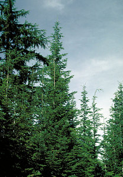
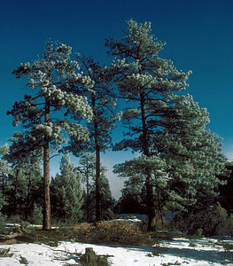
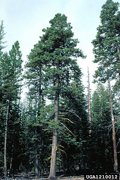

---
aliases:
  - Pinaceae
  - pine family
  - Pine
title: Pinaceae
---

# [[Pine]] 

Pine trees and relatives 

     

## #has_/text_of_/abstract 

> The **Pinaceae**, or pine family, are conifer trees or shrubs, 
> including many of the well-known conifers of commercial importance such as 
> cedars, firs, hemlocks, piñons, larches, pines and spruces. 
> 
> The family is included in the order Pinales, formerly known as Coniferales. 
> Pinaceae have distinctive cones with woody scales bearing typically two ovules, and are supported as monophyletic by both morphological trait and genetic analysis. They are the largest extant conifer family in species diversity, with between 220 and 250 species (depending on taxonomic opinion) in 11 genera, and the second-largest (after Cupressaceae) in geographical range, found in most of the Northern Hemisphere, with the majority of the species in temperate climates, but ranging from subarctic to tropical. The family often forms the dominant component of boreal, coastal, and montane forests. One species, Pinus merkusii, grows just south of the equator in Southeast Asia. Major centres of diversity are found in the mountains of southwest China, Mexico, central Japan, and California.
>
> [Wikipedia](https://en.wikipedia.org/wiki/Pinaceae) 

## Phylogeny 

-   « Ancestral Groups  
    -   [Conifers](../Conifers.md)
    -   [Seed_Plant](../../Seed_Plant.md)
    -   [Land_Plant](../../../Land_Plant.md)
    -  [Green plants](../../../../Plant.md) 
    -  [Eukarya](../../../../../Eukarya.md) 
    -   [Tree of Life](../../../../../Tree_of_Life.md)

-   ◊ Sibling Groups of  Conifers
    -   Pinaceae

-   » Sub-Groups
    -   [Pinus](Pine/Pinus.md)
    -   [Pseudotsuga](Pine/Pseudotsuga.md)
    -   [Larch](Pine/Larch.md)

## Title Illustrations

--------------------

scientific_name ::     Tsuga heterophylla
location ::           Idaho, USA
Comments             western hemlock
Acknowledgements     Photograph courtesy InsectImages.org (#1171008)
specimen_condition ::  Live Specimen
Source Collection    [InsectImages.org](http://www.insectimages.org/)
copyright ::            © Chris Schnepf, University of Idaho

-----------------------------
 
scientific_name ::     Pinus ponderosa
location ::           South Platte Ranger District, Colorado, USA
Comments             ponderosa pine trees covered with rime (an icy or frosty coating on foliage)
Acknowledgements     Photograph courtesy InsectImages.org (#1207094)
specimen_condition ::  Live Specimen
Source Collection    [InsectImages.org](http://www.insectimages.org/)
copyright ::            © Dave Powell, USDA Forest Service

------------------------
 
scientific_name ::     Abies concolor
Comments             white fir, old tree showing characteristic mature-tree form
Acknowledgements     Photograph courtesy InsectImages.org (#1210012)
specimen_condition ::  Live Specimen
Source Collection    [InsectImages.org](http://www.insectimages.org/)
copyright ::            © Dave Powell, USDA Forest Service

## Confidential Links & Embeds: 

### #is_/same_as :: [[/_Standards/bio/bio~Domain/Eukarya/Plant/Land_Plant/Seed_Plant/Conifers/Pine|Pine]] 

### #is_/same_as :: [[/_public/bio/bio~Domain/Eukarya/Plant/Land_Plant/Seed_Plant/Conifers/Pine.public|Pine.public]] 

### #is_/same_as :: [[/_internal/bio/bio~Domain/Eukarya/Plant/Land_Plant/Seed_Plant/Conifers/Pine.internal|Pine.internal]] 

### #is_/same_as :: [[/_protect/bio/bio~Domain/Eukarya/Plant/Land_Plant/Seed_Plant/Conifers/Pine.protect|Pine.protect]] 

### #is_/same_as :: [[/_private/bio/bio~Domain/Eukarya/Plant/Land_Plant/Seed_Plant/Conifers/Pine.private|Pine.private]] 

### #is_/same_as :: [[/_personal/bio/bio~Domain/Eukarya/Plant/Land_Plant/Seed_Plant/Conifers/Pine.personal|Pine.personal]] 

### #is_/same_as :: [[/_secret/bio/bio~Domain/Eukarya/Plant/Land_Plant/Seed_Plant/Conifers/Pine.secret|Pine.secret]] 

