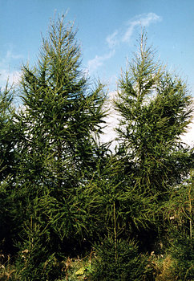
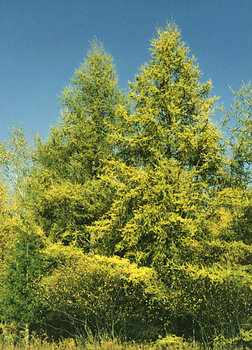

---
aliases:
  - Larch
  - Larix
  - Lärche
title: Larix
---

# [[Larch]] 

   

## Phylogeny 

-   « Ancestral Groups  
    -   [Pine](../Pine.md)
    -   [Conifers](../../Conifers.md)
    -   [Seed_Plant](../../../Seed_Plant.md)
    -   [Land_Plant](../../../../Land_Plant.md)
    -  [Green plants](../../../../../Plant.md) 
    -  [Eukarya](../../../../../../Eukarya.md) 
    -   [Tree of Life](../../../../../../Tree_of_Life.md)

-   ◊ Sibling Groups of  Pinaceae
    -   [Pinus](Pinus.md)
    -   [Pseudotsuga](Pseudotsuga.md)
    -   Larix

-   » Sub-Groups 

## Title Illustrations

--------------------

scientific_name ::     Larix decidua
location ::           Michigan, USA
Comments             European larch
Acknowledgements     Photograph courtesy InsectImages.org (#1218012)
specimen_condition ::  Live Specimen
Source Collection    [InsectImages.org](http://www.insectimages.org/)
copyright ::            © Bill Cook, Michigan State University

--------------------

scientific_name ::     Larix laricina
location ::           Michigan, USA
Comments             tamarack
Acknowledgements     Photograph courtesy InsectImages.org (#1218018)
specimen_condition ::  Live Specimen
Source Collection    [InsectImages.org](http://www.insectimages.org/)
copyright ::            © Bill Cook, Michigan State University

## Confidential Links & Embeds: 

### #is_/same_as :: [[/_Standards/bio/bio~Domain/Eukarya/Plant/Land_Plant/Seed_Plant/Conifers/Pine/Larch|Larch]] 

### #is_/same_as :: [[/_public/bio/bio~Domain/Eukarya/Plant/Land_Plant/Seed_Plant/Conifers/Pine/Larch.public|Larch.public]] 

### #is_/same_as :: [[/_internal/bio/bio~Domain/Eukarya/Plant/Land_Plant/Seed_Plant/Conifers/Pine/Larch.internal|Larch.internal]] 

### #is_/same_as :: [[/_protect/bio/bio~Domain/Eukarya/Plant/Land_Plant/Seed_Plant/Conifers/Pine/Larch.protect|Larch.protect]] 

### #is_/same_as :: [[/_private/bio/bio~Domain/Eukarya/Plant/Land_Plant/Seed_Plant/Conifers/Pine/Larch.private|Larch.private]] 

### #is_/same_as :: [[/_personal/bio/bio~Domain/Eukarya/Plant/Land_Plant/Seed_Plant/Conifers/Pine/Larch.personal|Larch.personal]] 

### #is_/same_as :: [[/_secret/bio/bio~Domain/Eukarya/Plant/Land_Plant/Seed_Plant/Conifers/Pine/Larch.secret|Larch.secret]] 

