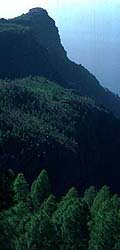
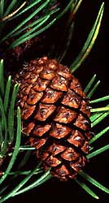

---
aliases:
  - Pine Tree
  - Pinus
  - Pīntrēoƿ
  - Şam ağacı
  - Kiefan
  - Хвоя
  - ཐང་ཤིང་།
  - Pino
  - Fyrreslægten
  - Chójca
  - Πεύκο
  - Mänd
  - Pinu
  - Männyt
  - Sjüüren
  - Péine
  - Giuthas
  - Juys
  - चीड़
  - Chójna
  - Tusam
  - マツ属
  - ფიჭვი
  - 소나무속
  - Пожум
  - یارِکُل
  - Пожӧм
  - pušis
  - Пиче
  - Пӱнчӧ
  - Бор
  - പൈൻ
  - Нарснууд
  - पाईन वृक्ष
  - Йӓктӹ
  - ထင်းရှူး
  - Furu
  - Furuslekta
  - Ńdíshchííʼ
  - Pin
  - Нæзы
  - Beintbaam
  - پائن
  - pinus
  - Umubunda
  - Бэс
  - Oppinu
  - Borovica
  - bor
  - Fjuurenboom
  - Pines
  - Tallar
  - పైన్
  - Пужым
  - Pynboom
  - סאסנע
  - 松属
  - 松屬
  - Den
  - کاج
  - borovice
  - Kiefern
  - sosna
  - אורן
  - Pinheiro
  - Pine
  - Çam
  - Piñeiro
  - صنوبر
  - Priedes
  - Сосна
  - Pi
has_id_wikidata: Q12024
title: Pinus
EPPO_Code: 1PIUG
MeSH_tree_code: B01.875.800.575.912.625.875.777
Krugosvet_article_archived_: biologiya/sosna
NBN_System_Key: NHMSYS0000461702
UNII: NT5UBA3P7Z
Commons_gallery: Pinus
Commons_category: Pinus
taxon_name: Pinus
taxon_common_name:
  - Pīntrēoƿ
  - Şam ağacı
  - Kiefan
  - Хвоя
  - ཐང་ཤིང་།
  - Pino
  - Fyrreslægten
  - Chójca
  - Πεύκο
  - Pino
  - Mänd
  - Pinu
  - Männyt
  - Sjüüren
  - Péine
  - Giuthas
  - Juys
  - चीड़
  - Chójna
  - Tusam
  - マツ属
  - ფიჭვი
  - 소나무속
  - Пожум
  - یارِکُل
  - Пожӧм
  - pušis
  - Пиче
  - Пӱнчӧ
  - Бор
  - പൈൻ
  - Нарснууд
  - पाईन वृक्ष
  - Йӓктӹ
  - ထင်းရှူး
  - Furu
  - Furuslekta
  - Ńdíshchííʼ
  - Pin
  - Нæзы
  - Beintbaam
  - پائن
  - pinus
  - Pin
  - Umubunda
  - Бэс
  - Oppinu
  - Borovica
  - bor
  - Fjuurenboom
  - Pines
  - Tallar
  - పైన్
  - Pino
  - Пужым
  - Pynboom
  - סאסנע
  - 松属
  - 松屬
  - 松属
  - Den
  - کاج
  - borovice
  - Kiefern
  - sosna
  - אורן
  - Pinheiro
  - Pine
  - Çam
  - Pino
  - Pino
  - Бор
  - Бор
  - Piñeiro
  - صنوبر
  - Priedes
  - Сосна
  - Pi
  - Сосна
  - Pin
  - Furu
nomenclatural_type_of: '[[_Standards/WikiData/WD~Pinaceae,101680]]'
taxonomic_type: '[[_Standards/WikiData/WD~Pinus_sylvestris,133128]]'
this_taxon_is_source_of:
  - '[[_Standards/WikiData/WD~pine_nut,212933]]'
  - '[[_Standards/WikiData/WD~Myrtol_standardized,730609]]'
  - '[[_Standards/WikiData/WD~pine_oil,990187]]'
  - '[[_Standards/WikiData/WD~pine,1503211]]'
  - '[[_Standards/WikiData/WD~naval_stores,6982026]]'
  - '[[_Standards/WikiData/WD~pine_needle,59672484]]'
  - '[[_Standards/WikiData/WD~pine_cone,118185651]]'
described_by_source:
  - '[[../../../../../../../../WikiData/WD~Brockhaus_and_Efron_Encyclopedic_Dictionary,602358]]'
  - '[[_Standards/WikiData/WD~Encyclopædia_Britannica_11th_edition,867541]]'
  - '[[_Standards/WikiData/WD~Granat_Encyclopedic_Dictionary,4532138]]'
  - "[[_Standards/WikiData/WD~The_New_Student's_Reference_Work,16082057]]"
  - '[[_Standards/WikiData/WD~Small_Brockhaus_and_Efron_Encyclopedic_Dictionary,19180675]]'
  - '[[_Standards/WikiData/WD~Meyers_Konversations_Lexikon,_4th_edition_(1885_1890),19219752]]'
  - '[[_Standards/WikiData/WD~Great_Soviet_Encyclopedia_(1926_1947),20078554]]'
  - '[[_Standards/WikiData/WD~The_Domestic_Encyclopædia;_Or,_A_Dictionary_Of_Facts,_And_Useful_Knowledge,56441911]]'
  - '[[_Standards/WikiData/WD~Flora_Reipublicae_Popularis_Sinicae,_volume_7,112869376]]'
parent_taxon: '[[_Standards/WikiData/WD~Pinoideae,9339721]]'
topic_has_template: '[[_Standards/WikiData/WD~Q10514261,10514261]]'
maintained_by_WikiProject: '[[_Standards/WikiData/WD~WikiProject_Invasion_Biology,56241615]]'
subclass_of: '[[_Standards/WikiData/WD~tree,10884]]'
instance_of: '[[_Standards/WikiData/WD~taxon,16521]]'
taxon_rank: '[[_Standards/WikiData/WD~genus,34740]]'
ITIS_TSN: 18035
OmegaWiki_Defined_Meaning: 706003
video: http://commons.wikimedia.org/wiki/Special:FilePath/%D0%9B%D1%96%D1%81%D0%BE%D1%81%D0%BC%D1%83%D0%B3%D0%B0%20%D0%B1%D1%96%D0%BB%D1%8F%20%D0%9E%D0%BB%D0%B5%D1%88%D0%BA%D1%96%D0%B2%D1%81%D1%8C%D0%BA%D0%B8%D1%85%20%D0%BF%D1%96%D1%81%D0%BA%D1%96%D0%B2.webm
image:
  - http://commons.wikimedia.org/wiki/Special:FilePath/Pinus%20lambertiana%20cones%20Cucamonga%20Peak.jpg
  - http://commons.wikimedia.org/wiki/Special:FilePath/Pinus%20pinaster.jpg
  - http://commons.wikimedia.org/wiki/Special:FilePath/Pinus%20sylvestris%20Grytdalen%2002.jpg
  - http://commons.wikimedia.org/wiki/Special:FilePath/Ponderosa%20Pine%20cones%2C%20Idaho%20Panhandle%20National%20Forest.jpg
taxon_range_map_image: http://commons.wikimedia.org/wiki/Special:FilePath/Pinus%20range.png
Flora_of_the_Hawaiian_Islands_URL: https://naturalhistory2.si.edu/botany/hawaiianflora/genusdescr.cfm?genus=Pinus
GRIN_URL: https://npgsweb.ars-grin.gov/gringlobal/taxonomygenus.aspx?id=9418
---

# [[Pinus]] 

#is_/instance_of :: [[../../../../../../../Taxon_Rank/bio~Kingdom/bio~Phylum/bio~Class/bio~Order/bio~Family/bio~Genus|bio-Genus]] 
#is_/same_as :: [[../../../../../../../../WikiData/WD~Pinus,12024|WD~Pinus,12024]] 

Pine Trees 

  .jpg)    .jpg) 

## #has_/text_of_/abstract 

> A pine is any conifer in the genus **Pinus** of the family Pinaceae. 
> Pinus is the sole genus in the subfamily Pinoideae. 
> The species are evergreen trees or shrubs with their leaves in bunches, usually of 2 to 5 needles. 
> The seeds are carried on woody cones, with two seeds to each cone scale.
>
> Pines are widely distributed in the Northern Hemisphere; 
> they occupy large areas of taiga (boreal forest), but are found in many habitats, 
> including the Mediterranean Basin, and dry tropical forests in southeast Asia and Central America. 
> 
> Some are fire-resistant or fire-dependent. 
>
> Pine trees provide one of the most extensively used types of timber. 
> The seeds are used to make dishes such as pesto, while retsina wine is flavoured with pine resin.
>
> [Wikipedia](https://en.wikipedia.org/wiki/Pine)

## Introduction

[David S. Gernandt, Aaron Liston, and Robert A. Price]()

*Pinus*, with over 100 species, is the largest genus of conifers 
and the most widespread genus of trees in the Northern Hemisphere. 

The natural distribution of pines ranges from arctic and subarctic regions of Eurasia and North America 
south to subtropical and tropical (usually montane) regions of Central America and Asia. 

Pines are also extensively planted in temperate regions of the Southern Hemisphere. 
Many pines are fast growing species tolerant of poor soils and relatively arid conditions, 
making them popular in reforestation. 

Important pine products include wood, turpentine, and edible seeds.

Pines have a relatively rich fossil record dating back to the Early Cretaceous, 130 million years ago. 

### Discussion of Phylogenetic Relationships

Most classifications of *Pinus* recognize two major lineages: 
- subgenus *Strobus* (haploxylon or soft pines, with one fibrovascular bundle in the needle) and 
- subgenus *Pinus* (diploxylon or hard pines, with two fibrovascular bundles in the needles). 

This division is consistent with data from wood anatomy and secondary chemistry, 
and is supported in recent molecular phylogenetic studies 
(Strauss & Doerksen 1990; Wang & Szmidt 1993; reviewed in Price et al., 1998). 

The Vietnamese species, *P. krempfii* possesses unusual flattened needles and a unique wood anatomy. 
Based on these distinctive features, the species was considered a third subgenus 
in the influential classification of Little & Critchfield (1969). 
On the other hand, secondary product chemistry (Erdtman et al. 1966), nuclear ribosomal DNA 
(Liston et al. 2003) and chloroplast DNA sequences (Wang et al. 1999; Gernandt et al. in press) 
indicate that *P. krempfii* should be considered a member of subgenus *Strobus*.

## Phylogeny 

-   « Ancestral Groups  
    -   [Pine](../Pine.md)
    -   [Conifers](../../Conifers.md)
    -   [Seed_Plant](../../../Seed_Plant.md)
    -   [Land_Plant](../../../../Land_Plant.md)
    -  [Green plants](../../../../../Plant.md) 
    -  [Eukarya](../../../../../../Eukarya.md) 
    -   [Tree of Life](../../../../../../Tree_of_Life.md)

-   ◊ Sibling Groups of  Pinaceae
    -   Pinus
    -   [Pseudotsuga](Pseudotsuga.md)
    -   [Larch](Larch.md)

-   » Sub-Groups
    -   [subgenus Pinus](subgenus_Pinus)
    -   [subgenus Strobus](subgenus_Strobus)

## Title Illustrations

---------------------------------------------------------------------------

Scientific Name ::  Pinus canariensis
Location ::        Tenerife, Spain
Copyright ::         © [Aaron Liston](http://www.bcc.orst.edu/bpp/faculty/liston/) 

---------------------------------------------------------------------------
 
Scientific Name ::  Pinus monticola
Body Part         ovulate cone
Copyright ::         © [Aaron Liston](http://www.bcc.orst.edu/bpp/faculty/liston/) 

---------------------------------------------------------------------------

Scientific Name ::  Pinus contorta
Body Part         ovulate cone
Copyright ::         © [Aaron Liston](http://www.bcc.orst.edu/bpp/faculty/liston/) 

---------------------------------------------------------------------------
.jpg) 
Scientific Name ::  Pinus krempfii
Body Part         flattened leaves
Copyright ::         © [Aaron Liston](http://www.bcc.orst.edu/bpp/faculty/liston/) 

## Confidential Links & Embeds: 

### #is_/same_as :: [[/_Standards/bio/bio~Domain/Eukarya/Plant/Land_Plant/Seed_Plant/Conifers/Pine/Pinus|Pinus]] 

### #is_/same_as :: [[/_public/bio/bio~Domain/Eukarya/Plant/Land_Plant/Seed_Plant/Conifers/Pine/Pinus.public|Pinus.public]] 

### #is_/same_as :: [[/_internal/bio/bio~Domain/Eukarya/Plant/Land_Plant/Seed_Plant/Conifers/Pine/Pinus.internal|Pinus.internal]] 

### #is_/same_as :: [[/_protect/bio/bio~Domain/Eukarya/Plant/Land_Plant/Seed_Plant/Conifers/Pine/Pinus.protect|Pinus.protect]] 

### #is_/same_as :: [[/_private/bio/bio~Domain/Eukarya/Plant/Land_Plant/Seed_Plant/Conifers/Pine/Pinus.private|Pinus.private]] 

### #is_/same_as :: [[/_personal/bio/bio~Domain/Eukarya/Plant/Land_Plant/Seed_Plant/Conifers/Pine/Pinus.personal|Pinus.personal]] 

### #is_/same_as :: [[/_secret/bio/bio~Domain/Eukarya/Plant/Land_Plant/Seed_Plant/Conifers/Pine/Pinus.secret|Pinus.secret]] 

