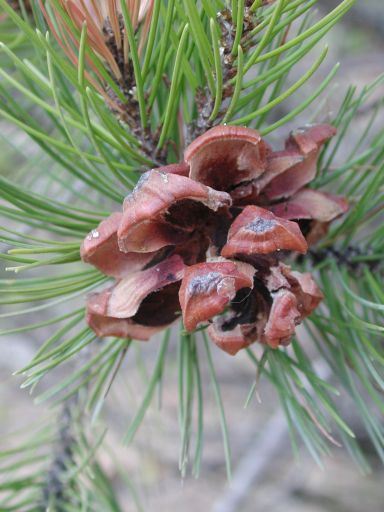

---
title: "Pinus cembroides"
---

# [[Pinus_cembroides]] 

## Phylogeny 

-   « Ancestral Groups  
    -   [subsection Cembroides](subsection_Cembroides)
    -   [subgenus Strobus](subgenus_Strobus)
    -   [Pinus](../../../Pinus.md)
    -   [Pine](../../../../Pine.md)
    -   [Conifers](../../../../../Conifers.md)
    -   [Seed_Plant](../../../../../../Seed_Plant.md)
    -   [Land_Plant](../../../../../../../Land_Plant.md)
    -  [Green plants](../../../../../../../../Plant.md))
    -  [Eukarya](../../../../../../../../../Eukarya.md))
    -   [Tree of Life](../../../../../../../../../Tree_of_Life.md)

-   ◊ Sibling Groups of  subsection Cembroides
    -   Pinus cembroides
    -   [Pinus johannis](Pinus_johannis)
    -   [Pinus remota](Pinus_remota)

-   » Sub-Groups 

-------------------------------------------------------------------------------------------

Scientific Name ::     Pinus cembroides subspecies orizabensis
Location ::           Puebla-Veracruz border, Mexico
Specimen Condition   Live Specimen
Body Part            ovulate cone
Copyright ::            © 2004 [David S. Gernandt](http://www.reduaeh.mx/investigacion/biologia/investigadores/gernandt_latteri.htm) 

## Confidential Links & Embeds: 

### #is_/same_as ::[Pinus_cembroides](Pinus_cembroides.md)) 

### #is_/same_as :: [Pinus_cembroides.public](/_public/bio/bio~Domain/Eukarya/Plants/Land_Plant/Seed_Plant/Conifers/Pine/Pinus/Strobus/Cembroides/Pinus_cembroides.public.md) 

### #is_/same_as :: [Pinus_cembroides.internal](/_internal/bio/bio~Domain/Eukarya/Plants/Land_Plant/Seed_Plant/Conifers/Pine/Pinus/Strobus/Cembroides/Pinus_cembroides.internal.md) 

### #is_/same_as :: [Pinus_cembroides.protect](/_protect/bio/bio~Domain/Eukarya/Plants/Land_Plant/Seed_Plant/Conifers/Pine/Pinus/Strobus/Cembroides/Pinus_cembroides.protect.md) 

### #is_/same_as :: [Pinus_cembroides.private](/_private/bio/bio~Domain/Eukarya/Plants/Land_Plant/Seed_Plant/Conifers/Pine/Pinus/Strobus/Cembroides/Pinus_cembroides.private.md) 

### #is_/same_as :: [Pinus_cembroides.personal](/_personal/bio/bio~Domain/Eukarya/Plants/Land_Plant/Seed_Plant/Conifers/Pine/Pinus/Strobus/Cembroides/Pinus_cembroides.personal.md) 

### #is_/same_as :: [Pinus_cembroides.secret](/_secret/bio/bio~Domain/Eukarya/Plants/Land_Plant/Seed_Plant/Conifers/Pine/Pinus/Strobus/Cembroides/Pinus_cembroides.secret.md)

