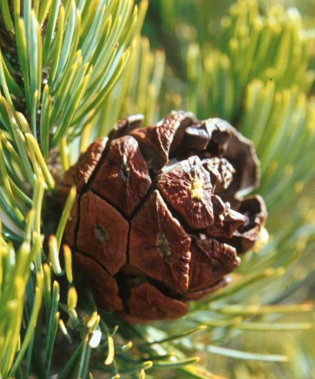

## Phylogeny 

-   « Ancestral Groups  
    -   [subsection Cembroides](subsection_Cembroides)
    -   [subgenus Strobus](subgenus_Strobus)
    -   [Pinus](../../../Pinus.md)
    -   [Pine](../../../../Pine.md)
    -   [Conifers](../../../../../Conifers.md)
    -   [Seed_Plant](../../../../../../Seed_Plant.md)
    -   [Land_Plant](../../../../../../../Land_Plant.md)
    -  [Green plants](../../../../../../../../Plant.md))
    -  [Eukarya](../../../../../../../../../Eukarya.md))
    -   [Tree of Life](../../../../../../../../../Tree_of_Life.md)

-   ◊ Sibling Groups of  subsection Cembroides
    -  [Pinus cembroides](Pinus_cembroides.md))
    -   Pinus johannis
    -   [Pinus remota](Pinus_remota)

-   » Sub-Groups 

# *Pinus johannis* 

Containing group: [subsection Cembroides](../Cembroides.md)

## Introduction

The validity of this species is in question. For example, Farjon and
Styles (1997) consider it a variety of *P. cembroides* (subspecies
*cembroides var. bicolor*). On the other hand, it is considered a valid
species by Price et al. (1998), and forms a separate lineage from *P.
cembroides* in chloroplast DNA trees (Gernandt et al. 2003).

### References

Farjon, A. and B. T. Styles. 1997. Pinus (Pinaceae). Flora Neotropica
Monograph 75. The New York Botanical Garden, New York.

Gernandt, D. S., A. Liston, and D. Piñero. 2001. Variation in the nrDNA
ITS of Pinus subsection Cembroides: implications for molecular
systematic studies of pine species complexes. Molec. Phyl. Evol. 21:
449-467.

Gernandt, D. S., A. Liston and D. Piñero. 2003. Phylogenetics of Pinus
subsections Cembroides and Nelsoniae inferred from cpDNA sequences.
Syst. Bot. 28: 657-673.

Price, R. A., A. Liston, and S. H. Strauss. 1998. Phylogeny and
systematics of Pinus. Pp. 49\--68 in: Richardson, D. M. (ed.), Ecology
and Biogeography of Pinus. Cambridge Univ. Press, Cambridge.

## Title Illustrations

)

  ------------------------------------------------------------------------------------------
  Scientific Name ::  Pinus johannis
  Location ::        Concepción del Oro, Zacatecas, Mexico
  Body Part         ovulate cone
  Copyright ::         © 2004 [David S. Gernandt](http://www.reduaeh.mx/investigacion/biologia/investigadores/gernandt_latteri.htm) 
  ------------------------------------------------------------------------------------------

## Confidential Links & Embeds: 

### #is_/same_as :: [johannis](/_Standards/bio/bio~Domain/Eukarya/Plant/Land_Plant/Seed_Plant/Conifers/Pine/Pinus/Strobus/Cembroides/johannis.md) 

### #is_/same_as :: [johannis.public](/_public/bio/bio~Domain/Eukarya/Plant/Land_Plant/Seed_Plant/Conifers/Pine/Pinus/Strobus/Cembroides/johannis.public.md) 

### #is_/same_as :: [johannis.internal](/_internal/bio/bio~Domain/Eukarya/Plant/Land_Plant/Seed_Plant/Conifers/Pine/Pinus/Strobus/Cembroides/johannis.internal.md) 

### #is_/same_as :: [johannis.protect](/_protect/bio/bio~Domain/Eukarya/Plant/Land_Plant/Seed_Plant/Conifers/Pine/Pinus/Strobus/Cembroides/johannis.protect.md) 

### #is_/same_as :: [johannis.private](/_private/bio/bio~Domain/Eukarya/Plant/Land_Plant/Seed_Plant/Conifers/Pine/Pinus/Strobus/Cembroides/johannis.private.md) 

### #is_/same_as :: [johannis.personal](/_personal/bio/bio~Domain/Eukarya/Plant/Land_Plant/Seed_Plant/Conifers/Pine/Pinus/Strobus/Cembroides/johannis.personal.md) 

### #is_/same_as :: [johannis.secret](/_secret/bio/bio~Domain/Eukarya/Plant/Land_Plant/Seed_Plant/Conifers/Pine/Pinus/Strobus/Cembroides/johannis.secret.md)

