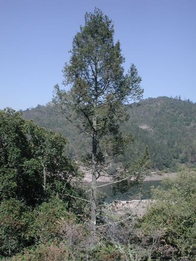

---
aliases:
- Avet Douglas
- Bigcone spruce
- daglezja
- Doeglas
- Douglaasien
- Douglas fir
- Douglas tree
- Douglas-fir
- Douglasdännen
- douglasgran
- Douglasgranslekten
- Douglasgranssläktet
- Douglasien
- Douglasija
- douglaska
- douglaskuuset
- Duglazija
- Duglazije
- duglászfenyő
- Ebatsuuga
- Oregon pine
- Pocūgė
- Pseudo-tsuga
- Pseudotsuga
- Pseŭdocugo
- Yalançı tsuqa
- Ψευδοτσούγκα
- Дуглазја
- Дуглазија
- Дугласія
- Дугласка ела
- Псевдотсуга
- կեղծաթսուգա
- צוגנית
- تنوب دوغلاس
- سرخنرادها
- ڈگلس فر
- ცრუცუგა
- トガサワラ属
- 黃杉屬
- 黄杉属
- 미송속
title: Pseudotsuga
has_id_wikidata: Q158771
dv_has_:
  name_:
    an: Pseudotsuga
    ar: تنوب دوغلاس
    arz: تنوب دوغلاس
    ast: Pseudotsuga
    az: Yalançı tsuqa
    be: Дугласія
    be-tarask: дугласія
    bg: Дугласка ела
    ca: Avet Douglas
    ceb: Pseudotsuga
    cs: douglaska
    da: douglasgran
    de: Douglasien
    el: Ψευδοτσούγκα
    en: Pseudotsuga
    eo: Pseŭdocugo
    es: Pseudotsuga
    et: Ebatsuuga
    eu: Pseudotsuga
    ext: Pseudotsuga
    fa: سرخنرادها
    fi: douglaskuuset
    fr: Pseudotsuga
    frr: Douglaasien
    ga: Pseudotsuga
    gl: Pseudotsuga
    he: צוגנית
    hr: Duglazije
    hsb: Douglasija
    hu: duglászfenyő
    hy: կեղծաթսուգա
    ia: Pseudotsuga
    ie: Pseudotsuga
    io: Pseudotsuga
    is: Pseudotsuga
    it: Pseudotsuga
    ja: トガサワラ属
    ka: ცრუცუგა
    ko: 미송속
    la: Pseudotsuga
    lb: Douglasdännen
    lt: Pocūgė
    mk: Дуглазја
    mul: Pseudotsuga
    nb: Douglasgranslekten
    nl: Pseudotsuga
    oc: Pseudotsuga
    pl: daglezja
    pnb: ڈگلس فر
    pt: Pseudotsuga
    pt-br: Pseudotsuga
    ro: Pseudotsuga
    ru: Псевдотсуга
    sq: Pseudotsuga
    sr: Дуглазија
    sr-ec: Дуглазија
    sr-el: Duglazija
    sv: Douglasgranssläktet
    tr: Pseudotsuga
    uk: Псевдотсуга
    vi: Pseudotsuga
    vls: Doeglas
    vo: Pseudotsuga
    war: Pseudotsuga
    zh: 黄杉属
    zh-cn: 黄杉属
    zh-hans: 黄杉属
    zh-hant: 黃杉屬
    zh-hk: 黃杉屬
    zh-sg: 黄杉属
    zh-tw: 黃杉屬
---
# Pseudotsuga [Carrière 1867]

## Douglas-fir 

## #has_/text_of_/abstract 

> **Pseudotsuga**  is a genus of evergreen coniferous trees in the family Pinaceae 
> (subfamily Laricoideae). 
> Common names for species in the genus include 
> Douglas fir, Douglas tree, Oregon pine and Bigcone spruce. 
> 
> Pseudotsuga menziesii (Douglas fir proper) is widespread in western North America 
> and is an important source of timber. 
> 
> The number of species has long been debated, but two in western North America 
> and two to four in eastern Asia are commonly acknowledged.
>
> Nineteenth-century botanists had problems in classifying Douglas firs, 
> due to the species' similarity to various other conifers better known at the time; 
> they have at times been classified in Pinus, Picea, Abies, Tsuga, and even Sequoia. 
> 
> Because of their distinctive cones, Douglas firs were finally placed in the new genus Pseudotsuga 
> (meaning "false hemlock") by the French botanist Carrière in 1867.  
> The genus name has also been hyphenated as Pseudo-tsuga.
>
> [Wikipedia](https://en.wikipedia.org/wiki/Pseudotsuga) 

## Introduction

[David S. Gernandt]()

*Pseudotsuga* is a small genus of approximately five species distributed
in eastern Asia and western North America. *Pseudotsuga menziesii*, with
a distribution from western Canada to central Mexico, is one of the most
economically important timber species in the world.

### Characteristics

Medium to tall trees with straight stems and upright to spreading
branches. Spirally arranged leaves (needles), reddish brown
ovoid-conical vegetative buds. Reddish brown ovulate cones are pendulous
with exserted bracts (Farjon 1990).

### Discussion of Phylogenetic Relationships

Farjon (1990) recognized only four species of *Pseudotsuga*:
*Pseudotsuga macrocarpa* from southern California, *Pseudotsuga
menziesii* ranging from Canada to south-central Mexico, *Pseudotsuga
japonica* from southern Japan, and *Pseudotsuga sinensis* from China.
Included in the ToL phylogeny is also *P. wilsoniana* from Taiwan. In
addition to *P. wilsoniana*, several other species have been segregated
from *Pseudotsuga sinensis* (*P. forrestii*, *P. salvadorii*, *P.
gaussenii*, *P. brevifolia*, *P. xichangensis*), but these have not been
widely accepted. Mexican botanists tend to recognize four segregate
species of *Pseudotsuga menziesii var. glauca* in Mexico: *P.
macrolepis*, *P. rehderi*, *P. guinieri*, and *P. flahaultii* (Martínez
1963).

Relationships among the widely-accepted species were studied by Strauss
et al. 1990 using DNA restriction fragments and by Gernandt and Liston
(1999) using nuclear ribosomal DNA.

## Phylogeny 

-   « Ancestral Groups  
    -   [Pine](../Pine.md)
    -   [Conifers](../../Conifers.md)
    -   [Seed_Plant](../../../Seed_Plant.md)
    -   [Land_Plant](../../../../Land_Plant.md)
    -  [Green plants](../../../../../Plant.md) 
    -  [Eukarya](../../../../../../Eukarya.md) 
    -   [Tree of Life](../../../../../../Tree_of_Life.md)

-   ◊ Sibling Groups of  Pinaceae
    -   [Pinus](Pinus.md)
    -   Pseudotsuga
    -   [Larch](Larch.md)

-   » Sub-Groups 

-------------------------------------------------------------------------------------------

scientific_name ::     Pseudotsuga menziesii var. glauca
location ::           El Chico, Hidalgo
specimen_condition ::  Live Specimen
copyright ::            © 2004 [David S. Gernandt](http://www.reduaeh.mx/investigacion/biologia/investigadores/gernandt_latteri.htm) 

## Confidential Links & Embeds: 

### #is_/same_as :: [[/_Standards/bio/bio~Domain/Eukarya/Plant/Land_Plant/Seed_Plant/Conifers/Pine/Pseudotsuga|Pseudotsuga]] 

### #is_/same_as :: [[/_public/bio/bio~Domain/Eukarya/Plant/Land_Plant/Seed_Plant/Conifers/Pine/Pseudotsuga.public|Pseudotsuga.public]] 

### #is_/same_as :: [[/_internal/bio/bio~Domain/Eukarya/Plant/Land_Plant/Seed_Plant/Conifers/Pine/Pseudotsuga.internal|Pseudotsuga.internal]] 

### #is_/same_as :: [[/_protect/bio/bio~Domain/Eukarya/Plant/Land_Plant/Seed_Plant/Conifers/Pine/Pseudotsuga.protect|Pseudotsuga.protect]] 

### #is_/same_as :: [[/_private/bio/bio~Domain/Eukarya/Plant/Land_Plant/Seed_Plant/Conifers/Pine/Pseudotsuga.private|Pseudotsuga.private]] 

### #is_/same_as :: [[/_personal/bio/bio~Domain/Eukarya/Plant/Land_Plant/Seed_Plant/Conifers/Pine/Pseudotsuga.personal|Pseudotsuga.personal]] 

### #is_/same_as :: [[/_secret/bio/bio~Domain/Eukarya/Plant/Land_Plant/Seed_Plant/Conifers/Pine/Pseudotsuga.secret|Pseudotsuga.secret]] 

