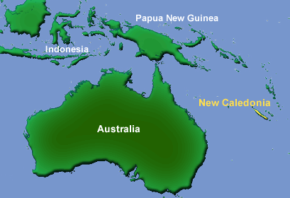

---
aliases:
- Amborella
- Amborella trichopoda
- Амборела
- Амборела волосоніжка
- Амборелла волосистоножковая
- آمبورلا
- أمبوريلة شعراء الساق
- امبوريله شعراء الساق
- امبوریلا
- அம்போரெல்லா
- ಅಂಬೊರೆಲ್ಲಾ
- അംബോറില
- 无油樟
- 無油樟
- 암보렐라
title: Amborella trichopoda
has_id_wikidata: Q310470
dv_has_:
  name_:
    af: Amborella trichopoda
    an: Amborella trichopoda
    ar: أمبوريلة شعراء الساق
    arz: امبوريله شعراء الساق
    ast: Amborella trichopoda
    bg: Amborella trichopoda
    br: Amborella trichopoda
    bs: Amborella trichopoda
    ca: Amborella trichopoda
    ceb: Amborella trichopoda
    cs: Amborella trichopoda
    cy: Amborella trichopoda
    da: Amborella trichopoda
    de: Amborella trichopoda
    en: Amborella trichopoda
    eo: Amborella trichopoda
    es: Amborella trichopoda
    et: Amborella trichopoda
    eu: Amborella trichopoda
    ext: Amborella trichopoda
    fa: آمبورلا
    fi: Amborella trichopoda
    fr: Amborella trichopoda
    frr: Amborella trichopoda
    ga: Amborella trichopoda
    gl: Amborella trichopoda
    gsw: Amborella trichopoda
    hr: Amborella trichopoda
    hu: Amborella trichopoda
    ia: Amborella trichopoda
    id: Amborella trichopoda
    ie: Amborella trichopoda
    io: Amborella trichopoda
    is: Amborella trichopoda
    it: Amborella trichopoda
    kn: ಅಂಬೊರೆಲ್ಲಾ
    ko: 암보렐라
    ku: Amborella trichopoda
    ku_latn: Amborella trichopoda
    la: Amborella trichopoda
    lb: Amborella trichopoda
    lmo: Amborella trichopoda
    lt: Amborella trichopoda
    mk: Амборела
    ml: അംബോറില
    mul: Amborella trichopoda
    nb: Amborella trichopoda
    nds: Amborella trichopoda
    nds_nl: Amborella trichopoda
    nl: Amborella trichopoda
    nn: Amborella trichopoda
    oc: Amborella trichopoda
    pl: Amborella trichopoda
    pms: Amborella trichopoda
    pnb: امبوریلا
    pt: Amborella trichopoda
    pt_br: Amborella trichopoda
    ro: Amborella trichopoda
    ru: Амборелла волосистоножковая
    sk: Amborella trichopoda
    sl: Amborella trichopoda
    sq: Amborella trichopoda
    sv: Amborella trichopoda
    ta: அம்போரெல்லா
    tr: Amborella trichopoda
    uk: Амборела волосоніжка
    vec: Amborella trichopoda
    vi: Amborella trichopoda
    vo: Amborella trichopoda
    wa: Amborella trichopoda
    war: Amborella trichopoda
    zh: 无油樟
    zh_cn: 无油樟
    zh_hans: 无油樟
    zh_hant: 無油樟
    zh_tw: 无油樟
---
# [[Amborella]] 

Amborella trichopoda is a small, evergreen, doecious shrub 
that occurs only in the moist, shaded understory of montane forests 
on the South Pacific island of New Caledonia.

## #has_/text_of_/abstract 

> **Amborella** is a monotypic genus of understory shrubs or small trees 
> endemic to the main island, Grande Terre, of New Caledonia in the southwest Pacific Ocean. 
> 
> The genus is the only member of the family Amborellaceae and the order Amborellales 
> and contains a single species, Amborella trichopoda. 
> 
> Amborella is of great interest to plant systematists 
> because molecular phylogenetic analyses consistently place it as 
> the sister group to all other flowering plants, 
> meaning it was the earliest group to evolve separately from all other flowering plants.
>
> [Wikipedia](https://en.wikipedia.org/wiki/Amborella) 

## Phylogeny 

-   « Ancestral Groups  
    -   [Flowering_Plant](../Flowering_Plant.md)
    -   [Seed_Plant](../../Seed_Plant.md)
    -   [Land_Plant](../../../Land_Plant.md)
    -  [Green plants](../../../../Plant.md) 
    -  [Eukarya](../../../../../Eukarya.md) 
    -   [Tree of Life](../../../../../Tree_of_Life.md)

-   ◊ Sibling Groups of  Angiosperms
    -   Amborella trichopoda
    -   [Magnoliids](Magnoliids.md)
    -   [Chloranthaceae](Chloranthaceae.md)
    -   [Ceratophyllaceae](Ceratophyllaceae.md)
    -   [Monocot](Monocot.md)
    -   [Eudicots](Eudicots.md)
    -   [Austrobaileyales](Austrobaileyales.md)
    -   [Nymphaeaceae](Nymphaeaceae.md)

-   » Sub-Groups 

## Confidential Links & Embeds: 

### #is_/same_as :: [[/_Standards/bio/bio~Domain/Eukarya/Plant/Land_Plant/Seed_Plant/Flowering_Plant/Amborella|Amborella]] 

### #is_/same_as :: [[/_public/bio/bio~Domain/Eukarya/Plant/Land_Plant/Seed_Plant/Flowering_Plant/Amborella.public|Amborella.public]] 

### #is_/same_as :: [[/_internal/bio/bio~Domain/Eukarya/Plant/Land_Plant/Seed_Plant/Flowering_Plant/Amborella.internal|Amborella.internal]] 

### #is_/same_as :: [[/_protect/bio/bio~Domain/Eukarya/Plant/Land_Plant/Seed_Plant/Flowering_Plant/Amborella.protect|Amborella.protect]] 

### #is_/same_as :: [[/_private/bio/bio~Domain/Eukarya/Plant/Land_Plant/Seed_Plant/Flowering_Plant/Amborella.private|Amborella.private]] 

### #is_/same_as :: [[/_personal/bio/bio~Domain/Eukarya/Plant/Land_Plant/Seed_Plant/Flowering_Plant/Amborella.personal|Amborella.personal]] 

### #is_/same_as :: [[/_secret/bio/bio~Domain/Eukarya/Plant/Land_Plant/Seed_Plant/Flowering_Plant/Amborella.secret|Amborella.secret]] 

