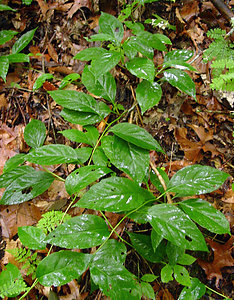

---
aliases:
- Austrobaileials
- Austrobaileyales
- Austrobejliotvaré
- Austrobileyales
- Avstrobeyliyaçiçəklilər
- Aŭstrobailejaloj
- Tähtaniisipuulaadsed
- австробејлиовидни
- Австробэйлиецветные
- أستربيليات
- استربيليات
- جنوبویرهایسانان
- ஆசுட்ரோபெய்லேல்சு
- アウストロバイレヤ目
- 木兰藤目
- 아우스트로바일레이아목
title: Austrobaileyales
has_id_wikidata: Q21788
dv_has_:
  name_:
    an: Austrobaileyales
    ar: أستربيليات
    arz: استربيليات
    ast: Austrobaileyales
    az: Avstrobeyliyaçiçəklilər
    bg: Austrobaileyales
    bs: Austrobaileyales
    ca: Austrobaileials
    ceb: Austrobaileyales
    cs: Austrobaileyales
    da: Austrobaileyales
    de: Austrobaileyales
    en: Austrobaileyales
    en-ca: Austrobaileyales
    en-gb: Austrobaileyales
    eo: Aŭstrobailejaloj
    es: Austrobaileyales
    et: Tähtaniisipuulaadsed
    eu: Austrobaileyales
    ext: Austrobaileyales
    fa: جنوبویرهایسانان
    fi: Austrobaileyales
    fr: Austrobaileyales
    frr: Austrobaileyales
    ga: Austrobaileyales
    gl: Austrobaileyales
    hr: Austrobaileyales
    hu: Austrobaileyales
    ia: Austrobaileyales
    id: Austrobaileyales
    ie: Austrobaileyales
    io: Austrobaileyales
    it: Austrobaileyales
    ja: アウストロバイレヤ目
    jv: Austrobileyales
    ko: 아우스트로바일레이아목
    ku: Austrobaileyales
    la: Austrobaileyales
    mk: австробејлиовидни
    mul: Austrobaileyales
    nb: Austrobaileyales
    nl: Austrobaileyales
    oc: Austrobaileyales
    pl: Austrobaileyales
    pt: Austrobaileyales
    pt-br: Austrobaileyales
    ro: Austrobaileyales
    ru: Австробэйлиецветные
    sh: Austrobaileyales
    sk: Austrobejliotvaré
    sq: Austrobaileyales
    sr: Austrobaileyales
    sv: Austrobaileyales
    ta: ஆசுட்ரோபெய்லேல்சு
    uk: Austrobaileyales
    vec: Austrobaileyales
    vi: Austrobaileyales
    vo: Austrobaileyales
    war: Austrobaileyales
    zh: 木兰藤目
    zh-cn: 木兰藤目
    zh-hans: 木兰藤目
    zh-hant: 木兰藤目
---
# [[Austrobaileyales]] 

## #has_/text_of_/abstract 

> **Austrobaileyales** is an order of flowering plants consisting of 
> about 100 species of woody plants growing as trees, shrubs and lianas. 
> 
> A well known example is Illicium verum, commonly known as star anise. 
> 
> The order belongs to the group of basal angiosperms, 
> the ANA grade (Amborellales, Nymphaeales, and Austrobaileyales), 
> which diverged earlier from the remaining flowering plants. 
> Austrobaileyales is sister to all remaining extant angiosperms outside the ANA grade.
>
> The order includes just three families of flowering plants: 
> - the Austrobaileyaceae, a monotypic family containing the sole genus, 
> - Austrobaileya scandens, a woody liana; 
> - the Schisandraceae, a family of trees, shrubs, or lianas containing essential oils; and 
> - the Trimeniaceae, essential oil-bearing trees and lianas.
>
> [Wikipedia](https://en.wikipedia.org/wiki/Austrobaileyales) 

## Phylogeny 

-   « Ancestral Groups  
    -   [Flowering_Plant](../Flowering_Plant.md)
    -   [Seed_Plant](../../Seed_Plant.md)
    -   [Land_Plant](../../../Land_Plant.md)
    -  [Green plants](../../../../Plant.md) 
    -  [Eukarya](../../../../../Eukarya.md) 
    -   [Tree of Life](../../../../../Tree_of_Life.md)

-   ◊ Sibling Groups of  Angiosperms
    -   [Amborella trichopoda](Amborella.md)
    -   [Magnoliids](Magnoliids.md)
    -   [Chloranthaceae](Chloranthaceae.md)
    -   [Ceratophyllaceae](Ceratophyllaceae.md)
    -   [Monocot](Monocot.md)
    -   [Eudicots](Eudicots.md)
    -   Austrobaileyales
    -   [Nymphaeaceae](Nymphaeaceae.md)

-   » Sub-Groups 

## Title Illustrations

-----------------------------------

scientific_name ::   Illicium floridanum
location ::         Southeastern United States
Comments           purple anise
Reference          from Curtis Botanical Magazine 1799
Creator            Image by Sydenham S. Edwards
Acknowledgements   Courtesy [National Agricultural Library, ARS, USDA](http://www.nal.usda.gov/curtis/index.shtml)

------------------------------

scientific_name ::     Schisandra glabra
location ::           West Feliciana Parish, Louisiana
Comments             bay starvine
Acknowledgements     Photograph courtesy [InsectImages.org](http://www.insectimages.org/) (#1241322)
specimen_condition ::  Live Specimen
Source Collection    [InsectImages.org](http://www.insectimages.org/)
copyright ::            © James Henderson, Gulf South Research Corporation

## Confidential Links & Embeds: 

### #is_/same_as :: [[/_Standards/bio/bio~Domain/Eukarya/Plant/Land_Plant/Seed_Plant/Flowering_Plant/Austrobaileyales|Austrobaileyales]] 

### #is_/same_as :: [[/_public/bio/bio~Domain/Eukarya/Plant/Land_Plant/Seed_Plant/Flowering_Plant/Austrobaileyales.public|Austrobaileyales.public]] 

### #is_/same_as :: [[/_internal/bio/bio~Domain/Eukarya/Plant/Land_Plant/Seed_Plant/Flowering_Plant/Austrobaileyales.internal|Austrobaileyales.internal]] 

### #is_/same_as :: [[/_protect/bio/bio~Domain/Eukarya/Plant/Land_Plant/Seed_Plant/Flowering_Plant/Austrobaileyales.protect|Austrobaileyales.protect]] 

### #is_/same_as :: [[/_private/bio/bio~Domain/Eukarya/Plant/Land_Plant/Seed_Plant/Flowering_Plant/Austrobaileyales.private|Austrobaileyales.private]] 

### #is_/same_as :: [[/_personal/bio/bio~Domain/Eukarya/Plant/Land_Plant/Seed_Plant/Flowering_Plant/Austrobaileyales.personal|Austrobaileyales.personal]] 

### #is_/same_as :: [[/_secret/bio/bio~Domain/Eukarya/Plant/Land_Plant/Seed_Plant/Flowering_Plant/Austrobaileyales.secret|Austrobaileyales.secret]] 

