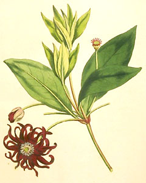

---
aliases:
  - Austrobaileyales
title: Austrobaileyales
---

# [[Austrobaileyales]] 

## #has_/text_of_/abstract 

> **Austrobaileyales** is an order of flowering plants consisting of 
> about 100 species of woody plants growing as trees, shrubs and lianas. 
> 
> A well known example is Illicium verum, commonly known as star anise. 
> 
> The order belongs to the group of basal angiosperms, 
> the ANA grade (Amborellales, Nymphaeales, and Austrobaileyales), 
> which diverged earlier from the remaining flowering plants. 
> Austrobaileyales is sister to all remaining extant angiosperms outside the ANA grade.
>
> The order includes just three families of flowering plants: 
> - the Austrobaileyaceae, a monotypic family containing the sole genus, 
> - Austrobaileya scandens, a woody liana; 
> - the Schisandraceae, a family of trees, shrubs, or lianas containing essential oils; and 
> - the Trimeniaceae, essential oil-bearing trees and lianas.
>
> [Wikipedia](https://en.wikipedia.org/wiki/Austrobaileyales)

## Phylogeny 

-   « Ancestral Groups  
    -   [Flowering_Plant](../Flowering_Plant.md)
    -   [Seed_Plant](../../Seed_Plant.md)
    -   [Land_Plant](../../../Land_Plant.md)
    -  [Green plants](../../../../Plant.md) 
    -  [Eukarya](../../../../../Eukarya.md) 
    -   [Tree of Life](../../../../../Tree_of_Life.md)

-   ◊ Sibling Groups of  Angiosperms
    -   [Amborella trichopoda](Amborella.md)
    -   [Magnoliids](Magnoliids.md)
    -   [Chloranthaceae](Chloranthaceae.md)
    -   [Ceratophyllaceae](Ceratophyllaceae.md)
    -   [Monocot](Monocot.md)
    -   [Eudicots](Eudicots.md)
    -   Austrobaileyales
    -   [Nymphaeaceae](Nymphaeaceae.md)

-   » Sub-Groups 

## Title Illustrations

-----------------------------------

Scientific Name ::   Illicium floridanum
Location ::         Southeastern United States
Comments           purple anise
Reference          from Curtis Botanical Magazine 1799
Creator            Image by Sydenham S. Edwards
Acknowledgements   Courtesy [National Agricultural Library, ARS, USDA](http://www.nal.usda.gov/curtis/index.shtml)

------------------------------

Scientific Name ::     Schisandra glabra
Location ::           West Feliciana Parish, Louisiana
Comments             bay starvine
Acknowledgements     Photograph courtesy [InsectImages.org](http://www.insectimages.org/) (#1241322)
Specimen Condition   Live Specimen
Source Collection    [InsectImages.org](http://www.insectimages.org/)
Copyright ::            © James Henderson, Gulf South Research Corporation

## Confidential Links & Embeds: 

### #is_/same_as :: [Austrobaileyales](/_Standards/bio/bio~Domain/Eukarya/Plant/Land_Plant/Seed_Plant/Flowering_Plant/Austrobaileyales.md) 

### #is_/same_as :: [Austrobaileyales.public](/_public/bio/bio~Domain/Eukarya/Plant/Land_Plant/Seed_Plant/Flowering_Plant/Austrobaileyales.public.md) 

### #is_/same_as :: [Austrobaileyales.internal](/_internal/bio/bio~Domain/Eukarya/Plant/Land_Plant/Seed_Plant/Flowering_Plant/Austrobaileyales.internal.md) 

### #is_/same_as :: [Austrobaileyales.protect](/_protect/bio/bio~Domain/Eukarya/Plant/Land_Plant/Seed_Plant/Flowering_Plant/Austrobaileyales.protect.md) 

### #is_/same_as :: [Austrobaileyales.private](/_private/bio/bio~Domain/Eukarya/Plant/Land_Plant/Seed_Plant/Flowering_Plant/Austrobaileyales.private.md) 

### #is_/same_as :: [Austrobaileyales.personal](/_personal/bio/bio~Domain/Eukarya/Plant/Land_Plant/Seed_Plant/Flowering_Plant/Austrobaileyales.personal.md) 

### #is_/same_as :: [Austrobaileyales.secret](/_secret/bio/bio~Domain/Eukarya/Plant/Land_Plant/Seed_Plant/Flowering_Plant/Austrobaileyales.secret.md)

