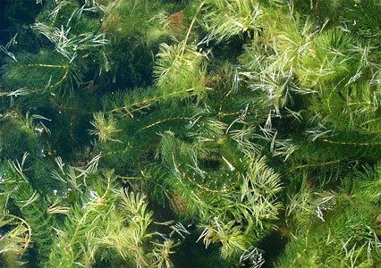

---
aliases:
- Ceratophyllaceae
- coontail
title: Ceratophyllaceae
---

## Phylogeny 

-   « Ancestral Groups  
    -   [Flowering_Plant](../Flowering_Plant.md)
    -   [Seed_Plant](../../Seed_Plant.md)
    -   [Land_Plant](../../../Land_Plant.md)
    -  [Green plants](../../../../Plant.md))
    -  [Eukarya](../../../../../Eukarya.md))
    -   [Tree of Life](../../../../../Tree_of_Life.md)

-   ◊ Sibling Groups of  Angiosperms
    -   [Amborella trichopoda](Amborella.md)
    -   [Magnoliids](Magnoliids.md)
    -   [Chloranthaceae](Chloranthaceae.md)
    -   Ceratophyllaceae
    -   [Monocot](Monocot.md)
    -   [Eudicots](Eudicots.md)
    -   [Austrobaileyales](Austrobaileyales.md)
    -   [Nymphaeaceae](Nymphaeaceae.md)

-   » Sub-Groups 

# Ceratophyllaceae 

## #has_/text_of_/abstract 

> **Ceratophyllaceae** is a cosmopolitan family of flowering plants 
> including one living genus commonly found in ponds, marshes, 
> and quiet streams in tropical and in temperate regions. 
> 
> It is the only extant family in the order Ceratophyllales. 
> Species are commonly called coontails or hornworts, 
> although hornwort is also used for unrelated plants of the division Anthocerotophyta.
>
> Living Ceratophyllum grows completely submerged, usually, 
> though not always, floating on the surface, and does not tolerate drought.
>
> [Wikipedia](https://en.wikipedia.org/wiki/Ceratophyllaceae) 

## Title Illustrations

------------------------------------------------------------------------

Scientific Name ::   Ceratophyllum demersum
Comments           Cultivated at the Botanical Garden Basel, Switzerland.
Acknowledgements   courtesy [Botanical Image Database](http://www.unibas.ch/botimage/)
Copyright ::          © 2001 University of Basel, Basel, Switzerland 

## Confidential Links & Embeds: 

### #is_/same_as :: [Ceratophyllaceae](/_Standards/bio/bio~Domain/Eukarya/Plant/Land_Plant/Seed_Plant/Flowering_Plant/Ceratophyllaceae.md) 

### #is_/same_as :: [Ceratophyllaceae.public](/_public/bio/bio~Domain/Eukarya/Plant/Land_Plant/Seed_Plant/Flowering_Plant/Ceratophyllaceae.public.md) 

### #is_/same_as :: [Ceratophyllaceae.internal](/_internal/bio/bio~Domain/Eukarya/Plant/Land_Plant/Seed_Plant/Flowering_Plant/Ceratophyllaceae.internal.md) 

### #is_/same_as :: [Ceratophyllaceae.protect](/_protect/bio/bio~Domain/Eukarya/Plant/Land_Plant/Seed_Plant/Flowering_Plant/Ceratophyllaceae.protect.md) 

### #is_/same_as :: [Ceratophyllaceae.private](/_private/bio/bio~Domain/Eukarya/Plant/Land_Plant/Seed_Plant/Flowering_Plant/Ceratophyllaceae.private.md) 

### #is_/same_as :: [Ceratophyllaceae.personal](/_personal/bio/bio~Domain/Eukarya/Plant/Land_Plant/Seed_Plant/Flowering_Plant/Ceratophyllaceae.personal.md) 

### #is_/same_as :: [Ceratophyllaceae.secret](/_secret/bio/bio~Domain/Eukarya/Plant/Land_Plant/Seed_Plant/Flowering_Plant/Ceratophyllaceae.secret.md)

