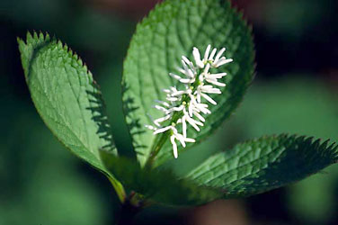
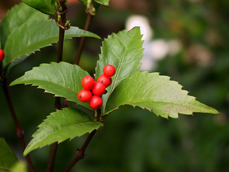

---
aliases:
- Chloranthaceae
- Chlorantusowe rostliny
- clorantàcies
- Họ Hoa sói
- Klorantacoj
- zelenokvetotvaré
- zieleńcowce
- žlutokvětovité
- Хлорантові
- Хлорантовые
- כלורנתיים
- عطروريات
- كلورانطيه
- วงศ์กระดูกไก่
- センリョウ科
- 金粟兰科
- 金粟蘭科
- 홀아비꽃대과
title: Chloranthaceae
has_id_wikidata: Q133208
dv_has_:
  name_:
    an: Chloranthaceae
    ar: عطروريات
    arz: كلورانطيه
    ast: Chloranthaceae
    az: Chloranthaceae
    bg: Chloranthaceae
    bs: Chloranthaceae
    ca: clorantàcies
    ceb: Chloranthaceae
    cs: žlutokvětovité
    cy: Chloranthaceae
    da: Chloranthaceae
    de: Chloranthaceae
    en: Chloranthaceae
    eo: Klorantacoj
    es: Chloranthaceae
    et: Chloranthaceae
    eu: Chloranthaceae
    ext: Chloranthaceae
    fi: Chloranthaceae
    fr: Chloranthaceae
    frr: Chloranthaceae
    ga: Chloranthaceae
    gl: Chloranthaceae
    he: כלורנתיים
    hr: Chloranthaceae
    hsb: Chlorantusowe rostliny
    hu: Chloranthaceae
    ia: Chloranthaceae
    id: Chloranthaceae
    ie: Chloranthaceae
    io: Chloranthaceae
    it: Chloranthaceae
    ja: センリョウ科
    jv: Chloranthaceae
    ko: 홀아비꽃대과
    la: Chloranthaceae
    mul: Chloranthaceae
    nb: Chloranthaceae
    nl: Chloranthaceae
    oc: Chloranthaceae
    pl: zieleńcowce
    pt: Chloranthaceae
    pt_br: Chloranthaceae
    ro: Chloranthaceae
    ru: Хлорантовые
    sk: zelenokvetotvaré
    sq: Chloranthaceae
    sr: Chloranthaceae
    sr_ec: Chloranthaceae
    sr_el: Chloranthaceae
    sv: Chloranthaceae
    th: วงศ์กระดูกไก่
    uk: Хлорантові
    vi: Họ Hoa sói
    vo: Chloranthaceae
    war: Chloranthaceae
    zh: 金粟兰科
    zh_cn: 金粟兰科
    zh_hans: 金粟兰科
    zh_hant: 金粟蘭科
    zh_hk: 金粟蘭科
    zh_sg: 金粟兰科
    zh_tw: 金粟蘭科
---

# [[Chloranthaceae]] 
)  

## #has_/text_of_/abstract 

> **Chloranthaceae** ( klor-ann-THAY-see-ee) is a family of flowering plants (angiosperms), 
> the only family in the order Chloranthales. 
> 
> It is not closely related to any other family of flowering plants, 
> and is among the early-diverging lineages in the angiosperms. 
> 
> They are woody or weakly woody plants occurring in Southeast Asia, the Pacific, 
> Madagascar, Central and South America, and the West Indies. 
> 
> The family consists of four extant genera, totalling about 77 known species 
> according to Christenhusz and Byng in 2016. 
> 
> Some species are used in traditional medicine.  The type genus is Chloranthus. 
> The fossil record of the family, mostly represented by pollen such as Clavatipollenites, 
> extends back to the dawn of the history of flowering plants in the Early Cretaceous, 
> and has been found on all continents.
>
> [Wikipedia](https://en.wikipedia.org/wiki/Chloranthaceae) 

## Phylogeny 

-   « Ancestral Groups  
    -   [Flowering_Plant](../Flowering_Plant.md)
    -   [Seed_Plant](../../Seed_Plant.md)
    -   [Land_Plant](../../../Land_Plant.md)
    -  [Green plants](../../../../Plant.md) 
    -  [Eukarya](../../../../../Eukarya.md) 
    -   [Tree of Life](../../../../../Tree_of_Life.md)

-   ◊ Sibling Groups of  Angiosperms
    -   [Amborella trichopoda](Amborella.md)
    -   [Magnoliids](Magnoliids.md)
    -   Chloranthaceae
    -   [Ceratophyllaceae](Ceratophyllaceae.md)
    -   [Monocot](Monocot.md)
    -   [Eudicots](Eudicots.md)
    -   [Austrobaileyales](Austrobaileyales.md)
    -   [Nymphaeaceae](Nymphaeaceae.md)

-   » Sub-Groups 

## Title Illustrations

-------------------------------------------------------- 
 
scientific_name ::     Sarcandra glabra
specimen_condition ::  Live Specimen
Body Part            fruits
Source               [Sarcandra glabra](http://flickr.com/photos/jam343/2103091/)
Source Collection    [Flickr](http://flickr.com/)
Image Use ::    [Attribution 2.0 Creative Commons License](http://creativecommons.org/licenses/by/2.0/).
copyright ::            © 2004 [Juni A.](http://flickr.com/people/jam343/)

-------------------------------------------------------------------------

[Chloranthus japonicus](Chloranthaceae/Sarcandra_glabra.jpg) 
scientific_name ::    Chloranthus japonicus
location ::          Vityaz inlet, Gamov Peninsula, Khasansky distr., Primorsky Territory (Russian Federation)
Source Collection   [CalPhotos](http://calphotos.berkeley.edu/)
copyright ::           © 2001 [Nick Kurzenko](mailto:kurzenko@ibss.dvo.ru) 

## Confidential Links & Embeds: 

### #is_/same_as :: [[/_Standards/bio/bio~Domain/Eukarya/Plant/Land_Plant/Seed_Plant/Flowering_Plant/Chloranthaceae|Chloranthaceae]] 

### #is_/same_as :: [[/_public/bio/bio~Domain/Eukarya/Plant/Land_Plant/Seed_Plant/Flowering_Plant/Chloranthaceae.public|Chloranthaceae.public]] 

### #is_/same_as :: [[/_internal/bio/bio~Domain/Eukarya/Plant/Land_Plant/Seed_Plant/Flowering_Plant/Chloranthaceae.internal|Chloranthaceae.internal]] 

### #is_/same_as :: [[/_protect/bio/bio~Domain/Eukarya/Plant/Land_Plant/Seed_Plant/Flowering_Plant/Chloranthaceae.protect|Chloranthaceae.protect]] 

### #is_/same_as :: [[/_private/bio/bio~Domain/Eukarya/Plant/Land_Plant/Seed_Plant/Flowering_Plant/Chloranthaceae.private|Chloranthaceae.private]] 

### #is_/same_as :: [[/_personal/bio/bio~Domain/Eukarya/Plant/Land_Plant/Seed_Plant/Flowering_Plant/Chloranthaceae.personal|Chloranthaceae.personal]] 

### #is_/same_as :: [[/_secret/bio/bio~Domain/Eukarya/Plant/Land_Plant/Seed_Plant/Flowering_Plant/Chloranthaceae.secret|Chloranthaceae.secret]] 

