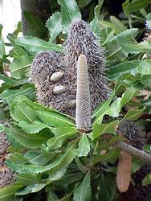
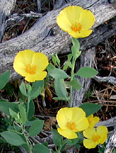
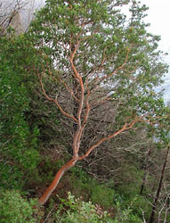

---
aliases:
- "'Nieuwe' tweezaadlobbigen"
- Aitokaksisirkkaiset
- Chin-siang-chí-hio̍h si̍t-bu̍t
- Dicotylédones vraies
- Dı hebıkıni
- ekte tofrøbladete planter
- ekte tofrøbladingar
- Eodikôtiledôna
- Eudicot
- Eudicote
- Eudicotidae
- eudicotiledoni
- Eudicotiledonèas
- Eudicotiledònies
- Eudicotiledóneas
- eudicotiledôneas
- Eudicots
- Eudicotyledonae
- Eudicotyledoneae
- Eudicotyln
- Eudikot
- Eudikotil
- Eudikotiledone
- Eudikotyledonen
- Evdikotlar
- Ewdicot
- Kimsa khata sisayuq
- non-magnoliid dicot
- olmâkyevtalgâlostâsiih
- prave dvokaličnice
- Pravé dvojklíčnolistové rastliny
- Rosopsida
- thực vật hai lá mầm thật sự
- Tricolpate
- trikolpater
- valódi kétszikűek
- Verdukotiledonaj
- vyšší dvouděložné
- çift çenekliler
- Ευδικοτυλήδονα
- евдикоти
- еудікоти
- еудикоти
- эўдыкоты
- эвдикоты
- էվդիկոտներ
- דו-פסיגיים אמיתיים
- النباتات ذوات الفلقتين
- ايوڊيڪاٽس
- دولپهایهای نو
- یوٗڈیکوٹٕس
- یوڈیکوٹس
- युडिकॉट
- यूडिकॉट्स
- সুদ্বিবীজপত্রী
- மெய்இருவித்திலி
- యుడికాట్స్
- യൂഡികോട്സ്
- พืชใบเลี้ยงคู่แท้
- 真双子叶植物
- 真孖葉植物
- 真正双子葉類
- 真雙子葉植物
- 진정쌍떡잎식물
title: eudicots
has_id_wikidata: Q165468
dv_has_:
  name_:
    af: Eudicots
    ar: النباتات ذوات الفلقتين
    ast: Eudicotyledoneae
    az: Evdikotlar
    bcl: Eudicots
    be: Eudicots
    be_tarask: эўдыкоты
    bg: еудикоти
    bho: यूडिकॉट्स
    bn: সুদ্বিবীজপত্রী
    bs: Eudikotiledone
    ca: Eudicotiledònies
    ceb: eudicots
    cs: vyšší dvouděložné
    cy: Ewdicot
    de: Eudikotyledonen
    diq: Dı hebıkıni
    el: Ευδικοτυλήδονα
    en: eudicots
    eo: Verdukotiledonaj
    es: Eudicotyledoneae
    eu: Eudicotyledoneae
    fa: دولپهایهای نو
    fi: Aitokaksisirkkaiset
    fr: Dicotylédones vraies
    ga: Eudicotidae
    gl: Eudicotiledóneas
    gv: Eudicotyledonae
    he: דו-פסיגיים אמיתיים
    hi: युडिकॉट
    hsb: Rosopsida
    hu: valódi kétszikűek
    hy: էվդիկոտներ
    ia: Eudicotyledoneae
    id: Eudikotil
    ilo: Eudicotidae
    it: eudicotiledoni
    ja: 真正双子葉類
    jv: Eudicots
    ko: 진정쌍떡잎식물
    ks: یوٗڈیکوٹٕس
    la: Eudicotyledoneae
    lb: Rosopsida
    mg: Eodikôtiledôna
    mk: евдикоти
    ml: യൂഡികോട്സ്
    ms: Eudikot
    nan: Chin-siang-chí-hio̍h si̍t-bu̍t
    nb: ekte tofrøbladete planter
    nl: "'Nieuwe' tweezaadlobbigen"
    nn: ekte tofrøbladingar
    oc: Eudicotiledonèas
    pl: Rosopsida
    pt: eudicotiledôneas
    pt_br: eudicotiledôneas
    qu: Kimsa khata sisayuq
    ro: Eudicote
    ru: эвдикоты
    sco: Eudicots
    sd: ايوڊيڪاٽس
    sh: Eudikotiledone
    sk: Pravé dvojklíčnolistové rastliny
    sl: prave dvokaličnice
    smn: olmâkyevtalgâlostâsiih
    sq: eudicots
    sr: Eudikotiledone
    sv: trikolpater
    ta: மெய்இருவித்திலி
    te: యుడికాట్స్
    th: พืชใบเลี้ยงคู่แท้
    tl: Eudicots
    tr: çift çenekliler
    uk: еудікоти
    ur: یوڈیکوٹس
    vi: thực vật hai lá mầm thật sự
    vls: Eudicotyln
    war: eudicots
    wuu: 真双子叶植物
    yue: 真孖葉植物
    zh: 真双子叶植物
    zh_cn: 真双子叶植物
    zh_hans: 真双子叶植物
    zh_hant: 真雙子葉植物
    zh_hk: 真雙子葉植物
    zh_sg: 真双子叶植物
    zh_tw: 真雙子葉植物
---

# [[Eudicots]]

     

#is_/same_as :: [[_Standards/WikiData/WD~core_eudicots,869087]]

## #has_/text_of_/abstract 

> The **Eudicots** or eudicotyledons are flowering plants 
> that have two seed leaves (cotyledons) upon germination. 
> 
> The term derives from dicotyledon (etymologically, eu = true; di = two; cotyledon = seed leaf). 
> Historically, authors have used the terms tricolpates or non-magnoliid dicots. 
> 
> The current botanical terms were introduced in 1991, 
> by evolutionary botanist James A. Doyle and paleobotanist Carol L. Hotton, 
> to emphasize the later evolutionary divergence of tricolpate dicots 
> from earlier, less specialized, dicots.
>
> Scores of familiar plants are eudicots, including many commonly cultivated and edible plants, 
> numerous trees, tropicals and ornamentals. 
> 
> Among the most well-known eudicot genera are those of the 
> - sunflower (Helianthus), 
> - dandelion (Taraxacum), 
> - forget-me-not (Myosotis), 
> - cabbage (Brassica), 
> - apple (Malus), 
> - buttercup (Ranunculus), 
> - maple (Acer) and 
> - macadamia (Macadamia). 
> 
> Most leafy, mid-latitude trees are also classified as eudicots, 
> with notable exceptions being the magnolias and American tulip tree (Liriodendron)—
> which belong to the magnoliids—and Ginkgo biloba, which is not an angiosperm.
>
> [Wikipedia](https://en.wikipedia.org/wiki/Eudicots) 

## Phylogeny 

-   « Ancestral Groups  
    -   [Flowering_Plant](../Flowering_Plant.md)
    -   [Seed_Plant](../../Seed_Plant.md)
    -   [Land_Plant](../../../Land_Plant.md)
    -  [Green plants](../../../../Plant.md) 
    -  [Eukarya](../../../../../Eukarya.md) 
    -   [Tree of Life](../../../../../Tree_of_Life.md)

-   ◊ Sibling Groups of  Angiosperms
    -   [Amborella trichopoda](Amborella.md)
    -   [Magnoliids](Magnoliids.md)
    -   [Chloranthaceae](Chloranthaceae.md)
    -   [Ceratophyllaceae](Ceratophyllaceae.md)
    -   [Monocot](Monocot.md)
    -   eudicots
    -   [Austrobaileyales](Austrobaileyales.md)
    -   [Nymphaeaceae](Nymphaeaceae.md)

-   » Sub-Groups
    -   [Buxaceae](Eudicots/Buxaceae.md)
    -   [Ranunculales](Eudicots/Ranunculales.md)
    -   [Proteales](Eudicots/Proteales.md)
    -  [Core Eudicots](Eudicots/Core_Eudicots.md) 

## Title Illustrations

---------------------------------------------------------------------
 
scientific_name ::  Banksia serrata
Comments          Proteales, Proteaceae
copyright ::         © [Kurt Stüber](http://www.biolib.de/) 

---------------------

scientific_name ::     Dendromecon rigida
location ::           Placer County, California, US
Comments             Tree Poppy, Ranunculales, Papaveraceae
specimen_condition ::  Live Specimen
Source Collection    [CalPhotos](http://calphotos.berkeley.edu/)
copyright ::            © 2001 [Russell Towle](mailto:rtowle@neworld.net)

------------------------------------------------------------------------
 
scientific_name ::   Arbutus andrachne
location ::         Samos, Greece.
Comments           Core Eudicots, Ericaceae
Acknowledgements   courtesy [Botanical Image Database](http://www.unibas.ch/botimage/)
copyright ::          © 2001 University of Basel, Basel, Switzerland 

## Confidential Links & Embeds: 

### #is_/same_as :: [[/_Standards/bio/bio~Domain/Eukarya/Plant/Land_Plant/Seed_Plant/Flowering_Plant/Eudicots|Eudicots]] 

### #is_/same_as :: [[/_public/bio/bio~Domain/Eukarya/Plant/Land_Plant/Seed_Plant/Flowering_Plant/Eudicots.public|Eudicots.public]] 

### #is_/same_as :: [[/_internal/bio/bio~Domain/Eukarya/Plant/Land_Plant/Seed_Plant/Flowering_Plant/Eudicots.internal|Eudicots.internal]] 

### #is_/same_as :: [[/_protect/bio/bio~Domain/Eukarya/Plant/Land_Plant/Seed_Plant/Flowering_Plant/Eudicots.protect|Eudicots.protect]] 

### #is_/same_as :: [[/_private/bio/bio~Domain/Eukarya/Plant/Land_Plant/Seed_Plant/Flowering_Plant/Eudicots.private|Eudicots.private]] 

### #is_/same_as :: [[/_personal/bio/bio~Domain/Eukarya/Plant/Land_Plant/Seed_Plant/Flowering_Plant/Eudicots.personal|Eudicots.personal]] 

### #is_/same_as :: [[/_secret/bio/bio~Domain/Eukarya/Plant/Land_Plant/Seed_Plant/Flowering_Plant/Eudicots.secret|Eudicots.secret]] 

