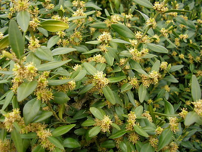
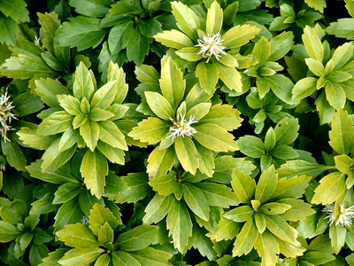

---
aliases:
- Buchsbaum
- Buchsbaumgewächs
- Buxaceae
- Buxus
title: Buxaceae
---

# [[Buxaceae]]  

## #has_/text_of_/abstract 

> The **Buxaceae** are a small family of six genera and about 123 known species of flowering plants. 
> They are shrubs and small trees, with a cosmopolitan distribution. 
> A seventh genus, sometimes accepted in the past (Notobuxus), 
> has been shown by genetic studies to be included within Buxus (Balthazar et al., 2000).
>
> The family is recognised by most taxonomists, and it is commonly known as the box family. 
> However, its placement and circumscription has varied; 
> some taxonomists treated Styloceras in its own family Stylocerataceae, 
> Didymeles in its own family Didymelaceae, Haptanthus in Haptanthaceae 
> (now all included in Buxaceae)), and formerly Simmondsia was included, 
> which is not related and now usually placed in its own family Simmondsiaceae.
>
> The APG II system of 2003 recognises the family, 
> but in a new circumscription in that it includes the genus Didymeles 
> (two species of evergreen trees from Madagascar). 
> 
> However, APG II does allow the option of segregating this genus as family Didymelaceae, as an optional segregate. This represents a slight change from the APG system of 1998, which firmly recognised both families as separate. In both APG and APG II, the family Buxaceae is unplaced as to order and left among the basal lineages of the eudicots. The AP website suggests instating the order Buxales for this family and the family Didymelaceae. In the APG IV system of 2016, Haptanthus and Didymeles are included in Buxaceae, which is the only family in Buxales.
>
> [Wikipedia](https://en.wikipedia.org/wiki/Buxaceae)

## Phylogeny 

-   « Ancestral Groups  
    -   [Eudicots](../Eudicots.md)
    -   [Flowering_Plant](../../Flowering_Plant.md)
    -   [Seed_Plant](../../../Seed_Plant.md)
    -   [Land_Plant](../../../../Land_Plant.md)
    -  [Green plants](../../../../../Plant.md))
    -  [Eukarya](../../../../../../Eukarya.md))
    -   [Tree of Life](../../../../../../Tree_of_Life.md)

-   ◊ Sibling Groups of  eudicots
    -   Buxaceae
    -   [Ranunculales](Ranunculales.md)
    -   [Proteales](Proteales.md)
    -  [Core Eudicots](Core_Eudicots.md))

-   » Sub-Groups 

## Title Illustrations
)

  ---------------------------------------------------------------------------
  Scientific Name ::     Buxus sempervirens
  Location ::           Romania
  Specimen Condition   Live Specimen
  Identified By        Ilisoi Gabriel
  Body Part            Aerial
  View                 General
  Copyright ::            © [Gabriel Ilisoi](mailto:ilisoi_gabriel@yahoo.co.uk) 
  ---------------------------------------------------------------------------
)

  --------------------------------------------------------
  Scientific Name ::     Pachysandra terminalis
  Specimen Condition   Live Specimen
  Source               [Pachysandra terminalis](http://flickr.com/photos/u123072/153530768/)
  Source Collection    [Flickr](http://flickr.com/)
  Image Use ::    [Attribution 2.0 Creative Commons License](http://creativecommons.org/licenses/by/2.0/).
  Copyright ::            © 2006 [Mark](http://flickr.com/people/u123072/)
  --------------------------------------------------------

## Confidential Links & Embeds: 

### #is_/same_as :: [Buxaceae](/_Standards/bio/bio~Domain/Eukarya/Plant/Land_Plant/Seed_Plant/Flowering_Plant/Eudicots/Buxaceae.md) 

### #is_/same_as :: [Buxaceae.public](/_public/bio/bio~Domain/Eukarya/Plant/Land_Plant/Seed_Plant/Flowering_Plant/Eudicots/Buxaceae.public.md) 

### #is_/same_as :: [Buxaceae.internal](/_internal/bio/bio~Domain/Eukarya/Plant/Land_Plant/Seed_Plant/Flowering_Plant/Eudicots/Buxaceae.internal.md) 

### #is_/same_as :: [Buxaceae.protect](/_protect/bio/bio~Domain/Eukarya/Plant/Land_Plant/Seed_Plant/Flowering_Plant/Eudicots/Buxaceae.protect.md) 

### #is_/same_as :: [Buxaceae.private](/_private/bio/bio~Domain/Eukarya/Plant/Land_Plant/Seed_Plant/Flowering_Plant/Eudicots/Buxaceae.private.md) 

### #is_/same_as :: [Buxaceae.personal](/_personal/bio/bio~Domain/Eukarya/Plant/Land_Plant/Seed_Plant/Flowering_Plant/Eudicots/Buxaceae.personal.md) 

### #is_/same_as :: [Buxaceae.secret](/_secret/bio/bio~Domain/Eukarya/Plant/Land_Plant/Seed_Plant/Flowering_Plant/Eudicots/Buxaceae.secret.md)

