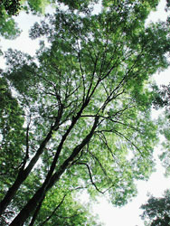
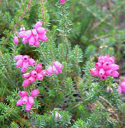
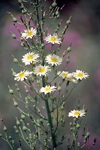

---
title: Asterids
---

# [[Asterids]]  

     

## #has_/text_of_/abstract 

> **Asterids** are a large clade (monophyletic group) of flowering plants, 
> composed of 17 orders and more than 80,000 species, 
> about a third of the total flowering plant species. 
> 
> The asterids are divided into the unranked clades lamiids (8 orders) and campanulids (7 orders), 
> and the single orders Cornales and Ericales. Well-known asterids include dogwoods and hydrangeas (order Cornales), tea, blueberries, cranberries, kiwifruit, Brazil nuts, argan, sapote, and azaleas (order Ericales), sunflowers, lettuce, common daisy, yacon, carrots, celery, parsley, parsnips, ginseng, ivies, holly, honeysuckle, elder, and valerian (clade campanulids), borage, forget-me-nots, comfrey, coffee, frangipani, gentian, pong-pong, oleander, periwinkle, basil, mint, rosemary, sage, oregano, thyme, lavender, wild dagga, olives, ash, teak, foxgloves, lilac, jasmine, snapdragons, African violets, butterfly bushes, sesame, psyllium, potatoes, eggplants, tomatoes, chilli peppers, tobacco, petunias, morning glory, and sweet potato (clade lamiids).
>
> Most of the taxa belonging to this clade had been referred to as Asteridae in the Cronquist system (1981) and as Sympetalae in earlier systems.  The name asterids (not necessarily capitalised) resembles the earlier botanical name but is intended to be the name of a clade rather than a formal ranked name, in the sense of the ICBN.
>
> [Wikipedia](https://en.wikipedia.org/wiki/Asterids) 

## Phylogeny 

-   « Ancestral Groups  
    -  [Core Eudicots](../Core_Eudicots.md))
    -   [Core_Eudicots](../Core_Eudicots.md)
    -   [Flowering_Plant](../../../Flowering_Plant.md)
    -   [Seed_Plant](../../../../Seed_Plant.md)
    -   [Land_Plant](../../../../../Land_Plant.md)
    -  [Green plants](../../../../../../Plant.md))
    -  [Eukarya](../../../../../../../Eukarya.md))
    -   [Tree of Life](../../../../../../../Tree_of_Life.md)

-   ◊ Sibling Groups of  Core Eudicots
    -   [Santalales](Santalales.md)
    -   [Saxifragales](Saxifragales.md)
    -   [Berberidopsidales](Berberidopsidales.md)
    -   [Rosids](Rosids.md)
    -   [Caryophyllales](Caryophyllales.md)
    -   Asterids

-   » Sub-Groups
    -   [Cornales](Asterids/Cornales.md)
    -   [Ericales](Asterids/Cornales/Ericales.md)
    -   [Solanales](Asterids/Solanales.md)
    -   [Lamiales](Asterids/Lamiales.md)
    -   [Gentianales](Asterids/Gentianales.md)
    -   [Garryales](Asterids/Garryales.md)
    -   [Asterales](Asterids/Asterales.md)
    -   [Apiales](Asterids/Apiales.md)
    -   [Dipsacales](Asterids/Dipsacales.md)
    -   [Aquifoliales](Asterids/Aquifoliales.md)

## Title Illustrations

------------------------------------------------------------------------)
Scientific Name ::   Fraxinus excelsior
Location ::         Allschwil, Basel, Switzerland.
Comments           European ash (Lamiales, Oleaceae)
Acknowledgements   courtesy [Botanical Image Database](http://www.unibas.ch/botimage/)
Copyright ::          © 2001 University of Basel, Basel, Switzerland 

---------------------------------------------------------------------)
Scientific Name ::  Erica cinera
Comments          Bell heather (Ericales, Ericaceae)
Copyright ::         © [Kurt Stüber](http://www.biolib.de/) 

-------------------------------------------------------------------------)
Scientific Name ::     Lactuca
Location ::           Vladivostok city, Primorsky Territory (Russian Federation)
Comments             Asterales, Asteraceae
Specimen Condition   Live Specimen
Source Collection    [CalPhotos](http://calphotos.berkeley.edu/)
Copyright ::            © 1999 [Nick Kurzenko](mailto:kurzenko@ibss.dvo.ru) 

## Confidential Links & Embeds: 

### #is_/same_as ::[Asterids](Asterids.md)) 

### #is_/same_as :: [Asterids.public](/_public/bio/bio~Domain/Eukarya/Plants/Land_Plant/Seed_Plant/Flowering_Plant/Eudicots/Core_Eudicots/Asterids.public.md) 

### #is_/same_as :: [Asterids.internal](/_internal/bio/bio~Domain/Eukarya/Plants/Land_Plant/Seed_Plant/Flowering_Plant/Eudicots/Core_Eudicots/Asterids.internal.md) 

### #is_/same_as :: [Asterids.protect](/_protect/bio/bio~Domain/Eukarya/Plants/Land_Plant/Seed_Plant/Flowering_Plant/Eudicots/Core_Eudicots/Asterids.protect.md) 

### #is_/same_as :: [Asterids.private](/_private/bio/bio~Domain/Eukarya/Plants/Land_Plant/Seed_Plant/Flowering_Plant/Eudicots/Core_Eudicots/Asterids.private.md) 

### #is_/same_as :: [Asterids.personal](/_personal/bio/bio~Domain/Eukarya/Plants/Land_Plant/Seed_Plant/Flowering_Plant/Eudicots/Core_Eudicots/Asterids.personal.md) 

### #is_/same_as :: [Asterids.secret](/_secret/bio/bio~Domain/Eukarya/Plants/Land_Plant/Seed_Plant/Flowering_Plant/Eudicots/Core_Eudicots/Asterids.secret.md)

