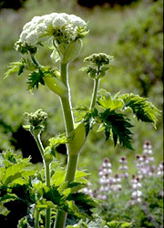

# [[Apiales]] 

 

#is_/same_as :: [[../../../../../../../../../../_Standards/WikiData/WD~Apiales,21138|WD~Apiales,21138]] 

## #has_/text_of_/abstract 

> The **Apiales** are an order of flowering plants, included in the asterid group of dicotyledons. 
> Well-known members of Apiales include carrots, celery, coriander, 
> parsley, parsnips, poison hemlock, ginseng, ivies, and pittosporums.
>
> Apiales consist of nine families, with the type family being the celery, carrot or parsley family, Apiaceae.
>
> [Wikipedia](https://en.wikipedia.org/wiki/Apiales)

## Phylogeny 

-   « Ancestral Groups  
    -   [Asterids](../Asterids.md)
    -  [Core Eudicots](../../Core_Eudicots.md))
    -   [Eudicots](../../../Eudicots.md)
    -   [Flowering_Plant](../../../../Flowering_Plant.md)
    -   [Seed_Plant](../../../../../Seed_Plant.md)
    -   [Land_Plant](../../../../../../Land_Plant.md)
    -  [Green plants](../../../../../../../Plant.md))
    -  [Eukarya](../../../../../../../../Eukarya.md))
    -   [Tree of Life](../../../../../../../../Tree_of_Life.md)

-   ◊ Sibling Groups of  Asterids
    -   [Cornales](Cornales.md)
    -   [Ericales](Cornales/Ericales.md)
    -   [Solanales](Solanales.md)
    -   [Lamiales](Lamiales.md)
    -   [Gentianales](Gentianales.md)
    -   [Garryales](Garryales.md)
    -   [Asterales](Asterales.md)
    -   Apiales
    -   [Dipsacales](Dipsacales.md)
    -   [Aquifoliales](Aquifoliales.md)

-   » Sub-Groups
    -   [Griselinia](Apiales/Griselinia.md)

## Title Illustrations

-------------------------------------------------------------------------)
Scientific Name ::     Kalopanax septemlobus
Location ::           Vladivostok suburb, Primorsky Territory (Russian Federation)
Comments             Castor aralia (Araliaceae)
Specimen Condition   Live Specimen
Source Collection    [CalPhotos](http://calphotos.berkeley.edu/)
Copyright ::            © 1999 [Nick Kurzenko](mailto:kurzenko@ibss.dvo.ru) 

------------------------------------------------------------------------------)
Scientific Name ::     Pittosporum crassifolium
Location ::           Golden Gate Park (San Francisco County, California, USA)
Comments             Stiffleaf cheesewood (Pittosporaceae)
Creator              Photograph by J.W. Thompson
Specimen Condition   Live Specimen
Source Collection    [CalPhotos](http://calphotos.berkeley.edu/)
Copyright ::            © 1999 [California Academy of Sciences](http://www.calacademy.org/) 

------------------------------------------------------------------------------)
Scientific Name ::     Heracleum lanatum (Apiaceae)
Location ::           Point Reyes National Seashore (Marin County, California, USA)
Creator              Photograph by Jo-Ann Ordano
Specimen Condition   Live Specimen
Source Collection    [CalPhotos](http://calphotos.berkeley.edu/)
Copyright ::            © 2000 [California Academy of Sciences](http://www.calacademy.org/) 

## Confidential Links & Embeds: 

### #is_/same_as :: [Apiales](/_Standards/bio/bio~Domain/Eukarya/Plant/Land_Plant/Seed_Plant/Flowering_Plant/Eudicots/Core_Eudicots/Asterids/Apiales.md) 

### #is_/same_as :: [Apiales.public](/_public/bio/bio~Domain/Eukarya/Plant/Land_Plant/Seed_Plant/Flowering_Plant/Eudicots/Core_Eudicots/Asterids/Apiales.public.md) 

### #is_/same_as :: [Apiales.internal](/_internal/bio/bio~Domain/Eukarya/Plant/Land_Plant/Seed_Plant/Flowering_Plant/Eudicots/Core_Eudicots/Asterids/Apiales.internal.md) 

### #is_/same_as :: [Apiales.protect](/_protect/bio/bio~Domain/Eukarya/Plant/Land_Plant/Seed_Plant/Flowering_Plant/Eudicots/Core_Eudicots/Asterids/Apiales.protect.md) 

### #is_/same_as :: [Apiales.private](/_private/bio/bio~Domain/Eukarya/Plant/Land_Plant/Seed_Plant/Flowering_Plant/Eudicots/Core_Eudicots/Asterids/Apiales.private.md) 

### #is_/same_as :: [Apiales.personal](/_personal/bio/bio~Domain/Eukarya/Plant/Land_Plant/Seed_Plant/Flowering_Plant/Eudicots/Core_Eudicots/Asterids/Apiales.personal.md) 

### #is_/same_as :: [Apiales.secret](/_secret/bio/bio~Domain/Eukarya/Plant/Land_Plant/Seed_Plant/Flowering_Plant/Eudicots/Core_Eudicots/Asterids/Apiales.secret.md)

