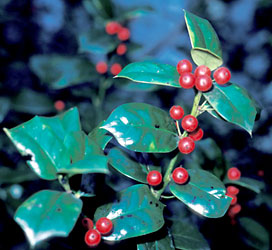

---
aliases:
- Akvifolialoj
- Aquifoliales
- Aqüifolials
- Astelpõõsalaadsed
- bodikovci
- Bộ Nhựa ruồi
- cesmínotvaré
- cezmínotvaré
- Koma holan
- kristtorn-ordenen
- kristtornordenen
- Ostrokrzewowce
- Stechpalmenartige
- Οξυφυλλώδη
- джелоцветни
- Падубоцвіті
- падубоцветные
- ציניתאים
- بهشيات
- خاسسانان
- അക്വിഫോളിയൽസ്
- อันดับเน่าใน
- モチノキ目
- 冬青目
- 감탕나무목
title: Aquifoliales
has_id_wikidata: Q21779
dv_has_:
  name_:
    an: Aquifoliales
    ar: بهشيات
    arz: بهشيات
    ast: Aquifoliales
    az: Aquifoliales
    bg: джелоцветни
    bs: Aquifoliales
    ca: Aqüifolials
    ceb: Aquifoliales
    cs: cesmínotvaré
    da: kristtorn-ordenen
    de: Stechpalmenartige
    el: Οξυφυλλώδη
    en: Aquifoliales
    en-ca: Aquifoliales
    en-gb: Aquifoliales
    eo: Akvifolialoj
    es: Aquifoliales
    et: Astelpõõsalaadsed
    eu: Aquifoliales
    ext: Aquifoliales
    fa: خاسسانان
    fi: Aquifoliales
    fr: Aquifoliales
    frr: Aquifoliales
    ga: Aquifoliales
    gl: Aquifoliales
    he: ציניתאים
    hr: Aquifoliales
    hu: Aquifoliales
    ia: Aquifoliales
    id: Aquifoliales
    ie: Aquifoliales
    io: Aquifoliales
    it: Aquifoliales
    ja: モチノキ目
    ko: 감탕나무목
    ku: Koma holan
    la: Aquifoliales
    ml: അക്വിഫോളിയൽസ്
    mul: Aquifoliales
    nb: kristtornordenen
    nl: Aquifoliales
    oc: Aquifoliales
    pl: Ostrokrzewowce
    pt: Aquifoliales
    pt-br: Aquifoliales
    ro: Aquifoliales
    ru: падубоцветные
    sk: cezmínotvaré
    sl: bodikovci
    sq: Aquifoliales
    sv: Aquifoliales
    th: อันดับเน่าใน
    tr: Aquifoliales
    uk: Падубоцвіті
    vi: Bộ Nhựa ruồi
    vo: Aquifoliales
    war: Aquifoliales
    wuu: 冬青目
    yue: 冬青目
    zh: 冬青目
    zh-cn: 冬青目
    zh-hans: 冬青目
    zh-hant: 冬青目
---
# [[Aquifoliales]] 

 

## #has_/text_of_/abstract 

> The **Aquifoliales** are an order of flowering plants, including the Aquifoliaceae (holly) family, and also the Helwingiaceae (2-5 species of temperate Asian shrubs) and the Phyllonomaceae (4 species of Central American trees and shrubs). In 2001, the families Stemonuraceae and Cardiopteridaceae were added to this order. This circumscription of Aquifoliales was recognized by the Angiosperm Phylogeny Group when they published the APG II system in 2003. In the Cronquist system, there is no Aquifoliales order: the Aquifoliaceae are placed within the order Celastrales and the others are in other families.
>
> [Wikipedia](https://en.wikipedia.org/wiki/Aquifoliales) 

## Phylogeny 

-   « Ancestral Groups  
    -   [Asterids](../Asterids.md)
    -  [Core Eudicots](../../Core_Eudicots.md) 
    -   [Eudicots](../../../Eudicots.md)
    -   [Flowering_Plant](../../../../Flowering_Plant.md)
    -   [Seed_Plant](../../../../../Seed_Plant.md)
    -   [Land_Plant](../../../../../../Land_Plant.md)
    -  [Green plants](../../../../../../../Plant.md) 
    -  [Eukarya](../../../../../../../../Eukarya.md) 
    -   [Tree of Life](../../../../../../../../Tree_of_Life.md)

-   ◊ Sibling Groups of  Asterids
    -   [Cornales](Cornales.md)
    -   [Ericales](Cornales/Ericales.md)
    -   [Solanales](Solanales.md)
    -   [Lamiales](Lamiales.md)
    -   [Gentianales](Gentianales.md)
    -   [Garryales](Garryales.md)
    -   [Asterales](Asterales.md)
    -   [Apiales](Apiales.md)
    -   [Dipsacales](Dipsacales.md)
    -   Aquifoliales

-   » Sub-Groups 

## Title Illustrations

------------------------- 
 
scientific_name ::     Ilex aquifolium
location ::           Davis (Yolo County, California, USA)
Comments             Holly (Aquifoliaceae)
specimen_condition ::  Live Specimen
Source Collection    [CalPhotos](http://calphotos.berkeley.edu/)
copyright ::            © 1986 [Joseph M. DiTomaso](mailto:ditomaso@vegmail.ucdavis.edu)

## Confidential Links & Embeds: 

### #is_/same_as :: [[/_Standards/bio/bio~Domain/Eukarya/Plant/Land_Plant/Seed_Plant/Flowering_Plant/Eudicots/Core_Eudicots/Asterids/Aquifoliales|Aquifoliales]] 

### #is_/same_as :: [[/_public/bio/bio~Domain/Eukarya/Plant/Land_Plant/Seed_Plant/Flowering_Plant/Eudicots/Core_Eudicots/Asterids/Aquifoliales.public|Aquifoliales.public]] 

### #is_/same_as :: [[/_internal/bio/bio~Domain/Eukarya/Plant/Land_Plant/Seed_Plant/Flowering_Plant/Eudicots/Core_Eudicots/Asterids/Aquifoliales.internal|Aquifoliales.internal]] 

### #is_/same_as :: [[/_protect/bio/bio~Domain/Eukarya/Plant/Land_Plant/Seed_Plant/Flowering_Plant/Eudicots/Core_Eudicots/Asterids/Aquifoliales.protect|Aquifoliales.protect]] 

### #is_/same_as :: [[/_private/bio/bio~Domain/Eukarya/Plant/Land_Plant/Seed_Plant/Flowering_Plant/Eudicots/Core_Eudicots/Asterids/Aquifoliales.private|Aquifoliales.private]] 

### #is_/same_as :: [[/_personal/bio/bio~Domain/Eukarya/Plant/Land_Plant/Seed_Plant/Flowering_Plant/Eudicots/Core_Eudicots/Asterids/Aquifoliales.personal|Aquifoliales.personal]] 

### #is_/same_as :: [[/_secret/bio/bio~Domain/Eukarya/Plant/Land_Plant/Seed_Plant/Flowering_Plant/Eudicots/Core_Eudicots/Asterids/Aquifoliales.secret|Aquifoliales.secret]] 

