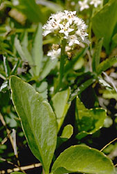

---
aliases:
- Asterales
- Asterales (plantae)
- Asteraloj
- Asterals
- Asternartige
- Asterordningen
- asteru rinda
- Astraçiçəklilər
- Astriečiai
- Astrilaadsed
- Astrotvaré
- astrowce
- Bộ Cúc
- fészkesvirágzatúak
- hvězdnicotvaré
- Koma kulîlkselikan
- korgplanteordenen
- košarnice
- Kurvblomstordenen
- Körfublómabálkur
- Zvjezdanolike
- Αστερώδη
- ѕвездовидни
- Айстроцвіті
- астракветныя
- астроцветни
- астроцветные
- աստղածաղկավորներ
- אסטראים
- تاریورگے
- تريز ډوله بوټي
- طبقہ تاراپھول
- میناسانان
- نجميات
- ఆస్టరేలిస్
- ആസ്റ്റെരേൽസ്
- อันดับทานตะวัน
- キク目
- 菊目
- 국화목
has_id_wikidata: Q21730
title: Asterales
parent_taxon: '[[_Standards/WikiData/WD~campanulids,2935471]]'
instance_of: '[[_Standards/WikiData/WD~taxon,16521]]'
taxon_rank: '[[_Standards/WikiData/WD~order,36602]]'
ITIS_TSN: 35419
OmegaWiki_Defined_Meaning: 358536
image:
- http://commons.wikimedia.org/wiki/Special:FilePath/A%20sunflower.jpg
- http://commons.wikimedia.org/wiki/Special:FilePath/Asteracea%20poster.jpg
EPPO_Code: 1ASTO
Commons_category: Asterales
taxon_name: Asterales
UMLS_CUI: C0524872
NBN_System_Key: NHMSYS0000065768
taxon_common_name: 菊目
dv_has_:
  name_:
    af: Asterales
    an: Asterales
    ar: نجميات
    arz: نجميات
    ast: Asterales
    az: Astraçiçəklilər
    bar: Asterales
    be: астракветныя
    be_tarask: Астракветныя
    bg: астроцветни
    br: Asterales
    bs: Asterales
    ca: Asterals
    ceb: Asterales
    co: Asterales
    cs: hvězdnicotvaré
    cy: Asterales
    da: Kurvblomstordenen
    de: Asternartige
    de_ch: Asterales
    el: Αστερώδη
    en: Asterales
    en_ca: Asterales
    en_gb: Asterales
    eo: Asteraloj
    es: Asterales
    et: Astrilaadsed
    eu: Asterales
    ext: Asterales
    fa: میناسانان
    fi: Asterales
    fr: Asterales
    frp: Asterales
    frr: Asterales
    fur: Asterales
    ga: Asterales
    gd: Asterales
    gl: Asterales
    gsw: Asterales
    he: אסטראים
    hr: Zvjezdanolike
    hu: fészkesvirágzatúak
    hy: աստղածաղկավորներ
    ia: Asterales
    id: Asterales
    ie: Asterales
    io: Asterales
    is: Körfublómabálkur
    it: Asterales
    ja: キク目
    jv: Asterales
    kg: Asterales
    ko: 국화목
    ku: Koma kulîlkselikan
    la: Asterales
    lb: Asterales
    li: Asterales
    lij: Asterales
    lt: Astriečiai
    lv: asteru rinda
    mg: Asterales
    min: Asterales
    mk: ѕвездовидни
    ml: ആസ്റ്റെരേൽസ്
    ms: Asterales
    mt: Asterales
    mul: Asterales
    nap: Asterales
    nb: Asterales
    nds: Asterales
    nds_nl: Asterales
    nl: Asterales
    nn: korgplanteordenen
    nrm: Asterales
    nys: Asterales
    oc: Asterales
    pcd: Asterales
    pl: astrowce
    pms: Asterales
    pnb: تاریورگے
    ps: تريز ډوله بوټي
    pt: Asterales
    pt_br: Asterales
    rm: Asterales
    ro: Asterales
    ru: астроцветные
    sc: Asterales
    scn: Asterales
    sco: Asterales
    sh: Asterales
    sk: Astrotvaré
    sl: košarnice
    sq: Asterales
    sr: Asterales
    su: Asterales
    sv: Asterordningen
    sw: Asterales
    te: ఆస్టరేలిస్
    th: อันดับทานตะวัน
    tl: Asterales
    tr: Asterales
    uk: Айстроцвіті
    ur: طبقہ تاراپھول
    vec: Asterales
    vi: Bộ Cúc
    vls: Asterales
    vo: Asterales
    wa: Asterales
    war: Asterales (plantae)
    wo: Asterales
    wuu: 菊目
    yue: 菊目
    zh: 菊目
    zh_cn: 菊目
    zh_hans: 菊目
    zh_hant: 菊目
    zh_tw: 菊目
    zu: Asterales
---
# [[Asterales]] 

 
 
 

#is_/same_as :: [[../../../../../../../../../../WikiData/WD~Asterales,21730|WD~Asterales,21730]] 

## #has_/text_of_/abstract 

> **Asterales** (  ASS-tər-RAY-leez) is an order of dicotyledonous flowering plants 
> that includes the large family Asteraceae (or Compositae) 
> known for composite flowers made of florets, and ten families related to the Asteraceae. 
> 
> While asterids in general are characterized by fused petals, 
> composite flowers consisting of many florets create the false appearance of separate petals (as found in the rosids).
>
> The order is cosmopolitan (plants found throughout most of the world including desert and frigid zones), 
> and includes mostly herbaceous species, 
> although a small number of trees 
> (such as the Lobelia deckenii, the giant lobelia, and Dendrosenecio, giant groundsels) and shrubs are also present.
>
> Asterales are organisms that seem to have evolved from one common ancestor. 
> Asterales share characteristics on morphological and biochemical levels. 
> 
> Synapomorphies (a character that is shared by two or more groups through evolutionary development) 
> include the presence in the plants of oligosaccharide inulin, 
> a nutrient storage molecule used instead of starch; and unique stamen morphology. 
> 
> The stamens are usually found around the style, either aggregated densely or fused into a tube, 
> probably an adaptation in association with the plunger (brush; or secondary) pollination 
> that is common among the families of the order, wherein pollen is collected and stored on the length of the pistil.
>
> [Wikipedia](https://en.wikipedia.org/wiki/Asterales) 

## Phylogeny 

-   « Ancestral Groups  
    -   [Asterids](../Asterids.md)
    -  [Core Eudicots](../../Core_Eudicots.md) 
    -   [Eudicots](../../../Eudicots.md)
    -   [Flowering_Plant](../../../../Flowering_Plant.md)
    -   [Seed_Plant](../../../../../Seed_Plant.md)
    -   [Land_Plant](../../../../../../Land_Plant.md)
    -   [Green plants](../../../../../../../Plant.md)
    -  [Eukarya](../../../../../../../../Eukarya.md) 
    -   [Tree of Life](../../../../../../../../Tree_of_Life.md)

-   ◊ Sibling Groups of  Asterids
    -   [Cornales](Cornales.md)
    -   [Ericales](Cornales/Ericales.md)
    -   [Solanales](Solanales.md)
    -   [Lamiales](Lamiales.md)
    -   [Gentianales](Gentianales.md)
    -   [Garryales](Garryales.md)
    -   Asterales
    -   [Apiales](Apiales.md)
    -   [Dipsacales](Dipsacales.md)
    -   [Aquifoliales](Aquifoliales.md)

-   » Sub-Groups
    -   [Asteraceae](Asteraceae)

## Title Illustrations

------------------------------------------------------------------------------ 
 
scientific_name ::    Menyanthes trifoliata
Comments            Menyanthaceae
Creator             Photograph by Gladys Lucille Smith
Source Collection   [CalPhotos](http://calphotos.berkeley.edu/)
copyright ::           © 1999 [California Academy of Sciences](http://www.calacademy.org/) 

------------------------------------------------------------------------ 
 
scientific_name ::   Legousia pentagonia
location ::         Samos, Greece
Comments           Campanulaceae
Acknowledgements   courtesy [Botanical Image Database](http://www.unibas.ch/botimage/)
copyright ::          © 2001 University of Basel, Basel, Switzerland 

------------------------------------------------------------------------ 
 
scientific_name ::   Erigeron annuus
location ::         Sevelen SG, Switzerland
Comments           Asteraceae
Acknowledgements   courtesy [Botanical Image Database](http://www.unibas.ch/botimage/)
copyright ::          © 2001 University of Basel, Basel, Switzerland 

## Confidential Links & Embeds: 

### #is_/same_as :: [[/_Standards/bio/bio~Domain/Eukarya/Plant/Land_Plant/Seed_Plant/Flowering_Plant/Eudicots/Core_Eudicots/Asterids/Asterales|Asterales]] 

### #is_/same_as :: [[/_public/bio/bio~Domain/Eukarya/Plant/Land_Plant/Seed_Plant/Flowering_Plant/Eudicots/Core_Eudicots/Asterids/Asterales.public|Asterales.public]] 

### #is_/same_as :: [[/_internal/bio/bio~Domain/Eukarya/Plant/Land_Plant/Seed_Plant/Flowering_Plant/Eudicots/Core_Eudicots/Asterids/Asterales.internal|Asterales.internal]] 

### #is_/same_as :: [[/_protect/bio/bio~Domain/Eukarya/Plant/Land_Plant/Seed_Plant/Flowering_Plant/Eudicots/Core_Eudicots/Asterids/Asterales.protect|Asterales.protect]] 

### #is_/same_as :: [[/_private/bio/bio~Domain/Eukarya/Plant/Land_Plant/Seed_Plant/Flowering_Plant/Eudicots/Core_Eudicots/Asterids/Asterales.private|Asterales.private]] 

### #is_/same_as :: [[/_personal/bio/bio~Domain/Eukarya/Plant/Land_Plant/Seed_Plant/Flowering_Plant/Eudicots/Core_Eudicots/Asterids/Asterales.personal|Asterales.personal]] 

### #is_/same_as :: [[/_secret/bio/bio~Domain/Eukarya/Plant/Land_Plant/Seed_Plant/Flowering_Plant/Eudicots/Core_Eudicots/Asterids/Asterales.secret|Asterales.secret]] 

