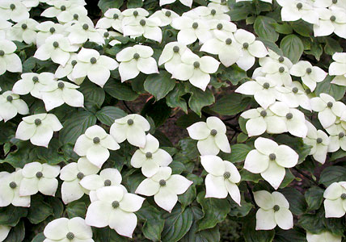

# [[Cornales]] 

## #has_/text_of_/abstract 

> The **Cornales** are an order of flowering plants, early diverging among the asterids, 
> containing about 600 species. 
> 
> Plants within the Cornales usually have four-parted flowers, drupaceous fruits, 
> and inferior to half-inferior gynoecia topped with disc-shaped nectaries.
>
> [Wikipedia](https://en.wikipedia.org/wiki/Cornales) 

## Phylogeny 

-   « Ancestral Groups  
    -   [Asterids](../Asterids.md)
    -  [Core Eudicots](../../Core_Eudicots.md))
    -   [Eudicots](../../../Eudicots.md)
    -   [Flowering_Plant](../../../../Flowering_Plant.md)
    -   [Seed_Plant](../../../../../Seed_Plant.md)
    -   [Land_Plant](../../../../../../Land_Plant.md)
    -  [Green plants](../../../../../../../Plant.md))
    -  [Eukarya](../../../../../../../../Eukarya.md))
    -   [Tree of Life](../../../../../../../../Tree_of_Life.md)

-   ◊ Sibling Groups of  Asterids
    -   Cornales
    -   [Ericales](Cornales/Ericales.md)
    -   [Solanales](Solanales.md)
    -   [Lamiales](Lamiales.md)
    -   [Gentianales](Gentianales.md)
    -   [Garryales](Garryales.md)
    -   [Asterales](Asterales.md)
    -   [Apiales](Apiales.md)
    -   [Dipsacales](Dipsacales.md)
    -   [Aquifoliales](Aquifoliales.md)

-   » Sub-Groups 

## Title Illustrations

------------------------------------------------------------------------)
Scientific Name ::   Cornus kousa
Comments           Japanese dogwood (Cornaceae). Cultivated at the Botanical Garden Basel, Switzerland.
Acknowledgements   courtesy [Botanical Image Database](http://www.unibas.ch/botimage/)
Copyright ::          © 2001 University of Basel, Basel, Switzerland 

## Confidential Links & Embeds: 

### #is_/same_as :: [Cornales](/_Standards/bio/bio~Domain/Eukarya/Plant/Land_Plant/Seed_Plant/Flowering_Plant/Eudicots/Core_Eudicots/Asterids/Cornales.md) 

### #is_/same_as :: [Cornales.public](/_public/bio/bio~Domain/Eukarya/Plant/Land_Plant/Seed_Plant/Flowering_Plant/Eudicots/Core_Eudicots/Asterids/Cornales.public.md) 

### #is_/same_as :: [Cornales.internal](/_internal/bio/bio~Domain/Eukarya/Plant/Land_Plant/Seed_Plant/Flowering_Plant/Eudicots/Core_Eudicots/Asterids/Cornales.internal.md) 

### #is_/same_as :: [Cornales.protect](/_protect/bio/bio~Domain/Eukarya/Plant/Land_Plant/Seed_Plant/Flowering_Plant/Eudicots/Core_Eudicots/Asterids/Cornales.protect.md) 

### #is_/same_as :: [Cornales.private](/_private/bio/bio~Domain/Eukarya/Plant/Land_Plant/Seed_Plant/Flowering_Plant/Eudicots/Core_Eudicots/Asterids/Cornales.private.md) 

### #is_/same_as :: [Cornales.personal](/_personal/bio/bio~Domain/Eukarya/Plant/Land_Plant/Seed_Plant/Flowering_Plant/Eudicots/Core_Eudicots/Asterids/Cornales.personal.md) 

### #is_/same_as :: [Cornales.secret](/_secret/bio/bio~Domain/Eukarya/Plant/Land_Plant/Seed_Plant/Flowering_Plant/Eudicots/Core_Eudicots/Asterids/Cornales.secret.md)

