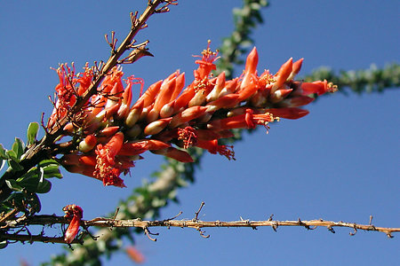

---
title: Fouquieria
---

# [[Fouquieriaceae]] 

 
 

## #has_/text_of_/abstract 

> Fouquieria is a genus of 11 species of desert flowering plants, the sole genus in the family **Fouquieriaceae**. The genus is native to North America and includes the ocotillo (F. splendens) and the Boojum tree or cirio (F. columnaris). They have semi succulent stems with thinner spikes projecting from them, with leaves on the bases spikes. They are unrelated to cacti and do not look much like them; their stems are proportionately thinner than cactus stems and their leaves are larger.
>
> [Wikipedia](https://en.wikipedia.org/wiki/Fouquieria) 

## Phylogeny 

-   « Ancestral Groups  
    -   [Ericales](../Ericales.md)
    -   [Asterids](../../../Asterids.md)
    -  [Core Eudicots](../../../../Core_Eudicots.md))
    -   [Eudicots](../../../../../Eudicots.md)
    -   [Flowering_Plant](../../../../../../Flowering_Plant.md)
    -   [Seed_Plant](../../../../../../../Seed_Plant.md)
    -   [Land_Plant](../../../../../../../../Land_Plant.md)
    -  [Green plants](../../../../../../../../../Plant.md))
    -  [Eukarya](../../../../../../../../../../Eukarya.md))
    -   [Tree of Life](../../../../../../../../../../Tree_of_Life.md)

-   ◊ Sibling Groups of  Ericales
    -   [Polemoniaceae](Polemoniaceae.md)
    -   Fouquieria

-   » Sub-Groups 
	- *Fouquieria* 

## Title Illustrations

-------------------------------------------------------------)
Scientific Name ::     Fouquieria splendens
Location ::           Anza-Borrego Desert State Park, California, USA
Specimen Condition   Live Specimen
Source               [Ocotillo, 2003-04-01B 127](http://flickr.com/photos/anitagould/9061906/)
Source Collection    [Flickr](http://flickr.com/)
Image Use ::    [Attribution-NonCommercial 2.0 Creative Commons License](http://creativecommons.org/licenses/by-nc/2.0/).
Copyright ::            © 2003 [Anita Gould](http://flickr.com/people/anitagould/)

-------------------------------------------------------------)
Scientific Name ::     Fouquieria splendens
Location ::           Anza-Borrego Desert State Park, California, USA
Specimen Condition   Live Specimen
Body Part            flower
Source               [Ocotillo, 2003-04-01B 132](http://flickr.com/photos/anitagould/9062136/)
Source Collection    [Flickr](http://flickr.com/)
Image Use ::    [Attribution-NonCommercial 2.0 Creative Commons License](http://creativecommons.org/licenses/by-nc/2.0/).
Copyright ::            © 2003 [Anita Gould](http://flickr.com/people/anitagould/)

## Confidential Links & Embeds: 

### #is_/same_as ::[Fouquieriaceae](Fouquieriaceae.md)) 

### #is_/same_as :: [Fouquieriaceae.public](/_public/bio/bio~Domain/Eukarya/Plants/Land_Plant/Seed_Plant/Flowering_Plant/Eudicots/Core_Eudicots/Asterids/Cornales/Ericales/Fouquieriaceae.public.md) 

### #is_/same_as :: [Fouquieriaceae.internal](/_internal/bio/bio~Domain/Eukarya/Plants/Land_Plant/Seed_Plant/Flowering_Plant/Eudicots/Core_Eudicots/Asterids/Cornales/Ericales/Fouquieriaceae.internal.md) 

### #is_/same_as :: [Fouquieriaceae.protect](/_protect/bio/bio~Domain/Eukarya/Plants/Land_Plant/Seed_Plant/Flowering_Plant/Eudicots/Core_Eudicots/Asterids/Cornales/Ericales/Fouquieriaceae.protect.md) 

### #is_/same_as :: [Fouquieriaceae.private](/_private/bio/bio~Domain/Eukarya/Plants/Land_Plant/Seed_Plant/Flowering_Plant/Eudicots/Core_Eudicots/Asterids/Cornales/Ericales/Fouquieriaceae.private.md) 

### #is_/same_as :: [Fouquieriaceae.personal](/_personal/bio/bio~Domain/Eukarya/Plants/Land_Plant/Seed_Plant/Flowering_Plant/Eudicots/Core_Eudicots/Asterids/Cornales/Ericales/Fouquieriaceae.personal.md) 

### #is_/same_as :: [Fouquieriaceae.secret](/_secret/bio/bio~Domain/Eukarya/Plants/Land_Plant/Seed_Plant/Flowering_Plant/Eudicots/Core_Eudicots/Asterids/Cornales/Ericales/Fouquieriaceae.secret.md)

