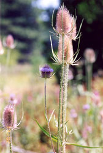
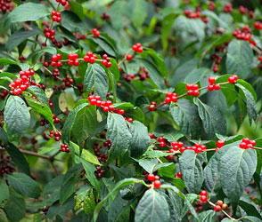
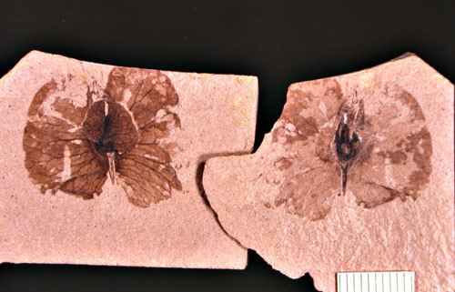
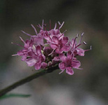

---
aliases:
  - Dipsacales
title: Dipsacales
---

# [[Dipsacales]] 

 
 
 

## #has_/text_of_/abstract 

> The **Dipsacales** are an order of flowering plants, included within the asterid group of dicotyledons. In the APG III system of 2009, the order includes only two families, Adoxaceae and a broadly defined Caprifoliaceae. Some well-known members of the Dipsacales order are honeysuckle, elder, viburnum, and valerian.
>
> Under the Cronquist system, the order included Adoxaceae, Caprifoliaceae sensu stricto, Dipsacaceae, and Valerianaceae.  Under the 2003 APG II system, the circumscription of the order was much the same but the system allowed either a broadly circumscribed Caprifoliaceae including the families Diervillaceae, Dipsacaceae, Linnaeaceae, Morinaceae, and Valerianaceae, or these families being kept separate. The APG III system only uses the broadly circumscribed Caprifoliceae.
>
> The Dipsacales appear to be most closely related to the Paracryphiales.
>
> [Wikipedia](https://en.wikipedia.org/wiki/Dipsacales) 

## Phylogeny 

-   « Ancestral Groups  
    -   [Asterids](../Asterids.md)
    -  [Core Eudicots](../../Core_Eudicots.md))
    -   [Eudicots](../../../Eudicots.md)
    -   [Flowering_Plant](../../../../Flowering_Plant.md)
    -   [Seed_Plant](../../../../../Seed_Plant.md)
    -   [Land_Plant](../../../../../../Land_Plant.md)
    -  [Green plants](../../../../../../../Plant.md))
    -  [Eukarya](../../../../../../../../Eukarya.md))
    -   [Tree of Life](../../../../../../../../Tree_of_Life.md)

-   ◊ Sibling Groups of  Asterids
    -   [Cornales](Cornales.md)
    -   [Ericales](Cornales/Ericales.md)
    -   [Solanales](Solanales.md)
    -   [Lamiales](Lamiales.md)
    -   [Gentianales](Gentianales.md)
    -   [Garryales](Garryales.md)
    -   [Asterales](Asterales.md)
    -   [Apiales](Apiales.md)
    -   Dipsacales
    -   [Aquifoliales](Aquifoliales.md)

-   » Sub-Groups
    -   [Adoxaceae](Dipsacales/Adoxaceae.md)
    -   [Morinaceae](Dipsacales/Morinaceae.md)
    -   [Valerianaceae](Dipsacales/Valerianaceae.md)

## Introduction

[Charles D. Bell]()

Dipsacales, with over 1000 species, form a branch within the Asteridae
related to the Asterales, Apiales, and several smaller lineages (Bremer
et al. 2002).

Knowledge of phylogenetic relationships within Dipsacales has improved
dramatically over the last two decades, but especially so within the
last few years. Analyses have been based on morphological characters, as
well as various molecular datasets, analyzed both separately and in
various combinations (Donoghue 1983a; Donoghue et al. 1992; Judd et al.
1994; Backlund and Donoghue 1996; Backlund and Bremer 1997; Kim et al.
1999; Pyck et al. 1999; Pyck and Smets 2000; Pyck 2001; Donoghue et al.
2001; Bell et al. 2001; Pyck et al. 2002; Zhang et al. 2002; Bell and
Donoghue 2003).

Overall, these studies show remarkable congruence with respect to the
major lineages identified and their relationships to one another.
Recently, phylogenetic names have been applied to these major clades
(Donoghue et al. 2001; Fig. 1A). The basal split separates Adoxaceae
(including *Viburnum*, *Sambucus*, and Adoxina, which contains *Adoxa*
and its relatives) from Caprifoliaceae (including Diervilleae,
Caprifolieae, Linnaeeae, Morinaceae, Valerianaceae, and Dipsacaceae).
Within Adoxaceae, *Viburnum* is sister to Adoxoideae, which includes
*Sambucus* and the Adoxina clade. Within Caprifoliaceae, Donoghue et al.
(2001) provided phylogenetic definitions for the names of two major
clades (de Queiroz and Gauthier 1994; Cantino and de Queiroz 2000). The
Linnina clade includes Linnaeeae and the Valerina clade, which contains
the herbaceous groups Morinaceae, Valerianaceae, and Dipsacaceae.
*Triplostegia* now appears to be more closely related to Dipsacaceae
than it is to Valerianaceae (in agreement with Thorne 1983; Peng et al.
1995, but contra Cronquist 1981; Backlund and Donoghue 1996; Backlund
and Nilsson 1997; Pyck 2001).

### Fossil Record & Molecular Dating

Although the fossil record is not rich for Dipsacales, a number of
fossils have been well documented (Muller, 1981; Manchester and
Donoghue, 1995; Backlund, 1996). In the Adoxaceae, *Sambucus* has been
reported based on endocarps from the late Eocene to Pliocene of Europe
(Reid and Chandler, 1926). Fruits of *Dipelta*, which are surrounded by
distinctive papery bracts, have been described from the late
Eocene/early Oligocene (Reid and Chandler, 1926), and those of
*Heptacodium* have been identified from the late Miocene (11.2-5.3 mya)
of Japan (Ozaki, 1980). *Diplodipelta* (Manchester and Donoghue, 1995),
from the late Eocene Florissant flora of Colorado (36-35 mya) and
several Oligocene sites in western North America, appears to be the
sister group of modern *Dipelta*; both are characterized by enlarged
supernumerary bracts that form a wind-dispersed unit. The distinctive
winged seeds of *Weigela* have been reported from the Miocene and
Pliocene of Poland (Lancucka-Srodoniowa, 1967), the Oligocene and
Miocene of Siberia (Dorofeev, 1963), as well as from the Miocene of
eastern Asia (Nikitin, 1976). In Valerianaceae, the unusual fruits
(\"wing\" on the ovary) of *Patrinia* have been documented from the
Miocene to Pliocene of Poland and Russia (Lancucka-Srodoniowa, 1967), as
well as from the late Miocene of Japan (Ozaki, 1980). Likewise,
*Valeriana* is known on the basis of fossil fruits from the late Miocene
and Pliocene in Europe. Fossils of other Dipsacales have been reported,
but are now known to be incorrectly assigned or are considered too
unreliable. These include *Abelia* (Manchester and Habley, 1997) and
many specimens attributed to *Viburnum* and *Lonicera*.

*Diplodipelta* from the late Eocene Florissant flora of Colorado.
Photograph copyright © Steven Manchester.

Several attempts have been made to estimate the age of Dipsacales.
Backlund\'s (1996) study used a linear regression method with *rbcL*
sequence data and several fossil calibration points, and estimated that
Dipsacales originated around 70-60 million years ago (mya), during the
late Cretaceous or Early Tertiary. This study assumed a molecular clock
for the rbcL data and used the midpoint of major geological time periods
for fossil calibrations. In an analysis of 560 species based on a
three-gene phylogeny (Soltis et al., 1999; 2000), Wikstrom et al. (2001)
used nonparametric rate smoothing (NPRS) to estimate divergence times
across angiosperms. They estimated an age for Dipsacales of 81-78 my.
Since the purpose of the Wikstrom et al. analysis was to estimate the
age of angiosperms as a whole, and of major lineages within angiosperms,
the sampling of Dipsacales was poor. The accuracy of the age estimates
from both of these analyses may also suffer from the fact that they used
the \"wrong\" topology for Dipsacales based on our current knowledge.

Bell and Donoghue (2005) used recently proposed methods that relax the
assumption of rate constancy among lineages (local clocks, nonparametric
rate smoothing, penalized likelihood, and Bayesian relaxed clock) to
estimate the ages of Dipsacales. Age estimates for Dipsacales varied
widely among markers and codon positions, and depended on the fossils
used for calibration and method of analysis. Some methods yielded dates
for the Dipsacales diversification that appear to be too old (prior to
the presumed 125 my \[million years\] age of eudicots), and others
suggested ages that are too young based on well-documented Dipsacales
fossils. Concordant penalized likelihood and Bayesian studies imply that
Dipsacales originated in the Cretaceous, as did its two major lineages,
Adoxaceae and Caprifoliaceae. However, diversification of crown
Adoxaceae and Caprifoliaceae mainly occurred in the Tertiary, with the
origin of major lineages within these clades mainly occurring during the
Eocene. Another round of diversification appears to have occurred in the
Miocene. Several radiations, such as Valerianaceae in South America and
Dipsacaceae around the Mediterranean, are even more recent. This study
demonstrates the wide range of divergence times that can be obtained
using different methods and data sets, and cautions against reliance on
age estimates based on only a single gene or methodology. Despite this
variance, significant conclusions can be made about the timing of
Dipsacales evolution (see, Bell and Donoghue, 2005 for more discussion).

### Discussion of Phylogenetic Relationships

All phylogenetic analyses have shown that Caprifoliaceae in the
traditional sense (consisting of *Viburnum*, *Sambucus*, Diervilleae,
Caprifolieae, and Linnaeeae) do not form a clade. In the phylogenetic
classification of Donoghue et al. (2001) the most significant change is
that the name Caprifoliaceae is applied to the clade including
Diervilleae, Caprifolieae, and Linnaeeae, as well as the Morinaceae,
Valerianaceae, and Dipsacaceae. In the interest of nomenclatural
stability these six names have been retained, since in their traditional
sense they refer to clades. The classification suggested by Backlund and
Pyck (1998; also Backlund and Bremer 1996; APG 1998; Stevens 2002) is
rejected because it requires a variety of name changes only for the sake
of adjusting ranks (Diervilleae, Caprifolieae, and Linnaeeae are renamed
Diervilleaceae, Caprifoliaceae, and Linnaeaceae, respectively), and
because it fails to provide names for several well supported clades
(e.g., the Linnina clade, which includes Linnaeeae, Morinaceae,
Valerianaceae, and Dipsacaceae). Similar criticisms apply to other
recently proposed classifications (Benko-Iseppon and Morawetz 2000).

Progress has also been made in elucidating phylogenetic relationships
within particular Dipsacales clades. Within Adoxaceae, analyses of
several datasets have been reported for *Viburnum*, including
morphological characters (Donoghue 1983b), cpDNA restriction sites
(Donoghue and Sytsma 1993), and sequences of the nuclear ribosomal
internal transcribed spacer (ITS) region (Donoghue and Baldwin 1993).
More recently, analyses have been conducted using the chloroplast locus
*matK* and the nuclear granule-bound starch synthase (*waxy*) genes
(Winkworth and Donoghue 2002, unpublished data). Sambucus has been
analyzed using ITS sequences (Eriksson and Donoghue 1998), and Adoxina
using morphology and sequences of *rbcL* and ITS (Liu et al. 2000;
Donoghue et al. 2001). Within Caprifoliaceae, Kim and Kim (1999)
analyzed Diervilleae (*Diervilla* and *Weigela*) using ITS sequences.
Triosteum has been studied using ITS and *waxy* sequences (Gould &
Donoghue 2000), and more recently using cpDNA *trnL* and *matK*
sequences (Cullis-Suzuki, Bell, Winkworth, and Donoghue, unpublished
data), and *Lonicera* is currently under study using ITS and matK (Li &
Donoghue 2002, unpublished data). Bell and Donoghue (2002, 2003) have
carried out analyses within Morinaceae and Valerianaceae based on
*trnL*, *matK*, and ITS. For Dipsacaceae, Caputo and Cozzolino (1994)
analyzed morphological characters, Mayer and Ehrendorfer (1999, 2000)
presented phylogenetic hypothesis for *Scabiosa* and *Pterocephalus* and
their relatives, and studies are underway using trnL, matK, ITS (Bell
and Donoghue, unpublished data) In all, nearly 300 species have now been
included in one or another phylogenetic analysis.

To date the single most convincing phylogenetic study of the Dipsacales,
both in terms of character number (7593 nucleotide sites) and confident
resolution, is that of Bell et al. (2001). However, this study was based
entirely on chloroplast DNA sequences, which leaves open the possibility
of incongruence with other data sources. Although it is comforting that
cpDNA and morphological analyses have yielded very similar results, the
addition of data from nuclear genes would be highly desirable.

## Title Illustrations

--------------------------)
Scientific Name ::    Dipsacus fullonum
Location ::          Mt. Shasta (Siskiyou County, California, USA)
Comments            Fuller\'s teasel (Dipsacaceae)
Source Collection   [CalPhotos](http://calphotos.berkeley.edu/)
Copyright ::           © 2002 [Molly Elizabeth Bagley](mailto:illustrations@snowcrest.net)

-------------------------------------------------------------------------)
Scientific Name ::    Lonicera maackii
Location ::          Kedrovaja Pad Natural Reserve, Khasansky distr., Primorsky Territory (Russian Federation)
Comments            Amur honeysuckle (Caprifoliaceae)
Source Collection   [CalPhotos](http://calphotos.berkeley.edu/)
Copyright ::           © 1999 [Nick Kurzenko](mailto:kurzenko@ibss.dvo.ru) 

---------------------------------------------------------------------------
 
Scientific Name ::     Nardostachys jatamansi
Specimen Condition   Live Specimen
Identified By        C. Bell
Copyright ::            © [Michael Donoghue](mailto:michael.donoghue@yale.edu) 

## Confidential Links & Embeds: 

### #is_/same_as :: [Dipsacales](/_Standards/bio/bio~Domain/Eukarya/Plant/Land_Plant/Seed_Plant/Flowering_Plant/Eudicots/Core_Eudicots/Asterids/Dipsacales.md) 

### #is_/same_as :: [Dipsacales.public](/_public/bio/bio~Domain/Eukarya/Plant/Land_Plant/Seed_Plant/Flowering_Plant/Eudicots/Core_Eudicots/Asterids/Dipsacales.public.md) 

### #is_/same_as :: [Dipsacales.internal](/_internal/bio/bio~Domain/Eukarya/Plant/Land_Plant/Seed_Plant/Flowering_Plant/Eudicots/Core_Eudicots/Asterids/Dipsacales.internal.md) 

### #is_/same_as :: [Dipsacales.protect](/_protect/bio/bio~Domain/Eukarya/Plant/Land_Plant/Seed_Plant/Flowering_Plant/Eudicots/Core_Eudicots/Asterids/Dipsacales.protect.md) 

### #is_/same_as :: [Dipsacales.private](/_private/bio/bio~Domain/Eukarya/Plant/Land_Plant/Seed_Plant/Flowering_Plant/Eudicots/Core_Eudicots/Asterids/Dipsacales.private.md) 

### #is_/same_as :: [Dipsacales.personal](/_personal/bio/bio~Domain/Eukarya/Plant/Land_Plant/Seed_Plant/Flowering_Plant/Eudicots/Core_Eudicots/Asterids/Dipsacales.personal.md) 

### #is_/same_as :: [Dipsacales.secret](/_secret/bio/bio~Domain/Eukarya/Plant/Land_Plant/Seed_Plant/Flowering_Plant/Eudicots/Core_Eudicots/Asterids/Dipsacales.secret.md)

