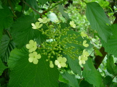
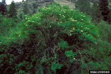

---
aliases:
- Adoksacoj
- Adokskimilər
- Adoxaceae
- adoxàcies
- Bezslavīšu dzimta
- Desmeknoppsväxter
- Desmerurt-familien
- Famîleya adoksasiyan
- Họ Ngũ phúc hoa
- Moschuskrautgewächse
- Moschuskrüüsplaanten
- Moskusurtfamilien
- Moškovičevke
- muskuskruidfamilie
- Muskuslillelised
- Piżmaczkowate
- Pižmonkowe rostliny
- pižmovkovité
- pézsmaboglárfélék
- tesmayrttikasvit
- Ūksmininiai
- Адоксавыя
- Адоксовые
- Байсаттар тұқымдасы
- мешковицови
- Палан йышшисем
- пиженца
- Пижмівкові
- ադոքսազգիներ
- מורניים
- فامیلەیائا دۆکساسیان
- مسكية
- مسكيه
- هفتکولان
- அடோக்சுசியே
- ადოქსასებრნი
- レンプクソウ科
- 五福花科
- 연복초과
title: Adoxaceae
has_id_wikidata: Q156677
dv_has_:
  name_:
    an: Adoxaceae
    ar: مسكية
    arz: مسكيه
    ast: Adoxaceae
    az: Adokskimilər
    be: Адоксавыя
    be_tarask: Адоксавыя
    bg: мешковицови
    bs: Adoxaceae
    ca: adoxàcies
    ceb: Adoxaceae
    cs: pižmovkovité
    cv: Палан йышшисем
    cy: Adoxaceae
    da: Desmerurt-familien
    de: Moschuskrautgewächse
    en: Adoxaceae
    eo: Adoksacoj
    es: Adoxaceae
    et: Muskuslillelised
    eu: Adoxaceae
    ext: Adoxaceae
    fa: هفتکولان
    fi: tesmayrttikasvit
    fr: Adoxaceae
    frr: Moschuskrüüsplaanten
    ga: Adoxaceae
    gl: Adoxaceae
    he: מורניים
    hr: Moškovičevke
    hsb: Pižmonkowe rostliny
    hu: pézsmaboglárfélék
    hy: ադոքսազգիներ
    ia: Adoxaceae
    id: Adoxaceae
    ie: Adoxaceae
    io: Adoxaceae
    it: Adoxaceae
    ja: レンプクソウ科
    ka: ადოქსასებრნი
    kk: Байсаттар тұқымдасы
    ko: 연복초과
    ku: Famîleya adoksasiyan
    ku_arab: فامیلەیائا دۆکساسیان
    ku_latn: Famîleya adoksasiyan
    la: Adoxaceae
    lt: Ūksmininiai
    lv: Bezslavīšu dzimta
    mk: пиженца
    mul: Adoxaceae
    nb: Moskusurtfamilien
    nl: muskuskruidfamilie
    nn: moskusurtfamilien
    oc: Adoxaceae
    pl: Piżmaczkowate
    pt: Adoxaceae
    pt_br: Adoxaceae
    ro: Adoxaceae
    ru: Адоксовые
    sk: pižmovkovité
    sq: Adoxaceae
    sr: Adoxaceae
    sv: Desmeknoppsväxter
    ta: அடோக்சுசியே
    tr: Adoxaceae
    uk: Пижмівкові
    vi: Họ Ngũ phúc hoa
    vo: Adoxaceae
    war: Adoxaceae
    zh: 五福花科
    zh_cn: 五福花科
    zh_hans: 五福花科
    zh_hant: 五福花科
    zh_hk: 五福花科
    zh_sg: 五福花科
    zh_tw: 五福花科
---
# [[Adoxaceae]] 

     

## #has_/text_of_/abstract 

> **Adoxaceae**, commonly known as moschatel family, is a small family of flowering plants in the order Dipsacales, now consisting of five genera and about 150–200 species. They are characterised by opposite toothed leaves, small five- or, more rarely, four-petalled flowers in cymose inflorescences, and the fruit being a drupe. They are thus similar to many Cornaceae.
>
> In older classifications, this entire family was part of Caprifoliaceae, the honeysuckle family.  Adoxa (moschatel) was the first plant to be moved to this new group.  Much later, the genera Sambucus (elders) and Viburnum were added after careful morphological analysis and biochemical tests by the Angiosperm Phylogeny Group.  An additional monotypic genus Sinadoxa has been added based on molecular comparison with Adoxa.
>
> Recent sources, including the Angiosperm Phylogeny Website, treat this family as Viburnaceae Raf., nom. cons.
>
> Adoxa is a small perennial herbaceous plant, flowering early in the spring and dying down to ground level in summer immediately after the berries are mature; the leaves are compound.
>
> The elders are mostly shrubs, but two species are large herbaceous plants; all have compound leaves. The viburnums are all shrubs, with simple leaves.
>
> [Wikipedia](https://en.wikipedia.org/wiki/Adoxaceae) 

## Phylogeny 

-   « Ancestral Groups  
    -   [Dipsacales](../Dipsacales.md)
    -   [Asterids](../../Asterids.md)
    -  [Core Eudicots](../../../Core_Eudicots.md) 
    -   [Eudicots](../../../../Eudicots.md)
    -   [Flowering_Plant](../../../../../Flowering_Plant.md)
    -   [Seed_Plant](../../../../../../Seed_Plant.md)
    -   [Land_Plant](../../../../../../../Land_Plant.md)
    -  [Green plants](../../../../../../../../Plant.md) 
    -  [Eukarya](../../../../../../../../../Eukarya.md) 
    -   [Tree of Life](../../../../../../../../../Tree_of_Life.md)

-   ◊ Sibling Groups of  Dipsacales
    -   Adoxaceae
    -   [Morinaceae](Morinaceae.md)
    -   [Valerianaceae](Valerianaceae.md)

-   » Sub-Groups 

## Title Illustrations

---------------------------------------------------------------------------
 
scientific_name ::     Tetradoxa omeiensis
specimen_condition ::  Live Specimen
Identified By        Michael J. Donoghue
copyright ::            © [Michael Donoghue](mailto:michael.donoghue@yale.edu) 

---------------------------------------------------------------------------
 
scientific_name ::     Viburnum opulus
location ::           Romania
Comments             Opened flowers on the edges represent sterile flowers. Central, fertila flowers open little later. V. opulus is a shrub growing in shaddy or semi-sunny places
specimen_condition ::  Live Specimen
Identified By        Ilisoi Gabriel
Body Part            Inflorescence
copyright ::            © [Gabriel Ilisoi](mailto:ilisoi_gabriel@yahoo.co.uk) 

-------------------- 
 
scientific_name ::     Sambucus nigra cerulea
Comments             blue elderberry, one shrub in typical habitat
Acknowledgements     Photograph courtesy InsectImages.org (#1208060)
specimen_condition ::  Live Specimen
Source Collection    [InsectImages.org](http://www.insectimages.org/)
copyright ::            © Dave Powell, USDA Forest Service

## Confidential Links & Embeds: 

### #is_/same_as :: [[/_Standards/bio/bio~Domain/Eukarya/Plant/Land_Plant/Seed_Plant/Flowering_Plant/Eudicots/Core_Eudicots/Asterids/Dipsacales/Adoxaceae|Adoxaceae]] 

### #is_/same_as :: [[/_public/bio/bio~Domain/Eukarya/Plant/Land_Plant/Seed_Plant/Flowering_Plant/Eudicots/Core_Eudicots/Asterids/Dipsacales/Adoxaceae.public|Adoxaceae.public]] 

### #is_/same_as :: [[/_internal/bio/bio~Domain/Eukarya/Plant/Land_Plant/Seed_Plant/Flowering_Plant/Eudicots/Core_Eudicots/Asterids/Dipsacales/Adoxaceae.internal|Adoxaceae.internal]] 

### #is_/same_as :: [[/_protect/bio/bio~Domain/Eukarya/Plant/Land_Plant/Seed_Plant/Flowering_Plant/Eudicots/Core_Eudicots/Asterids/Dipsacales/Adoxaceae.protect|Adoxaceae.protect]] 

### #is_/same_as :: [[/_private/bio/bio~Domain/Eukarya/Plant/Land_Plant/Seed_Plant/Flowering_Plant/Eudicots/Core_Eudicots/Asterids/Dipsacales/Adoxaceae.private|Adoxaceae.private]] 

### #is_/same_as :: [[/_personal/bio/bio~Domain/Eukarya/Plant/Land_Plant/Seed_Plant/Flowering_Plant/Eudicots/Core_Eudicots/Asterids/Dipsacales/Adoxaceae.personal|Adoxaceae.personal]] 

### #is_/same_as :: [[/_secret/bio/bio~Domain/Eukarya/Plant/Land_Plant/Seed_Plant/Flowering_Plant/Eudicots/Core_Eudicots/Asterids/Dipsacales/Adoxaceae.secret|Adoxaceae.secret]] 

