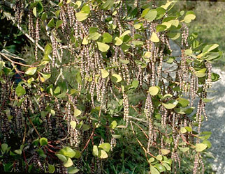

---
title: Garryales
---

# [[Garryales]] 

 

## #has_/text_of_/abstract 

> The **Garryales** are a small order of dicotyledons, including only two families and three genera.
>
> [Wikipedia](https://en.wikipedia.org/wiki/Garryales) 

## Phylogeny 

-   « Ancestral Groups  
    -   [Asterids](../Asterids.md)
    -  [Core Eudicots](../../Core_Eudicots.md))
    -   [Eudicots](../../../Eudicots.md)
    -   [Flowering_Plant](../../../../Flowering_Plant.md)
    -   [Seed_Plant](../../../../../Seed_Plant.md)
    -   [Land_Plant](../../../../../../Land_Plant.md)
    -  [Green plants](../../../../../../../Plant.md))
    -  [Eukarya](../../../../../../../../Eukarya.md))
    -   [Tree of Life](../../../../../../../../Tree_of_Life.md)

-   ◊ Sibling Groups of  Asterids
    -   [Cornales](Cornales.md)
    -   [Ericales](Cornales/Ericales.md)
    -   [Solanales](Solanales.md)
    -   [Lamiales](Lamiales.md)
    -   [Gentianales](Gentianales.md)
    -   Garryales
    -   [Asterales](Asterales.md)
    -   [Apiales](Apiales.md)
    -   [Dipsacales](Dipsacales.md)
    -   [Aquifoliales](Aquifoliales.md)

-   » Sub-Groups 

## Title Illustrations

---------------------------------------------------------------------------------)
Scientific Name ::     Garrya fremontii
Location ::           Tilden (Contra Costa County, California, USA)
Comments             Fremont silktassel
Creator              Photograph by Brother Alfred Brousseau
Specimen Condition   Live Specimen
Source Collection    [CalPhotos](http://calphotos.berkeley.edu/)
Copyright ::            © 1995 [Saint Mary\'s College of California](mailto:rpolowin@stmarys-ca.edu) 

## Confidential Links & Embeds: 

### #is_/same_as ::[Garryales](Garryales.md)) 

### #is_/same_as :: [Garryales.public](/_public/bio/bio~Domain/Eukarya/Plants/Land_Plant/Seed_Plant/Flowering_Plant/Eudicots/Core_Eudicots/Asterids/Garryales.public.md) 

### #is_/same_as :: [Garryales.internal](/_internal/bio/bio~Domain/Eukarya/Plants/Land_Plant/Seed_Plant/Flowering_Plant/Eudicots/Core_Eudicots/Asterids/Garryales.internal.md) 

### #is_/same_as :: [Garryales.protect](/_protect/bio/bio~Domain/Eukarya/Plants/Land_Plant/Seed_Plant/Flowering_Plant/Eudicots/Core_Eudicots/Asterids/Garryales.protect.md) 

### #is_/same_as :: [Garryales.private](/_private/bio/bio~Domain/Eukarya/Plants/Land_Plant/Seed_Plant/Flowering_Plant/Eudicots/Core_Eudicots/Asterids/Garryales.private.md) 

### #is_/same_as :: [Garryales.personal](/_personal/bio/bio~Domain/Eukarya/Plants/Land_Plant/Seed_Plant/Flowering_Plant/Eudicots/Core_Eudicots/Asterids/Garryales.personal.md) 

### #is_/same_as :: [Garryales.secret](/_secret/bio/bio~Domain/Eukarya/Plants/Land_Plant/Seed_Plant/Flowering_Plant/Eudicots/Core_Eudicots/Asterids/Garryales.secret.md)

