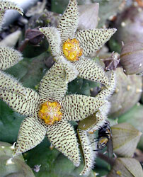
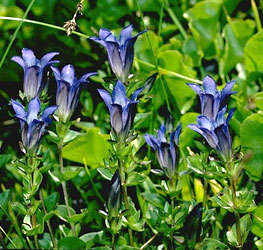
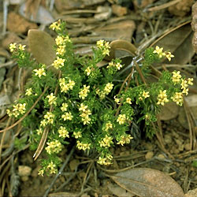

# [[Gentianales]] 

 
 
 

#is_/same_as :: [[../../../../../../../../../../WikiData/WD~Gentianales,21754|WD~Gentianales,21754]] 
## #has_/text_of_/abstract 

> **Gentianales** is an order of flowering plant, included within the asterid clade of eudicots. It comprises more than 20,000 species in about 1,200 genera in 5 families. More than 80% of the species in this order belong to the family Rubiaceae.
>
> Many of these flowering plants are used in traditional medicine. They have been used to treat pain, anxiety, cancers and neurological conditions.
>
> According to molecular clock calculations, the lineage that led to Gentianales split from other plants about 108 million years ago or 81 million years ago.
>
> [Wikipedia](https://en.wikipedia.org/wiki/Gentianales) 

## Phylogeny 

-   « Ancestral Groups  
    -   [Asterids](../Asterids.md)
    -  [Core Eudicots](../../Core_Eudicots.md) 
    -   [Eudicots](../../../Eudicots.md)
    -   [Flowering_Plant](../../../../Flowering_Plant.md)
    -   [Seed_Plant](../../../../../Seed_Plant.md)
    -   [Land_Plant](../../../../../../Land_Plant.md)
    -  [Green plants](../../../../../../../Plant.md) 
    -  [Eukarya](../../../../../../../../Eukarya.md) 
    -   [Tree of Life](../../../../../../../../Tree_of_Life.md)

-   ◊ Sibling Groups of  Asterids
    -   [Cornales](Cornales.md)
    -   [Ericales](Cornales/Ericales.md)
    -   [Solanales](Solanales.md)
    -   [Lamiales](Lamiales.md)
    -   Gentianales
    -   [Garryales](Garryales.md)
    -   [Asterales](Asterales.md)
    -   [Apiales](Apiales.md)
    -   [Dipsacales](Dipsacales.md)
    -   [Aquifoliales](Aquifoliales.md)

-   » Sub-Groups 

## Title Illustrations

------------------------------------------------------------------------

Scientific Name ::   Piaranthus foetidus
Comments           Carrion flower (Apocynaceae). Cultivated at the Botanical Garden Basel, Switzerland.
Acknowledgements   courtesy [Botanical Image Database](http://www.unibas.ch/botimage/)
Copyright ::          © 2001 University of Basel, Basel, Switzerland 

--------------------------------------- 
)

Scientific Name ::    Gentiana calycosa (Gentianaceae)
Location ::          Kidd Basin, near Kidd Creek, north of Black Mountain in the Trinity Alps (Siskiyou County, California, USA).
Comments            Rainier pleated gentian
Source Collection   [CalPhotos](http://calphotos.berkeley.edu/)
Copyright ::           © 1999 [John Game](mailto:jcgame@lbl.gov)

---------------------------------------------------------------------------------

Scientific Name ::     Galium ambiguum
Location ::           Low Divide (California, USA).
Comments             Rubiaceae
Creator              Photograph by Brother Alfred Brousseau
Specimen Condition   Live Specimen
Source Collection    [CalPhotos](http://calphotos.berkeley.edu/)
Copyright ::            © 1995 [Saint Mary\'s College of California](mailto:rpolowin@stmarys-ca.edu) 

## Confidential Links & Embeds: 

### #is_/same_as :: [[/_Standards/bio/bio~Domain/Eukarya/Plant/Land_Plant/Seed_Plant/Flowering_Plant/Eudicots/Core_Eudicots/Asterids/Gentianales|Gentianales]] 

### #is_/same_as :: [[/_public/bio/bio~Domain/Eukarya/Plant/Land_Plant/Seed_Plant/Flowering_Plant/Eudicots/Core_Eudicots/Asterids/Gentianales.public|Gentianales.public]] 

### #is_/same_as :: [[/_internal/bio/bio~Domain/Eukarya/Plant/Land_Plant/Seed_Plant/Flowering_Plant/Eudicots/Core_Eudicots/Asterids/Gentianales.internal|Gentianales.internal]] 

### #is_/same_as :: [[/_protect/bio/bio~Domain/Eukarya/Plant/Land_Plant/Seed_Plant/Flowering_Plant/Eudicots/Core_Eudicots/Asterids/Gentianales.protect|Gentianales.protect]] 

### #is_/same_as :: [[/_private/bio/bio~Domain/Eukarya/Plant/Land_Plant/Seed_Plant/Flowering_Plant/Eudicots/Core_Eudicots/Asterids/Gentianales.private|Gentianales.private]] 

### #is_/same_as :: [[/_personal/bio/bio~Domain/Eukarya/Plant/Land_Plant/Seed_Plant/Flowering_Plant/Eudicots/Core_Eudicots/Asterids/Gentianales.personal|Gentianales.personal]] 

### #is_/same_as :: [[/_secret/bio/bio~Domain/Eukarya/Plant/Land_Plant/Seed_Plant/Flowering_Plant/Eudicots/Core_Eudicots/Asterids/Gentianales.secret|Gentianales.secret]] 

