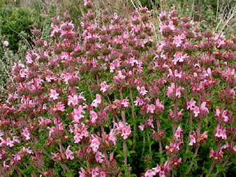
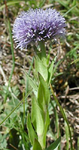

---
aliases:
- ajakosvirágúak
- Bộ Hoa môi
- Dalamazçiçəklilər
- hluchavkotvaré
- Iminõgeselaadsed
- jasnotowce
- Koma gezika derewîn
- Lamiales
- Lamialoj
- Lamials
- leppeblomordenen
- Leppeblomstordenen
- Lippenblütlerartige
- Læbeblomst-ordenen
- medićolike
- mint order
- Notreliečiai
- panātru rinda
- Plisterordningen
- Timessferranin
- ustnatičevci
- Varablómabálkur
- Λαμιώδη
- губоцвіті
- Ерінгүлділер
- усноцветовидни
- устноцветни
- ясноткакветныя
- ясноткоцветные
- խուլեղինջածաղկավորներ
- צינוראים
- شفويات
- نعنا ډوله بوټي
- نعناسانان
- লেমিয়ালেস
- புதினா வரிசை
- లామియేలిస్
- ലാമിയേൽസ്
- อันดับกะเพรา
- シソ目
- 唇形目
- 脣形目
- 꿀풀목
has_id_wikidata: Q21742
title: Lamiales
parent_taxon: '[[_Standards/WikiData/WD~lamiids,2182368]]'
instance_of: '[[_Standards/WikiData/WD~taxon,16521]]'
taxon_rank: '[[_Standards/WikiData/WD~order,36602]]'
ITIS_TSN: 31632
OmegaWiki_Defined_Meaning: 358548
image:
- http://commons.wikimedia.org/wiki/Special:FilePath/Lamium%20album4%20ies.jpg
- http://commons.wikimedia.org/wiki/Special:FilePath/Starr%20070906-9094%20Sutera%20cordata.jpg
taxon_common_name: 唇形目
Commons_category: Lamiales
taxon_name: Lamiales
EPPO_Code: 1LAMO
MeSH_tree_code: B01.875.800.575.912.250.583
UMLS_CUI: C1080876
NBN_System_Key: NHMSYS0021060389
dv_has_:
  name_:
    af: Lamiales
    an: Lamiales
    ar: شفويات
    arz: شفويات
    ast: Lamiales
    az: Dalamazçiçəklilər
    bar: Lamiales
    bcl: Lamiales
    be: ясноткакветныя
    be_tarask: Ясноткакветныя
    bg: устноцветни
    bn: লেমিয়ালেস
    br: Lamiales
    bs: Lamiales
    ca: Lamials
    ceb: Lamiales
    co: Lamiales
    cs: hluchavkotvaré
    cy: Lamiales
    da: Læbeblomst-ordenen
    de: Lippenblütlerartige
    de_ch: Lamiales
    el: Λαμιώδη
    en: Lamiales
    en_ca: Lamiales
    en_gb: Lamiales
    eo: Lamialoj
    es: Lamiales
    et: Iminõgeselaadsed
    eu: Lamiales
    ext: Lamiales
    fa: نعناسانان
    fi: Lamiales
    fr: Lamiales
    frp: Lamiales
    frr: Lamiales
    fur: Lamiales
    ga: Lamiales
    gd: Lamiales
    gl: Lamiales
    gsw: Lippenblütlerartige
    he: צינוראים
    hr: medićolike
    hu: ajakosvirágúak
    hy: խուլեղինջածաղկավորներ
    ia: Lamiales
    id: Lamiales
    ie: Lamiales
    io: Lamiales
    is: Varablómabálkur
    it: Lamiales
    ja: シソ目
    jv: Lamiales
    kab: Timessferranin
    kg: Lamiales
    kk: Ерінгүлділер
    ko: 꿀풀목
    ku: Koma gezika derewîn
    la: Lamiales
    lb: Lamiales
    li: Lamiales
    lij: Lamiales
    lt: Notreliečiai
    lv: panātru rinda
    mg: Lamiales
    min: Lamiales
    mk: усноцветовидни
    ml: ലാമിയേൽസ്
    ms: Lamiales
    mul: Lamiales
    nap: Lamiales
    nb: Leppeblomstordenen
    nds: Lamiales
    nds_nl: Lamiales
    nl: Lamiales
    nn: leppeblomordenen
    nrm: Lamiales
    nys: Lamiales
    oc: Lamiales
    pcd: Lamiales
    pl: jasnotowce
    pms: Lamiales
    ps: نعنا ډوله بوټي
    pt: Lamiales
    pt_br: Lamiales
    rm: Lamiales
    ro: Lamiales
    ru: ясноткоцветные
    sc: Lamiales
    scn: Lamiales
    sco: Lamiales
    sh: Lamiales
    sk: hluchavkotvaré
    sl: ustnatičevci
    sq: Lamiales
    sr: Lamiales
    sv: Plisterordningen
    sw: Lamiales
    ta: புதினா வரிசை
    te: లామియేలిస్
    th: อันดับกะเพรา
    tl: Lamiales
    tr: Lamiales
    uk: губоцвіті
    vec: Lamiales
    vi: Bộ Hoa môi
    vls: Lamiales
    vo: Lamiales
    wa: Lamiales
    war: Lamiales
    wo: Lamiales
    wuu: 唇形目
    yue: 唇形目
    zh: 唇形目
    zh_cn: 唇形目
    zh_hans: 唇形目
    zh_hant: 脣形目
    zh_tw: 脣形目
    zu: Lamiales
---
# [[Lamiales]] 

#is_/same_as :: [[../../../../../../../../../../WikiData/WD~Lamiales,21742|WD~Lamiales,21742]] 

     

## #has_/text_of_/abstract 

> The **Lamiales** (also known as the mint order) 
> are an order of flowering plants in the asterids clade of the Eudicots. 
> 
> Under the APG IV system of flowering plant classification the order consists of 24 families, and includes about 23,810 species and 1,059 genera with representatives found all over the world. Well-known or economically important members of this order include aromatic, culinary, and medicinal herbs such as basil, mint, rosemary, sage, savory, marjoram, oregano, hyssop, thyme, lavender, perilla, lemon verbena, catnip, bee balm, wild dagga, and oriental motherwort, as well as olives, ash trees, teak, foxgloves, lilacs, jasmine, snapdragons, African violets, Jacarandas, Paulownias, butterfly bushes, sesame, and psyllium.
>
> [Wikipedia](https://en.wikipedia.org/wiki/Lamiales) 

## Phylogeny 

-   « Ancestral Groups  
    -   [Asterids](../Asterids.md)
    -  [Core Eudicots](../../Core_Eudicots.md) 
    -   [Eudicots](../../../Eudicots.md)
    -   [Flowering_Plant](../../../../Flowering_Plant.md)
    -   [Seed_Plant](../../../../../Seed_Plant.md)
    -   [Land_Plant](../../../../../../Land_Plant.md)
    -   [Green plants](../../../../../../../Plant.md)
    -  [Eukarya](../../../../../../../../Eukarya.md) 
    -   [Tree of Life](../../../../../../../../Tree_of_Life.md)

-   ◊ Sibling Groups of  Asterids
    -   [Cornales](Cornales.md)
    -   [Ericales](Cornales/Ericales.md)
    -   [Solanales](Solanales.md)
    -   Lamiales
    -   [Gentianales](Gentianales.md)
    -   [Garryales](Garryales.md)
    -   [Asterales](Asterales.md)
    -   [Apiales](Apiales.md)
    -   [Dipsacales](Dipsacales.md)
    -   [Aquifoliales](Aquifoliales.md)

-   » Sub-Groups
    -   [Oleaceae](Lamiales/Oleaceae.md)
    -   [Acanthaceae](Lamiales/Acanthaceae.md)
    -   [Gesneriaceae](Lamiales/Gesneriaceae.md)

## Title Illustrations

------------------------------------------------------------------------------ 
 
scientific_name ::     Castilleja rubicundula ssp. lithospermoides
location ::           Napa County, California, US.
Comments             Cream sacs (Scrophulariaceae)
Creator              Photograph by Robert Thomas and Margaret Orr
specimen_condition ::  Live Specimen
Source Collection    [CalPhotos](http://calphotos.berkeley.edu/)
copyright ::            © 1999 [California Academy of Sciences](http://www.calacademy.org/) 

------------------------------------------------------------------------ 
 
scientific_name ::   Satureja thymbra
location ::         Samos, Greece.
Comments           Lamiaceae
Acknowledgements   courtesy [Botanical Image Database](http://www.unibas.ch/botimage/)
copyright ::          © 2001 University of Basel, Basel, Switzerland 

------------------------------------------------------------------------ 
 
scientific_name ::   Globularia punctata
location ::         Strangenberg, Haut-Rhin, Dép. Westhalten, France.
Comments           Antirrhinaceae
Acknowledgements   courtesy [Botanical Image Database](http://www.unibas.ch/botimage/)
copyright ::          © 2001 University of Basel, Basel, Switzerland 

## Confidential Links & Embeds: 

### #is_/same_as :: [[/_Standards/bio/bio~Domain/Eukarya/Plant/Land_Plant/Seed_Plant/Flowering_Plant/Eudicots/Core_Eudicots/Asterids/Lamiales|Lamiales]] 

### #is_/same_as :: [[/_public/bio/bio~Domain/Eukarya/Plant/Land_Plant/Seed_Plant/Flowering_Plant/Eudicots/Core_Eudicots/Asterids/Lamiales.public|Lamiales.public]] 

### #is_/same_as :: [[/_internal/bio/bio~Domain/Eukarya/Plant/Land_Plant/Seed_Plant/Flowering_Plant/Eudicots/Core_Eudicots/Asterids/Lamiales.internal|Lamiales.internal]] 

### #is_/same_as :: [[/_protect/bio/bio~Domain/Eukarya/Plant/Land_Plant/Seed_Plant/Flowering_Plant/Eudicots/Core_Eudicots/Asterids/Lamiales.protect|Lamiales.protect]] 

### #is_/same_as :: [[/_private/bio/bio~Domain/Eukarya/Plant/Land_Plant/Seed_Plant/Flowering_Plant/Eudicots/Core_Eudicots/Asterids/Lamiales.private|Lamiales.private]] 

### #is_/same_as :: [[/_personal/bio/bio~Domain/Eukarya/Plant/Land_Plant/Seed_Plant/Flowering_Plant/Eudicots/Core_Eudicots/Asterids/Lamiales.personal|Lamiales.personal]] 

### #is_/same_as :: [[/_secret/bio/bio~Domain/Eukarya/Plant/Land_Plant/Seed_Plant/Flowering_Plant/Eudicots/Core_Eudicots/Asterids/Lamiales.secret|Lamiales.secret]] 

