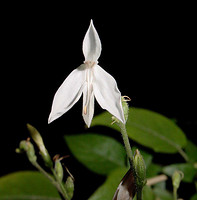
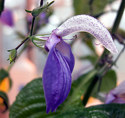
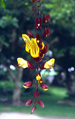
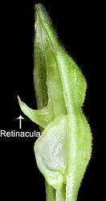
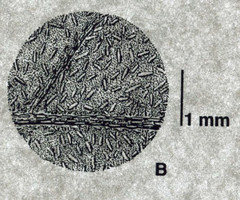
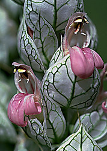
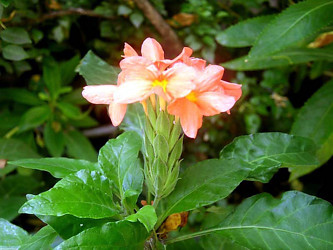

---
aliases:
  - Acanthaceae
title: Acanthaceae
---

# [[Acanthaceae]] 

 
 
 
 

## #has_/text_of_/abstract 

> **Acanthaceae** () is a family (the acanthus family) of dicotyledonous flowering plants containing almost 250 genera and about 2500 species. Most are tropical herbs, shrubs, or twining vines; some are epiphytes. Only a few species are distributed in temperate regions. The four main centres of distribution are Indonesia and Malaysia, Africa, Brazil, and Central America. Representatives of the family can be found in nearly every habitat, including dense or open forests, scrublands, wet fields and valleys, sea coast and marine areas, swamps, and mangrove forests.
>
> [Wikipedia](https://en.wikipedia.org/wiki/Acanthaceae) 

## Phylogeny 

-   « Ancestral Groups  
    -   [Lamiales](../Lamiales.md)
    -   [Asterids](../../Asterids.md)
    -  [Core Eudicots](../../../Core_Eudicots.md) 
    -   [Eudicots](../../../../Eudicots.md)
    -   [Flowering_Plant](../../../../../Flowering_Plant.md)
    -   [Seed_Plant](../../../../../../Seed_Plant.md)
    -   [Land_Plant](../../../../../../../Land_Plant.md)
    -  [Green plants](../../../../../../../../Plant.md) 
    -  [Eukarya](../../../../../../../../../Eukarya.md) 
    -   [Tree of Life](../../../../../../../../../Tree_of_Life.md)

-   ◊ Sibling Groups of  Lamiales
    -   [Oleaceae](Oleaceae.md)
    -   Acanthaceae
    -   [Gesneriaceae](Gesneriaceae.md)

-   » Sub-Groups
    -   [Ruellieae](Acanthaceae/Ruellieae.md)
    -   [Acantheae](Acanthaceae/Acantheae.md)

## Introduction

[Lucinda A. McDade and Carrie Kiel]() 

The large and largely tropical plant family Acanthaceae includes at
least 4000 species. The group is part of the order[Lamiales](../Lamiales.md)) which includes plants such as the
familiar snap dragon (Plantaginaceae), mint (Lamiaceae) and African
violet [Gesneriaceae](Gesneriaceae.md))). These plants
have sympetalous corollas (i.e., with petals fused into a tube) and four
stamens (sometimes reduced further to two).\

Acanthaceae includes the 221 genera treated by Scotland & Vollesen
(2000) plus the black mangrove genus, *Avicennia*. Notably, as a result
of the largely tropical distribution of Acanthaceae, species-level
diversity remains poorly understood, and there is little doubt that many
new species remain to be discovered. In particular, the Neotropics house
the richest and most poorly documented angiosperm flora on Earth. It is
thus not surprising that Neotropical acanths remain incompletely known,
and we expect many more species to be described from this region. As a
quantitative indication of the pace of new discovery in Acanthaceae,
Index Kewensis reports 81 new species described in the genus *Justicia*
alone between 1986 and 1995.  We expect the species count eventually to
exceed 4000.\

### Characteristics

Plants belonging to the Core Acanthaceae (i.e., Acantheae through
Ruellieae as indicated in the phylogeny presented at the top of this
page; Acanthoideae sensu Scotland & Vollesen 2001) may be recognized by
their fruit: a few-seeded, explosively dehiscent capsule within which
seeds are borne on hook-like structures called retinacula (the lignified
derivatives of the funiculus). These retinacula are a unique and
unreversed synapomorphy for Acanthoideae: among these plants--all 4000
of them--fruits vary in size and in seed number but are otherwise
remarkably homogeneous. The hooks presumably serve to propel the seeds
away from the parent plant when the fruit dehisces but studies are
lacking.

\

Retinacula of the fruit of Asystasia gangetica.  © 2006 [Gerald Carr](http://www.botany.hawaii.edu/Faculty/Carr/acanth.htm)

Within Core Acanthaceae, Acantheae are well marked as monophyletic by
morphological and molecular synapomorphies. Its sister group which we
have here called Ruellioideae is also marked by a number of
morphological synapomorphies including cystoliths (crystals) in most
plant structures.

Cystoliths are the small linear structures that \'dot\' the lower
surface of this leaf of a South American *Ruellia* species. © C. Ezcurra

In addition to this core group, four other small lineages are very
closely related and are now treated as part of a broad Acanthaceae: the
pantropical and subtropical black mangroves, *Avicennia*; Old World
*Thunbergia* (including the commonly cultivated black-eyed Susan,
Elytraria, Staurogyne, a handful of other small genera). Each of these
four groups has its own distinctive fruit type. Unfortunately, we have
yet to identify a synapomorphy for all Acanthaceae that is as notable
and easy to recognize as fruit type is for the core group.  Compared to
most other Lamiales, Acanthaceae have relatively few ovules.\

Beyond fruits of Acanthaceae, diversity in other traits is spectacular.
Plants are rosette and caulescent herbs, shrubs and trees (rarely vines
except *Thunbergia* and *Mendoncia* which are almost entirely climbing
plants). Most acanths have solid green leaves, but a few have remarkably
colored leaves, and some are cultivated for their foliage (e.g., polka
dot plant, *Hypoestes phyllostashya*; Persian shield, *Strobilanthes
dyerianus*). Inflorescences of many acanths have large, colorful bracts
that often eclipse the corollas in showiness (e.g., *Pachystachys,
Megaskepasma*; see images below). However, bracts of plants of many
other species are diminutive, green and clearly not involved in
attracting pollinators. Many species have extremely showy flowers and a
number are cultivated for their beauty (e.g.,  *Justicia brandegeana*
and many other species belonging to this large genus*, Aphelandra
squarrosa*; you will see examples below); however, many others have
diminutive green bracts and very small flowers. Across the family,
flowers range in size from a few mm to more than 10 cm, with a parallel
range of variation in shape and color. Variation in these corolla traits
is no doubt associated with a wide range of animal pollinators, although
studies are remarkably few.\

*Pachystachys lutea* Nees (left, © 2006 Lucinda A. McDade) and
*Megaskepasma erythrochlamys* Lindau (middle, © 2003 [Shigenobu Aoki Botanical Garden](http://aoki2.si.gunma-u.ac.jp/BotanicalGarden/HTMLs/Megaskepasma.html))
have large, colorful bracts. *Justicia betonica* L. (right, © Gerald D.
Carr) is cultivated because of its showy flowers.\
### Pollen and Chromosomes

Structural diversity continues below the visible level in Acanthaceae.
In terms of number and type of apertures and, especially in terms of
ultrasculpturing, pollen grains of Acanthaceae are without doubt as
diverse as any other family-level lineage regardless of size.  

Pollen grains of Acanthaceae. From left to right: *Crossandra
sulphurea*, © 1990 Carol Furness. *Acanthus mollis*, *Acanthus
spinosus*, *Neriacanthus grandiflorus*, *Aphelandra flammea*, and
*Crossandra pungens*, © T. F. Daniel.

Chromosome numbers are similarly diverse, with documented haploid
numbers ranging from 7 to 68, thus indicating many evolutionary
transitions via both dysploidy and polyploidy.

### Discussion of Phylogenetic Relationships

There is at present little disagreement among students of Acanthaceae
regarding membership in the family and delineation of the main clades as
presented in the phylogeny above.  There is, however, quite a bit of
work to be done to resolve relationships at a number of levels.  For
example, the results of Schwarzbach & McDade (2001) placed *Avicennia*
sister to Thunbergioideae but without strong support from molecular data
for this relationship and with no identifiable morphological
synapomorphies supporting the relationship.  Similarly, the placement of
*Neuracanthus* among the lineages of core Acanthaceae (i. e., the
lineages with retinacula) have yet to be fully resolved.

There also remains a great deal of work to be done on relationships
within lineages.  At present (August 2006), we present intra-lineage
phylogenetic information for Acantheae, for Isoglossinae and the
Tetramerium Lineage within Justicieae, and for Ruellieae.  Our
continuing work and that of our colleagues will gradually add knowledge
of relationships within the other lineages.     

## Title Illustrations

--------------------------
 
scientific_name ::     Carlowrightia hintonii T.F.Daniel (Justicieae: Tetramerium Lineage)
specimen_condition ::  Live Specimen
copyright ::            © Thomas F. Daniel

------------------------------------------------------------------------
 
scientific_name ::     Brillantaisia nyanzarum Burkill (Ruellieae)
location ::           Greenhouse, Duke University
specimen_condition ::  Live Specimen
Identified By        E. A. Tripp
copyright ::            © 2006 [Erin Tripp](mailto:erin.tripp@duke.edu) 

-----------------

scientific_name ::     Aphelandra impressa Lindau (Acantheae)
location ::           Venezuela
specimen_condition ::  Live Specimen
Identified By        L. A. McDade
copyright ::            © 2006 Mark Skinner

--------------------------------------------------------------------------- 
 
scientific_name ::     Thunbergia mysorensis T.Anders. ex Bedd. (Thunbergioideae)
location ::           Oribi Gorge, Tourist Lodge, South Africa
specimen_condition ::  Live Specimen
copyright ::            © 2006 [Lucinda A. McDade](mailto:lucinda.mcdade@cgu.edu) 

## Confidential Links & Embeds: 

### #is_/same_as :: [[/_Standards/bio/bio~Domain/Eukarya/Plant/Land_Plant/Seed_Plant/Flowering_Plant/Eudicots/Core_Eudicots/Asterids/Lamiales/Acanthaceae|Acanthaceae]] 

### #is_/same_as :: [[/_public/bio/bio~Domain/Eukarya/Plant/Land_Plant/Seed_Plant/Flowering_Plant/Eudicots/Core_Eudicots/Asterids/Lamiales/Acanthaceae.public|Acanthaceae.public]] 

### #is_/same_as :: [[/_internal/bio/bio~Domain/Eukarya/Plant/Land_Plant/Seed_Plant/Flowering_Plant/Eudicots/Core_Eudicots/Asterids/Lamiales/Acanthaceae.internal|Acanthaceae.internal]] 

### #is_/same_as :: [[/_protect/bio/bio~Domain/Eukarya/Plant/Land_Plant/Seed_Plant/Flowering_Plant/Eudicots/Core_Eudicots/Asterids/Lamiales/Acanthaceae.protect|Acanthaceae.protect]] 

### #is_/same_as :: [[/_private/bio/bio~Domain/Eukarya/Plant/Land_Plant/Seed_Plant/Flowering_Plant/Eudicots/Core_Eudicots/Asterids/Lamiales/Acanthaceae.private|Acanthaceae.private]] 

### #is_/same_as :: [[/_personal/bio/bio~Domain/Eukarya/Plant/Land_Plant/Seed_Plant/Flowering_Plant/Eudicots/Core_Eudicots/Asterids/Lamiales/Acanthaceae.personal|Acanthaceae.personal]] 

### #is_/same_as :: [[/_secret/bio/bio~Domain/Eukarya/Plant/Land_Plant/Seed_Plant/Flowering_Plant/Eudicots/Core_Eudicots/Asterids/Lamiales/Acanthaceae.secret|Acanthaceae.secret]] 

