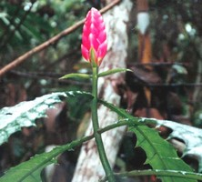

---
title: Acantheae
---

# [[Acantheae]] 

 

 
 

## #has_/text_of_/abstract 

> Acanthoideae is a subfamily of plants in the family Acanthaceae.
>
> [Wikipedia](https://en.wikipedia.org/wiki/Acanthoideae) 

## Phylogeny 

-   « Ancestral Groups  
    -   [Acanthaceae](../Acanthaceae.md)
    -   [Lamiales](../../Lamiales.md)
    -   [Asterids](../../../Asterids.md)
    -  [Core Eudicots](../../../../Core_Eudicots.md))
    -   [Eudicots](../../../../../Eudicots.md)
    -   [Flowering_Plant](../../../../../../Flowering_Plant.md)
    -   [Seed_Plant](../../../../../../../Seed_Plant.md)
    -   [Land_Plant](../../../../../../../../Land_Plant.md)
    -  [Green plants](../../../../../../../../../Plant.md))
    -  [Eukarya](../../../../../../../../../../Eukarya.md))
    -   [Tree of Life](../../../../../../../../../../Tree_of_Life.md)

-   ◊ Sibling Groups of  Acanthaceae
    -   [Ruellieae](Ruellieae.md)
    -   Acantheae

-   » Sub-Groups
    -   [Acanthus Clade](Acanthus_Clade)
    -   [Acanthopsis](Acantheae/Acanthopsis.md)
    -   [Blepharis](Acantheae/Blepharis.md)
    -   [Cynarospermum         asperrimum](Cynarospermum_asperrimum)
    -   [Crossandrella dusenii](Crossandrella_dusenii)
    -   [Streptosiphon hirsutus](Streptosiphon_hirsutus)
    -   [Sclerochiton](Acantheae/Sclerochiton.md)
    -   [Crossandra](Acantheae/Crossandra.md)
    -   [Stenandriopsis Clade](Stenandriopsis_Clade)
    -   [Stenandrium Clade](Stenandrium_Clade)
    -   [Other New World         Acantheae](Other_New_World_Acantheae)

## Introduction

[Lucinda A. McDade and Carrie Kiel]() 

Acantheae are well supported as the basal lineage of core Acanthaceae
(i.e., those plants with retinaculate fruits) and also as a clade.  The
group has  about 500 species that are currently placed in about 20
genera (but this taxonomy does not entirely reflect our recent
phylogenetic results:  McDade et al. 2005).  Plants belonging to this
lineage occur in both the New and Old Worlds; in the Old World, the vast
majority of species occur in Africa with just a few in southern Europe
and in Asia.

### Characteristics

Among Acanthaceae, Acantheae are marked by the synapomorphy of
monothecate anthers.  A few other distantly related lineages of
Acanthaceae have monothecate stamens (e.g., core Isoglossinae of
Justicieae, McDade et al. 2000a, Kiel et al. 2006) but, in these
lineages, the loss of one theca per stamen seems to have occurred after
reduction to two stamens.  In contrast, Acantheae retain the
plesiomorphic trait of four stamens, and this combination of stamen
(four) and thecae (one) number is, to our knowledge, unique among
Acanthaceae. 

Note the four stamens, each with a single theca or anther sac.  This
combination of traits is synapomorphic for Acantheae. © Lucinda McDade

Most New World Acantheae, members of the *Stenandriopsis* clade,
*Crossandra*, *Sclerochiton*, and *Streptosiphon* have a five-lobed
calyx with at least slightly unequal segments: the dorsal lobe is
widest, the paired anterior lobes are narrower, and the paired lateral
lobes are narrowest.   We have proposed that the unequal, 1,2,2
configuration of the calyx is a synapomorphy for Acantheae (McDade et
al. 2005).  The trait has been further modified in the members of the
one-lipped clade that have a four-lobed calyx (see Fig. 2g in McDade et
al. 2005), and also in at least some members of the *Stenandrium* clade
that have narrow, apparently equal segments.  At least the basal members
of the other main lineages of Acanthaceae s.s. have a calyx of five
equal lobes, although there are further modifications in some lineages,
notably Barlerieae.   

As the phylogeny above suggests, the two main lineages of Acantheae can
be characterized as having a plesiomorphic two-lipped corolla or a
synapomorphic one-lipped corolla.  As is typical of Acanthaceae and
Lamiales in general, two-lipped corollas have two lobes in the upper lip
and three lobes in the lower lip.  Plants in the one-lipped clade have
all five lobes of the corolla directed ventrally such that the plants
lack an upper lip (although in some, the dorsal sepal seems to fulfill
that role functionally).  

## Title Illustrations

-----------------
 
Scientific Name ::     Aphelandra impressa Lindau (Acantheae)
Location ::           Venezuela
Specimen Condition   Live Specimen
Identified By        L. A. McDade
Copyright ::            © 2006 Mark Skinner

 
---------------------------------------------------------------------------
Scientific Name ::     Blepharis Juss.
Location ::           Davenham, South Africa
Specimen Condition   Live Specimen
Collection           J
Copyright ::            © 2006 [Lucinda A. McDade](mailto:lucinda.mcdade@cgu.edu) 
---------------------------------------------------------------------------

---------------------
Scientific Name ::     Encephalosphaera lasiandra Mildbr.
Location ::           Peru
Comments             Image is on a herbarium at F
Specimen Condition   Live Specimen
Collector            J. G. Graham & J. Schunke Vigo
Copyright ::            © 2006 [Field Museum](mailto:mcdade@acnatsci.org)
---------------------

---------------------------------------------------------------------------
Scientific Name ::     Stenandrium guineensis (Nees) Vollesen
Location ::           Greenhouses, Kew Botanical Garden, Richmond England
Specimen Condition   Live Specimen
Identified By        K. Vollesen
Copyright ::            © 2006 [Lucinda A. McDade](mailto:lucinda.mcdade@cgu.edu) 
---------------------------------------------------------------------------

## Confidential Links & Embeds: 

### #is_/same_as ::[Acantheae](Acantheae.md)) 

### #is_/same_as :: [Acantheae.public](/_public/bio/bio~Domain/Eukarya/Plants/Land_Plant/Seed_Plant/Flowering_Plant/Eudicots/Core_Eudicots/Asterids/Lamiales/Acanthaceae/Acantheae.public.md) 

### #is_/same_as :: [Acantheae.internal](/_internal/bio/bio~Domain/Eukarya/Plants/Land_Plant/Seed_Plant/Flowering_Plant/Eudicots/Core_Eudicots/Asterids/Lamiales/Acanthaceae/Acantheae.internal.md) 

### #is_/same_as :: [Acantheae.protect](/_protect/bio/bio~Domain/Eukarya/Plants/Land_Plant/Seed_Plant/Flowering_Plant/Eudicots/Core_Eudicots/Asterids/Lamiales/Acanthaceae/Acantheae.protect.md) 

### #is_/same_as :: [Acantheae.private](/_private/bio/bio~Domain/Eukarya/Plants/Land_Plant/Seed_Plant/Flowering_Plant/Eudicots/Core_Eudicots/Asterids/Lamiales/Acanthaceae/Acantheae.private.md) 

### #is_/same_as :: [Acantheae.personal](/_personal/bio/bio~Domain/Eukarya/Plants/Land_Plant/Seed_Plant/Flowering_Plant/Eudicots/Core_Eudicots/Asterids/Lamiales/Acanthaceae/Acantheae.personal.md) 

### #is_/same_as :: [Acantheae.secret](/_secret/bio/bio~Domain/Eukarya/Plants/Land_Plant/Seed_Plant/Flowering_Plant/Eudicots/Core_Eudicots/Asterids/Lamiales/Acanthaceae/Acantheae.secret.md)

