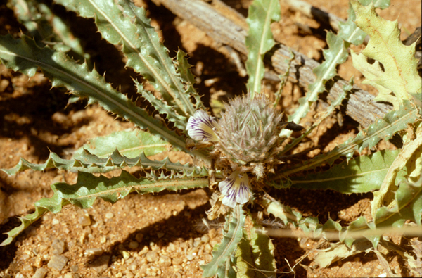

---
aliases:
- Acanthopsis
- 全簕花属
- 全簕花屬
title: Acanthopsis
has_id_wikidata: Q8186577
dv_has_:
  name_:
    an: Acanthopsis
    ast: Acanthopsis
    bg: Acanthopsis
    ca: Acanthopsis
    ceb: Acanthopsis
    de: Acanthopsis
    en: Acanthopsis
    eo: Acanthopsis
    es: Acanthopsis
    eu: Acanthopsis
    ext: Acanthopsis
    fi: Acanthopsis
    fr: Acanthopsis
    ga: Acanthopsis
    gl: Acanthopsis
    hr: Acanthopsis
    ia: Acanthopsis
    ie: Acanthopsis
    io: Acanthopsis
    it: Acanthopsis
    la: Acanthopsis
    mul: Acanthopsis
    nl: Acanthopsis
    oc: Acanthopsis
    pl: Acanthopsis
    pt: Acanthopsis
    pt_br: Acanthopsis
    ro: Acanthopsis
    ru: Acanthopsis
    sq: Acanthopsis
    sv: Acanthopsis
    uk: Acanthopsis
    vi: Acanthopsis
    vo: Acanthopsis
    war: Acanthopsis
    zh: 全簕花属
    zh_cn: 全簕花属
    zh_tw: 全簕花屬
---

# [[Acanthopsis]] 

	
## #has_/text_of_/abstract 

> **Acanthopsis** is a genus of flowering plants in the family Acanthaceae. It includes 20 species native to Namibia and the Cape Provinces of South Africa.
>
> [Wikipedia](https://en.wikipedia.org/wiki/Acanthopsis) 

## Phylogeny 

-   « Ancestral Groups  
    -   [Acantheae](../Acantheae.md)
    -   [Acanthaceae](../../Acanthaceae.md)
    -   [Lamiales](../../../Lamiales.md)
    -   [Asterids](../../../../Asterids.md)
    -  [Core Eudicots](../../../../../Core_Eudicots.md) 
    -   [Eudicots](../../../../../../Eudicots.md)
    -   [Flowering_Plant](../../../../../../../Flowering_Plant.md)
    -   [Seed_Plant](../../../../../../../../Seed_Plant.md)
    -   [Land_Plant](../../../../../../../../../Land_Plant.md)
    -  [Green plants](../../../../../../../../../../Plant.md) 
    -  [Eukarya](../../../../../../../../../../../Eukarya.md) 
    -   [Tree of Life](../../../../../../../../../../../Tree_of_Life.md)

-   ◊ Sibling Groups of  Acantheae
    -   [Acanthus Clade](Acanthus_Clade)
    -   Acanthopsis
    -   [Blepharis](Blepharis.md)
    -   [Cynarospermum         asperrimum](Cynarospermum_asperrimum)
    -   [Crossandrella dusenii](Crossandrella_dusenii)
    -   [Streptosiphon hirsutus](Streptosiphon_hirsutus)
    -   [Sclerochiton](Sclerochiton.md)
    -   [Crossandra](Crossandra.md)
    -   [Stenandriopsis Clade](Stenandriopsis_Clade)
    -   [Stenandrium Clade](Stenandrium_Clade)
    -   [Other New World         Acantheae](Other_New_World_Acantheae)

-   » Sub-Groups 
	-   *Acanthopsis carduifolia*[ Shinz]
	-   *Acanthopsis hoffmannseggiana*[ C. B. Clarke]
	-   *Acanthopsis disperma*[ Nees]

## Introduction

[Lucinda A. McDade and Carrie Kiel]() 

The small southern African genus *Acanthopsis* is monophyletic in
phylogenetic studies to date (McDade et al. 2005).  These plants have
unusual bracts with 3-5 apical spines that are themselves spinescent and
branched hygroscopic trichomes on the seeds.  Although phylogenetic
results based on DNA data place *Acanthopsis* sister to *Acanthus*, we
do not know of morphological data that support this relationship. 
Indeed, the fact that *Acanthopsis* and *Blepharis* have unusual
branched hygroscopic trichomes on their seeds (the seeds of *Acanthus*
are glabrous or puberulous) would suggest a closer relationship between
the former two genera than is supported by our results.

## Title Illustrations

-------------------------------------------------------------------------- 
 
scientific_name ::     Acanthopsis sp. Harv.
location ::           South Africa
specimen_condition ::  Live Specimen
copyright ::            © [Lucinda A. McDade](mailto:lucinda.mcdade@cgu.edu) 

## Confidential Links & Embeds: 

### #is_/same_as :: [[/_Standards/bio/bio~Domain/Eukarya/Plant/Land_Plant/Seed_Plant/Flowering_Plant/Eudicots/Core_Eudicots/Asterids/Lamiales/Acanthaceae/Acantheae/Acanthopsis|Acanthopsis]] 

### #is_/same_as :: [[/_public/bio/bio~Domain/Eukarya/Plant/Land_Plant/Seed_Plant/Flowering_Plant/Eudicots/Core_Eudicots/Asterids/Lamiales/Acanthaceae/Acantheae/Acanthopsis.public|Acanthopsis.public]] 

### #is_/same_as :: [[/_internal/bio/bio~Domain/Eukarya/Plant/Land_Plant/Seed_Plant/Flowering_Plant/Eudicots/Core_Eudicots/Asterids/Lamiales/Acanthaceae/Acantheae/Acanthopsis.internal|Acanthopsis.internal]] 

### #is_/same_as :: [[/_protect/bio/bio~Domain/Eukarya/Plant/Land_Plant/Seed_Plant/Flowering_Plant/Eudicots/Core_Eudicots/Asterids/Lamiales/Acanthaceae/Acantheae/Acanthopsis.protect|Acanthopsis.protect]] 

### #is_/same_as :: [[/_private/bio/bio~Domain/Eukarya/Plant/Land_Plant/Seed_Plant/Flowering_Plant/Eudicots/Core_Eudicots/Asterids/Lamiales/Acanthaceae/Acantheae/Acanthopsis.private|Acanthopsis.private]] 

### #is_/same_as :: [[/_personal/bio/bio~Domain/Eukarya/Plant/Land_Plant/Seed_Plant/Flowering_Plant/Eudicots/Core_Eudicots/Asterids/Lamiales/Acanthaceae/Acantheae/Acanthopsis.personal|Acanthopsis.personal]] 

### #is_/same_as :: [[/_secret/bio/bio~Domain/Eukarya/Plant/Land_Plant/Seed_Plant/Flowering_Plant/Eudicots/Core_Eudicots/Asterids/Lamiales/Acanthaceae/Acantheae/Acanthopsis.secret|Acanthopsis.secret]] 

