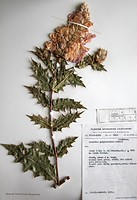
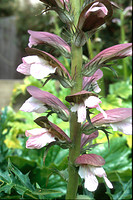
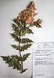
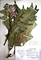

---
aliases:
  - Acanthus
title: Acanthus Clade
---

# [[Acanthus]]

     
	
## #has_/text_of_/abstract 

> **Acanthus** is a genus of about 30 species of flowering plants in the family Acanthaceae, native to tropical and warm temperate regions, with the highest species diversity in the Mediterranean Basin and Asia. This flowering plant is nectar-producing and depends on butterflies, such as Anartia fatima, and other nectar-feeding organisms to distribute its pollen. Common names include Acanthus and bear's breeches. The generic name derives from the Greek term ἄκανθος (akanthos) for Acanthus mollis, a plant that was commonly imitated in Corinthian capitals.
>
> The genus comprises herbaceous perennial plants, rarely subshrubs, with spiny leaves and flower spikes bearing white or purplish flowers. Size varies from 0.4 to 2 m (1.3 to 6.6 ft) in height.
>
> [Wikipedia](https://en.wikipedia.org/wiki/Acanthus%20(plant)) 

## Phylogeny 

-   « Ancestral Groups  
    -   [Acantheae](../Acantheae.md)
    -   [Acanthaceae](../../Acanthaceae.md)
    -   [Lamiales](../../../Lamiales.md)
    -   [Asterids](../../../../Asterids.md)
    -  [Core Eudicots](../../../../../Core_Eudicots.md) 
    -   [Eudicots](../../../../../../Eudicots.md)
    -   [Flowering_Plant](../../../../../../../Flowering_Plant.md)
    -   [Seed_Plant](../../../../../../../../Seed_Plant.md)
    -   [Land_Plant](../../../../../../../../../Land_Plant.md)
    -  [Green plants](../../../../../../../../../../Plant.md) 
    -  [Eukarya](../../../../../../../../../../../Eukarya.md) 
    -   [Tree of Life](../../../../../../../../../../../Tree_of_Life.md)

-   ◊ Sibling Groups of  Acantheae
    -   Acanthus Clade
    -   [Acanthopsis](Acanthopsis.md)
    -   [Blepharis](Blepharis.md)
    -   [Cynarospermum         asperrimum](Cynarospermum_asperrimum)
    -   [Crossandrella dusenii](Crossandrella_dusenii)
    -   [Streptosiphon hirsutus](Streptosiphon_hirsutus)
    -   [Sclerochiton](Sclerochiton.md)
    -   [Crossandra](Crossandra.md)
    -   [Stenandriopsis Clade](Stenandriopsis_Clade)
    -   [Stenandrium Clade](Stenandrium_Clade)
    -   [Other New World         Acantheae](Other_New_World_Acantheae)

-   » Sub-Groups 

	-   *Acanthus eminens*[ C. B. Clarke]
	-   *Acanthus ilicifolius*[ L.]
	-   *Acanthus longifolius*[ Host.]
	-   *Acanthus mollis*[ L.]
	-   *Acanthus montanus*[ (Nees) T. Anders.]
	-   *Acanthus pubescens*[ (Oliver) Engler]
	-   *Acanthus sennii* [ Chiovenda]
	-   *Acanthus spinosus*[ L.]
	-   *Blepharis dhofarensis*[ A. G. Miller]

## Introduction 

[Lucinda A. McDade and Carrie Kiel]()

*Acanthus* L. is an Old World genus of about 20 species; most species
occur in Africa but a few range into southern Europe and one extends
through south Asia and Malesia to Australasia.   Studies to date
indicate that the genus is monophyletic with the inclusion of a single
species of *Blepharis* (see below).  Excepting this single *Blepharis*,
*Acanthus* is apparently unique among members of the one-lipped clade
(i.e., *Crossandra* through *Acanthus* clade in the phylogeny for
Acantheae) in having glabrous or rarely puberulous seeds.

These are, to our knowledge, the only architecturally important members
of Acanthaceae.  *Acanthus* leaves have a long history of use as a
decorative motif in architecture of the Meditteranean area (for
examples: [Acanthus Gallery](http://www.acanth.com/gallery/acanthus02.php)).  A number of
species of *Acanthus* are also widely cultivated, in particular *A*.
*mollis*.

Perhaps the most unusual species of the genus is *A*. *ilicifolius*, the
"mangrove thistle."  This plant shares many of the peculiar adaptations
that characterize mangroves (e.g., special glands to secrete salt,
special roots that emerge above the water surface to permit gas exchange
even during high tide; see Tomlinson 1986).  It occurs in coastal
habitats from south Asia to Australia.  In this context, it is
interesting that the mangrove genus *Avicennia* has been shown to be
part of Acanthaceae s.l.:  phylogenetic results indicate that
*Avicennia* and *A*. *ilicifolius* are not closely related such that the
mangrove habit has evolved twice in acanths.

We refer to this group as the *Acanthus* clade rather than simply
*Acanthus* because, as noted above, it includes one species of
*Blepharis*, *B*. *dhofarensis*.  Inclusion of this species with
*Acanthus* is both very strongly supported by our molecular data (see
McDade et al. 2005) and also unexpected based on morphology.  To verify
our results, we obtained DNA from a different specimen of this species
and obtained essentially identical DNA sequence data for it, which
enabled us to rule out contamination.  Vollesen (2000) has noted that
this species is remarkable in *Blepharis* in a number of characters
including habit, and size of the anthers, capsules, and seeds.  However,
these plants have a number of the synapomorphies of *Blepharis*, notably
dimorphic filaments and hygroscopic trichomes on seeds.  This enigmatic
result deserves further study.

### References

McDade, L. A., T. F. Daniel, C. A. Kiel, and K. Vollesen. 2005.
Phylogenetic relatinships among Acantheae (Acanthaceae): Major lineages
present contrasting patterns of molecular evolution and morphological
differentiation. Systematic Botany 30: 834-862.

Tomlinson, P. B. 1986. The botany of mangroves. Cambridge: Cambridge
University Press.

Vollesen, K. 2000. Blepharis (Acanthaceae): a taxonomic revision. Kew:
Royal Botanic Gardens.

## Title Illustrations

---------------------------------------------------------------------------

Scientific Name ::     Acanthus polystachyus Delile
Location ::           Ethiopia
Reference            Herbarium WAG
Specimen Condition   Dead Specimen
Collection           Plantae Aethiopiae Exsiccatae
Collector            W. de Wilde
Copyright ::            © 2006 [Lucinda A. McDade](mailto:lucinda.mcdade@cgu.edu) 

--------------------------------------------------------------------------- 
 
Scientific Name ::     Acanthus spinosissimus Desf.
Specimen Condition   Live Specimen
Copyright ::            © 2006 [Lucinda A. McDade](mailto:lucinda.mcdade@cgu.edu) 

---------------------------------------------------------------------------

Scientific Name ::     Acanthus eminens C.B. Clarke
Location ::           Bebeka Coffee Plantation, Ethiopia
Reference            Copenhagen Herbarium (C)
Specimen Condition   Dead Specimen
Collection           C
Collector            Friis et al.
Copyright ::            © 2006 [Lucinda A. McDade](mailto:lucinda.mcdade@cgu.edu) 

## Confidential Links & Embeds: 

### #is_/same_as :: [[/_Standards/bio/bio~Domain/Eukarya/Plant/Land_Plant/Seed_Plant/Flowering_Plant/Eudicots/Core_Eudicots/Asterids/Lamiales/Acanthaceae/Acantheae/Acanthus|Acanthus]] 

### #is_/same_as :: [[/_public/bio/bio~Domain/Eukarya/Plant/Land_Plant/Seed_Plant/Flowering_Plant/Eudicots/Core_Eudicots/Asterids/Lamiales/Acanthaceae/Acantheae/Acanthus.public|Acanthus.public]] 

### #is_/same_as :: [[/_internal/bio/bio~Domain/Eukarya/Plant/Land_Plant/Seed_Plant/Flowering_Plant/Eudicots/Core_Eudicots/Asterids/Lamiales/Acanthaceae/Acantheae/Acanthus.internal|Acanthus.internal]] 

### #is_/same_as :: [[/_protect/bio/bio~Domain/Eukarya/Plant/Land_Plant/Seed_Plant/Flowering_Plant/Eudicots/Core_Eudicots/Asterids/Lamiales/Acanthaceae/Acantheae/Acanthus.protect|Acanthus.protect]] 

### #is_/same_as :: [[/_private/bio/bio~Domain/Eukarya/Plant/Land_Plant/Seed_Plant/Flowering_Plant/Eudicots/Core_Eudicots/Asterids/Lamiales/Acanthaceae/Acantheae/Acanthus.private|Acanthus.private]] 

### #is_/same_as :: [[/_personal/bio/bio~Domain/Eukarya/Plant/Land_Plant/Seed_Plant/Flowering_Plant/Eudicots/Core_Eudicots/Asterids/Lamiales/Acanthaceae/Acantheae/Acanthus.personal|Acanthus.personal]] 

### #is_/same_as :: [[/_secret/bio/bio~Domain/Eukarya/Plant/Land_Plant/Seed_Plant/Flowering_Plant/Eudicots/Core_Eudicots/Asterids/Lamiales/Acanthaceae/Acantheae/Acanthus.secret|Acanthus.secret]] 

