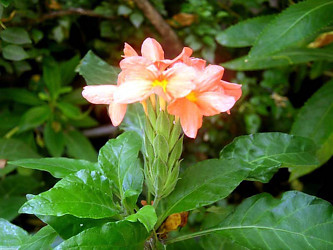

---
aliases:
  - Crossandra
title: Crossandra
---

# [[Crossandra]] 

 

## #has_/text_of_/abstract 

> **Crossandra** is a genus of plants in the family Acanthaceae, comprising 54  species that occur in Africa, Madagascar, Arabia and the Indian subcontinent. Some species, especially Crossandra infundibuliformis, are cultivated for their brightly colored flowers.
>
> [Wikipedia](https://en.wikipedia.org/wiki/Crossandra) 

## Phylogeny 

-   « Ancestral Groups  
    -   [Acantheae](../Acantheae.md)
    -   [Acanthaceae](../../Acanthaceae.md)
    -   [Lamiales](../../../Lamiales.md)
    -   [Asterids](../../../../Asterids.md)
    -  [Core Eudicots](../../../../../Core_Eudicots.md) 
    -   [Eudicots](../../../../../../Eudicots.md)
    -   [Flowering_Plant](../../../../../../../Flowering_Plant.md)
    -   [Seed_Plant](../../../../../../../../Seed_Plant.md)
    -   [Land_Plant](../../../../../../../../../Land_Plant.md)
    -  [Green plants](../../../../../../../../../../Plant.md) 
    -  [Eukarya](../../../../../../../../../../../Eukarya.md) 
    -   [Tree of Life](../../../../../../../../../../../Tree_of_Life.md)

-   ◊ Sibling Groups of  Acantheae
    -   [Acanthus Clade](Acanthus_Clade)
    -   [Acanthopsis](Acanthopsis.md)
    -   [Blepharis](Blepharis.md)
    -   [Cynarospermum         asperrimum](Cynarospermum_asperrimum)
    -   [Crossandrella dusenii](Crossandrella_dusenii)
    -   [Streptosiphon hirsutus](Streptosiphon_hirsutus)
    -   [Sclerochiton](Sclerochiton.md)
    -   Crossandra
    -   [Stenandriopsis Clade](Stenandriopsis_Clade)
    -   [Stenandrium Clade](Stenandrium_Clade)
    -   [Other New World         Acantheae](Other_New_World_Acantheae)

-   » Sub-Groups 
	-   *Crossandra greenstockii* [ S. Moore]
	-   *Crossandra horrida* [ Vollesen]
	-   *Crossandra infundibuliformis*[ (L.) Nees]
	-   *Crossandra longipes* [ S. Moore]
	-   *Crossandra pungens* [ Lindau]
	-   *Crossandra strobilifera*[ (Lam.) Benoist]
	

## Introduction

[Lucinda A. McDade and Carrie Kiel]() 

*Crossandra* is a genus of 52 species that occur in Africa, Madagascar,
Arabia and the Indian subcontinent. A number of species of this genus,
notably *C*. *infundibuliformis*, are cultivated owing to their
beautiful and often brightly colored flowers. \

Like other members of the One-lipped Corolla Lineage (i.e., as indicated
in the phylogeny of Acantheae, all lineages from *Crossandra* through
the *Acanthus* clade), the corollas of plants of *Crossandra* have all
five lobes of the corolla directed ventrally.  The tube is of the same
length dorsally and ventrally (which distinguishes these plants from the
crown clade of Acantheae \[i.e., *Cynarospermum* through *Acanthus*
clade\]) and the stamens are almost always included within the tube
(which distinguishes *Crossandra* from all other members of the
One-Lipped Corolla Lineage except *Crossandrella*). Vollesen (1990)
suggested that the 2-veined and 2-toothed dorsal calyx lobe is a
diagnostic morphological character for at least the African species of
*Crossandra*.  However, this character is sometimes hard to detect and
is apparently lacking or dimorphic in some Malagasy species (Vollesen
1997).\

## Title Illustrations

--------------------------------------------------------------------------- 
 
scientific_name ::     Crossandra nilotica Oliv.
location ::           Tsombitse Park, Tana, Malagasy Republic, Cultivated
specimen_condition ::  Live Specimen
copyright ::            © 2006 [Lucinda A. McDade](mailto:lucinda.mcdade@cgu.edu) 

-------------------------------------------------------------------------- 
 
scientific_name ::     Crossandra infundibuliformis Nees
specimen_condition ::  Live Specimen
copyright ::            © [Lucinda A. McDade](mailto:lucinda.mcdade@cgu.edu) 

## Confidential Links & Embeds: 

### #is_/same_as :: [[/_Standards/bio/bio~Domain/Eukarya/Plant/Land_Plant/Seed_Plant/Flowering_Plant/Eudicots/Core_Eudicots/Asterids/Lamiales/Acanthaceae/Acantheae/Crossandra|Crossandra]] 

### #is_/same_as :: [[/_public/bio/bio~Domain/Eukarya/Plant/Land_Plant/Seed_Plant/Flowering_Plant/Eudicots/Core_Eudicots/Asterids/Lamiales/Acanthaceae/Acantheae/Crossandra.public|Crossandra.public]] 

### #is_/same_as :: [[/_internal/bio/bio~Domain/Eukarya/Plant/Land_Plant/Seed_Plant/Flowering_Plant/Eudicots/Core_Eudicots/Asterids/Lamiales/Acanthaceae/Acantheae/Crossandra.internal|Crossandra.internal]] 

### #is_/same_as :: [[/_protect/bio/bio~Domain/Eukarya/Plant/Land_Plant/Seed_Plant/Flowering_Plant/Eudicots/Core_Eudicots/Asterids/Lamiales/Acanthaceae/Acantheae/Crossandra.protect|Crossandra.protect]] 

### #is_/same_as :: [[/_private/bio/bio~Domain/Eukarya/Plant/Land_Plant/Seed_Plant/Flowering_Plant/Eudicots/Core_Eudicots/Asterids/Lamiales/Acanthaceae/Acantheae/Crossandra.private|Crossandra.private]] 

### #is_/same_as :: [[/_personal/bio/bio~Domain/Eukarya/Plant/Land_Plant/Seed_Plant/Flowering_Plant/Eudicots/Core_Eudicots/Asterids/Lamiales/Acanthaceae/Acantheae/Crossandra.personal|Crossandra.personal]] 

### #is_/same_as :: [[/_secret/bio/bio~Domain/Eukarya/Plant/Land_Plant/Seed_Plant/Flowering_Plant/Eudicots/Core_Eudicots/Asterids/Lamiales/Acanthaceae/Acantheae/Crossandra.secret|Crossandra.secret]] 

