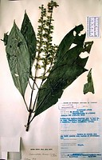

---
aliases:
- Crossandrella
title: Crossandrella dusenii
has_id_wikidata: Q8351878
dv_has_:
  name_:
    an: Crossandrella
    ast: Crossandrella
    bg: Crossandrella
    ca: Crossandrella
    ceb: Crossandrella
    de: Crossandrella
    en: Crossandrella
    eo: Crossandrella
    es: Crossandrella
    eu: Crossandrella
    ext: Crossandrella
    fi: Crossandrella
    fr: Crossandrella
    ga: Crossandrella
    gl: Crossandrella
    hr: Crossandrella
    ia: Crossandrella
    ie: Crossandrella
    io: Crossandrella
    it: Crossandrella
    la: Crossandrella
    mul: Crossandrella
    nl: Crossandrella
    oc: Crossandrella
    pl: Crossandrella
    pt: Crossandrella
    pt-br: Crossandrella
    ro: Crossandrella
    ru: Crossandrella
    sq: Crossandrella
    sv: Crossandrella
    th: Crossandrella
    uk: Crossandrella
    vi: Crossandrella
    vo: Crossandrella
    war: Crossandrella
---
## [[Crossandrella]] 

     

## #has_/text_of_/abstract 

> **Crossandrella** is a genus of flowering plants belonging to the family Acanthaceae.
>
> Its native range is tropical Africa, including Liberia and from Nigeria to Tanzania.
> Species:
> - Crossandrella adamii Heine
> - Crossandrella cristalensis Champl. & Senterre
> - Crossandrella dusenii (Lindau) S.Moore
>
> [Wikipedia](https://en.wikipedia.org/wiki/Crossandrella) 

## Phylogeny 

-   « Ancestral Groups  
    -   [Acantheae](../Acantheae.md)
    -   [Acanthaceae](../../Acanthaceae.md)
    -   [Lamiales](../../../Lamiales.md)
    -   [Asterids](../../../../Asterids.md)
    -  [Core Eudicots](../../../../../Core_Eudicots.md) 
    -   [Eudicots](../../../../../../Eudicots.md)
    -   [Flowering_Plant](../../../../../../../Flowering_Plant.md)
    -   [Seed_Plant](../../../../../../../../Seed_Plant.md)
    -   [Land_Plant](../../../../../../../../../Land_Plant.md)
    -  [Green plants](../../../../../../../../../../Plant.md) 
    -  [Eukarya](../../../../../../../../../../../Eukarya.md) 
    -   [Tree of Life](../../../../../../../../../../../Tree_of_Life.md)

-   ◊ Sibling Groups of  Acantheae
    -   [Acanthus Clade](Acanthus_Clade)
    -   [Acanthopsis](Acanthopsis.md)
    -   [Blepharis](Blepharis.md)
    -   [Cynarospermum         asperrimum](Cynarospermum_asperrimum)
    -   Crossandrella dusenii
    -   [Streptosiphon hirsutus](Streptosiphon_hirsutus)
    -   [Sclerochiton](Sclerochiton.md)
    -   [Crossandra](Crossandra.md)
    -   [Stenandriopsis Clade](Stenandriopsis_Clade)
    -   [Stenandrium Clade](Stenandrium_Clade)
    -   [Other New World         Acantheae](Other_New_World_Acantheae)

-   » Sub-Groups 
	- *Crossandrella dusenii* [(Lindau) S. Moore] 

## Introduction

[Lucinda A. McDade and Carrie Kiel]() 

*Crossandrella* is a West African genus of two species.  These plants
are unique among Acantheae in having beaked capsules that crack
transversely at maturity.  Although our molecular data place
*Crossandrella* as part of the *Schlerochiton* clade, other characters
suggest other affinities.  For example, with *Cynarospermum,*
*Blepharis,* *Acanthopsis* and the *Acanthus* clade, plants of
*Crossandrella* share the four-lobed, \"fused, sheathing, reduced\"
calyx.  In contrast, with *Sclerochiton* and some species of
*Crossandra,* plants of *Crossandrella* share remarkable pollen that is
shaped rather like a Toblerone chocolate bar:  triangular in polar view,
elongate in equatorial view, and with open areas (caveae) at the
\'points\' of the triangle.  In sum, *Crossandrella* presents a mosaic
of characters that do not permiit an entirely satisfactory placement of
the genus.

## Title Illustrations

--------------------------------------------------------------------------- 
 
scientific_name ::     Crossandrella dusenii (Lindau) S. Moore
location ::           Uganda
Reference            KEW (K)
specimen_condition ::  Dead Specimen
Collection           \(K\)
Collector            Poulsen et al. 912
copyright ::            © 2006 [Lucinda A. McDade](mailto:lucinda.mcdade@cgu.edu) 

---------------------------------------------------------------------------
 
scientific_name ::     Crossandrella dusenii (Lindau) S. Moore
location ::           Uganda
specimen_condition ::  Dead Specimen
copyright ::            © 2006 [Lucinda A. McDade](mailto:lucinda.mcdade@cgu.edu) 

--------------------------------------------------------------------------- 
) 
scientific_name ::     Crossandrella dusenii (Lindau) S. Moore
location ::           Republic of Cameroon
Reference            KEW
specimen_condition ::  Dead Specimen
Collection           KEW
Collector            Letzy 8179
copyright ::            © 2006 [Lucinda A. McDade](mailto:lucinda.mcdade@cgu.edu) 

## Confidential Links & Embeds: 

### #is_/same_as :: [[/_Standards/bio/bio~Domain/Eukarya/Plant/Land_Plant/Seed_Plant/Flowering_Plant/Eudicots/Core_Eudicots/Asterids/Lamiales/Acanthaceae/Acantheae/Crossandrella|Crossandrella]] 

### #is_/same_as :: [[/_public/bio/bio~Domain/Eukarya/Plant/Land_Plant/Seed_Plant/Flowering_Plant/Eudicots/Core_Eudicots/Asterids/Lamiales/Acanthaceae/Acantheae/Crossandrella.public|Crossandrella.public]] 

### #is_/same_as :: [[/_internal/bio/bio~Domain/Eukarya/Plant/Land_Plant/Seed_Plant/Flowering_Plant/Eudicots/Core_Eudicots/Asterids/Lamiales/Acanthaceae/Acantheae/Crossandrella.internal|Crossandrella.internal]] 

### #is_/same_as :: [[/_protect/bio/bio~Domain/Eukarya/Plant/Land_Plant/Seed_Plant/Flowering_Plant/Eudicots/Core_Eudicots/Asterids/Lamiales/Acanthaceae/Acantheae/Crossandrella.protect|Crossandrella.protect]] 

### #is_/same_as :: [[/_private/bio/bio~Domain/Eukarya/Plant/Land_Plant/Seed_Plant/Flowering_Plant/Eudicots/Core_Eudicots/Asterids/Lamiales/Acanthaceae/Acantheae/Crossandrella.private|Crossandrella.private]] 

### #is_/same_as :: [[/_personal/bio/bio~Domain/Eukarya/Plant/Land_Plant/Seed_Plant/Flowering_Plant/Eudicots/Core_Eudicots/Asterids/Lamiales/Acanthaceae/Acantheae/Crossandrella.personal|Crossandrella.personal]] 

### #is_/same_as :: [[/_secret/bio/bio~Domain/Eukarya/Plant/Land_Plant/Seed_Plant/Flowering_Plant/Eudicots/Core_Eudicots/Asterids/Lamiales/Acanthaceae/Acantheae/Crossandrella.secret|Crossandrella.secret]] 

