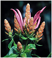

# New World Acantheae 

       

## Introduction

[Lucinda A. McDade and Carrie Kiel]()

All other New World members of Acantheae are part of a large, poorly
resolved clade that includes *Neriacanthus* (except Jamaican *N.
purdieanus* which is part of the *Stenandrium* clade), *Rhombochlamys*
(2 species), *Encephalosphaera* (3 species), *Geissomeria* (15 species),
and the large and morphologically diverse genus *Aphelandra* (180
species). Molecular data suggest the existence of a number of subclades
but relationships among these are poorly resolved by the data that we
assembled for McDade et al. (2005) and that form the basis of the
information presented here for Acantheae.

## Phylogeny 

-   « Ancestral Groups  
    -   [Acantheae](../Acantheae.md)
    -   [Acanthaceae](../../Acanthaceae.md)
    -   [Lamiales](../../../Lamiales.md)
    -   [Asterids](../../../../Asterids.md)
    -  [Core Eudicots](../../../../../Core_Eudicots.md))
    -   [Eudicots](../../../../../../Eudicots.md)
    -   [Flowering_Plant](../../../../../../../Flowering_Plant.md)
    -   [Seed_Plant](../../../../../../../../Seed_Plant.md)
    -   [Land_Plant](../../../../../../../../../Land_Plant.md)
    -  [Green plants](../../../../../../../../../../Plant.md))
    -  [Eukarya](../../../../../../../../../../../Eukarya.md))
    -   [Tree of Life](../../../../../../../../../../../Tree_of_Life.md)

-   ◊ Sibling Groups of  Acantheae
    -   [Acanthus Clade](Acanthus_Clade)
    -   [Acanthopsis](Acanthopsis.md)
    -   [Blepharis](Blepharis.md)
    -   [Cynarospermum         asperrimum](Cynarospermum_asperrimum)
    -   [Crossandrella dusenii](Crossandrella_dusenii)
    -   [Streptosiphon hirsutus](Streptosiphon_hirsutus)
    -   [Sclerochiton](Sclerochiton.md)
    -   [Crossandra](Crossandra.md)
    -   [Stenandriopsis Clade](Stenandriopsis_Clade)
    -   [Stenandrium Clade](Stenandrium_Clade)
    -   Other New World Acantheae

-   » Sub-Groups 
	-   *Aphelandra aurantiaca* [ Lindl.]
	-   *Aphelandra boyacensis* [ Leonard]
	-   *Aphelandra campanensis* [ Durkee]
	-   *Aphelandra castanifolia* [ Britton]
	-   *Aphelandra dolichantha* [ Donn. Sm.]
	-   *Aphelandra fasciculata* [ Wassh]
	-   *Aphelandra fernandezii* [ Leonard]
	-   *Aphelandra golfodulcensis* [ McDade]
	-   *Aphelandra gigantiflora* [ Lindau]
	-   *Aphelandra guerrerensis* [ Wassh.]
	-   *Aphelandra hylaea* [ Leonard]
	-   *Aphelandra impressa* [ Lindau]
	-   *Aphelandra lasia* [ Leonard]
	-   *Aphelandra leonardii* [ McDade]
	-   *Aphelandra maculata*[ (Tafalla ex Nees) Voss]
	-   *Aphelandra maximiliana* [ (Nees) Bentham]
	-   *Aphelandra rubra* [ Wassh.]
	-   *Aphelandra runcinata* [ Klotzsch in DC ex Nees]
	-   *Aphelandra speciosa* [ Brandegee]
	-   *Aphelandra squarrosa* [ Nees]
	-   *Aphelandra tetragona* [ Nees]
	-   *Aphelandra tonduzii* [ Leonard]
	-   *Aphelandra tridentata* [ Hemsl.]
	-   *Encephalosphaera lasiandra* [ Mildbr.]
	-   *Geissomeria longiflora* [ Lindl.]
	-   *Geissomeria tetragona* [ Lindau]
	-   *Neriacanthus grandiflorus* [ Leonard]
	-   *Neriacanthus lehmannianus* [ Lindau]
	-   *Rhombochlamys rosulata* [ Lindau]

## Title Illustrations

  ---------------------------------------------------------------------------

Scientific Name ::     Aphelandra terryae Standl.
Specimen Condition   Live Specimen
Copyright ::            © 2006 [Lucinda A. McDade](mailto:lucinda.mcdade@cgu.edu) 

---------------------------------------------------------------------------)
Scientific Name ::     Aphelandra macrophylla Leonard
Specimen Condition   Live Specimen
Copyright ::            © 2006 [Lucinda A. McDade](mailto:lucinda.mcdade@cgu.edu) 

--------------------------------------------------------------------------)
Scientific Name ::     Geissomeria tetragona Lindau
Specimen Condition   Live Specimen
Copyright ::            © [Lucinda A. McDade](mailto:lucinda.mcdade@cgu.edu) 

---------------

Scientific Name ::     Aphelandra rosulata (Lindau) Wassh.
Location ::           Ecuador
Specimen Condition   Live Specimen
Collector            John L. Clark
Copyright ::            © 2005 John L. Clark

## Confidential Links & Embeds: 

### #is_/same_as :: [New_Acantheae](/_Standards/bio/bio~Domain/Eukarya/Plant/Land_Plant/Seed_Plant/Flowering_Plant/Eudicots/Core_Eudicots/Asterids/Lamiales/Acanthaceae/Acantheae/New_Acantheae.md) 

### #is_/same_as :: [New_Acantheae.public](/_public/bio/bio~Domain/Eukarya/Plant/Land_Plant/Seed_Plant/Flowering_Plant/Eudicots/Core_Eudicots/Asterids/Lamiales/Acanthaceae/Acantheae/New_Acantheae.public.md) 

### #is_/same_as :: [New_Acantheae.internal](/_internal/bio/bio~Domain/Eukarya/Plant/Land_Plant/Seed_Plant/Flowering_Plant/Eudicots/Core_Eudicots/Asterids/Lamiales/Acanthaceae/Acantheae/New_Acantheae.internal.md) 

### #is_/same_as :: [New_Acantheae.protect](/_protect/bio/bio~Domain/Eukarya/Plant/Land_Plant/Seed_Plant/Flowering_Plant/Eudicots/Core_Eudicots/Asterids/Lamiales/Acanthaceae/Acantheae/New_Acantheae.protect.md) 

### #is_/same_as :: [New_Acantheae.private](/_private/bio/bio~Domain/Eukarya/Plant/Land_Plant/Seed_Plant/Flowering_Plant/Eudicots/Core_Eudicots/Asterids/Lamiales/Acanthaceae/Acantheae/New_Acantheae.private.md) 

### #is_/same_as :: [New_Acantheae.personal](/_personal/bio/bio~Domain/Eukarya/Plant/Land_Plant/Seed_Plant/Flowering_Plant/Eudicots/Core_Eudicots/Asterids/Lamiales/Acanthaceae/Acantheae/New_Acantheae.personal.md) 

### #is_/same_as :: [New_Acantheae.secret](/_secret/bio/bio~Domain/Eukarya/Plant/Land_Plant/Seed_Plant/Flowering_Plant/Eudicots/Core_Eudicots/Asterids/Lamiales/Acanthaceae/Acantheae/New_Acantheae.secret.md)

