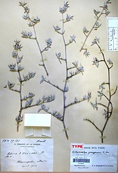
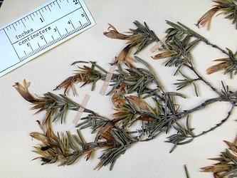
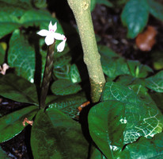

---
aliases:
  - Stenandriopsis
title: Stenandriopsis Clade
has_id_wikidata: Q10374140
---
# [[Stenandriopsis]] 

 
 
 

## #has_/text_of_/abstract 

> **Stenandriopsis** is a genus of flowering plants belonging to the family Acanthaceae. It includes 20 species native to tropical Africa and Madagascar. Molecular phylogenies have placed the Old World Stenandriopsis apart from New World Stenandrium, and the genus is accepted in a classification of the family Acanthaceae published in 2022.
>
> [Wikipedia](https://en.wikipedia.org/wiki/Stenandriopsis) 

## Phylogeny 

-   « Ancestral Groups  
    -   [Acantheae](../Acantheae.md)
    -   [Acanthaceae](../../Acanthaceae.md)
    -   [Lamiales](../../../Lamiales.md)
    -   [Asterids](../../../../Asterids.md)
    -  [Core Eudicots](../../../../../Core_Eudicots.md) 
    -   [Eudicots](../../../../../../Eudicots.md)
    -   [Flowering_Plant](../../../../../../../Flowering_Plant.md)
    -   [Seed_Plant](../../../../../../../../Seed_Plant.md)
    -   [Land_Plant](../../../../../../../../../Land_Plant.md)
    -  [Green plants](../../../../../../../../../../Plant.md) 
    -  [Eukarya](../../../../../../../../../../../Eukarya.md) 
    -   [Tree of Life](../../../../../../../../../../../Tree_of_Life.md)

-   ◊ Sibling Groups of  Acantheae
    -   [Acanthus Clade](Acanthus_Clade)
    -   [Acanthopsis](Acanthopsis.md)
    -   [Blepharis](Blepharis.md)
    -   [Cynarospermum         asperrimum](Cynarospermum_asperrimum)
    -   [Crossandrella dusenii](Crossandrella_dusenii)
    -   [Streptosiphon hirsutus](Streptosiphon_hirsutus)
    -   [Sclerochiton](Sclerochiton.md)
    -   [Crossandra](Crossandra.md)
    -   Stenandriopsis Clade
    -   [Stenandrium Clade](Stenandrium_Clade)
    -   [Other New World         Acantheae](Other_New_World_Acantheae)

-   » Sub-Groups 
	-   *Achyrocalyx decaryi* [ Benoist]
	-   *Stenandrium afromontanum*[ (Mildbr.) Vollesen]
	    [(=Stenandriopsis afromontana (Mildbr.) Benoist)]
	-   *Stenandrium guineensis*[ (Nees) Vollesen ]
	    [(=Stenandriopsis guineense (Nees) Benoist)]
	-   *Stenandrium humile Benoist Vollesen* [ (Benoist ) Vollesen
	    ] [(=Stenandriopsis humile Benoist)]
	-   *Stenandrium thompsonii*[ (S. Moore) Vollesen ]
	    [(=Stenandriopsis thompsonii S. Moore)]
	-   *Stenandrium warneckei*[ (S. Moore) Vollesen ] [(=
	    Stenandriopsis warneckei (S. Moore) Napper)]

## Introduction

[Lucinda A. McDade and Carrie Kiel]() 

The basal clade of the \"Two-lipped Corolla\" lineage apparently
includes all Old World Acantheae that retain the primitive corolla
morphology. *Stenandriopsis* is a genus of 17 species that are
distributed in Africa and Madagascar. Based in part on the similar (but
plesiomorphic) corolla morphology, Vollesen (1992) transferred species
of *Stenandriopsis* to *Stenandrium,* but molecular data indicate that
the Old World and New World plants instead form two distinct lineages.
The small Malagasy genus *Achyrocalyx* (3 species) is also part of the
*Stenandriopsis* clade and our data indicate that recognition of this
genus as distinct from *Stenandriopsis* may be unwarranted.

## Title Illustrations

--------------------------------------------------------------------------- 
 
scientific_name ::     Achyrocalyx gossypinus Benoist
location ::           Madagascar
Reference            \(P\) Herbarium Museum Paris
specimen_condition ::  Dead Specimen
Collector            Perrier de la Bathie
copyright ::            © 2006 [Lucinda A. McDade](mailto:lucinda.mcdade@cgu.edu) 

--------------------------------------------------------------------------- 
 
scientific_name ::     Achyrocalyx pungens Benoist
location ::           Madagascar
specimen_condition ::  Dead Specimen
copyright ::            © 2006 [Lucinda A. McDade](mailto:lucinda.mcdade@cgu.edu) 

scientific_name ::     Stenandrium guineensis (Nees) Vollesen
location ::           Greenhouses, Kew Botanical Garden, Richmond England
specimen_condition ::  Live Specimen
Identified By        K. Vollesen
copyright ::            © 2006 [Lucinda A. McDade](mailto:lucinda.mcdade@cgu.edu) 

--------------------------------------------------------------------------- 
 
scientific_name ::     Achyrocalyx pungens Benoist
location ::           Madagascar
Reference            \(P\) Herbarium Museum Paris
specimen_condition ::  Dead Specimen
Collector            Rauh
copyright ::            © 2006 [Lucinda A. McDade](mailto:lucinda.mcdade@cgu.edu) 

## Confidential Links & Embeds: 

### #is_/same_as :: [[/_Standards/bio/bio~Domain/Eukarya/Plant/Land_Plant/Seed_Plant/Flowering_Plant/Eudicots/Core_Eudicots/Asterids/Lamiales/Acanthaceae/Acantheae/Stenandriopsis|Stenandriopsis]] 

### #is_/same_as :: [[/_public/bio/bio~Domain/Eukarya/Plant/Land_Plant/Seed_Plant/Flowering_Plant/Eudicots/Core_Eudicots/Asterids/Lamiales/Acanthaceae/Acantheae/Stenandriopsis.public|Stenandriopsis.public]] 

### #is_/same_as :: [[/_internal/bio/bio~Domain/Eukarya/Plant/Land_Plant/Seed_Plant/Flowering_Plant/Eudicots/Core_Eudicots/Asterids/Lamiales/Acanthaceae/Acantheae/Stenandriopsis.internal|Stenandriopsis.internal]] 

### #is_/same_as :: [[/_protect/bio/bio~Domain/Eukarya/Plant/Land_Plant/Seed_Plant/Flowering_Plant/Eudicots/Core_Eudicots/Asterids/Lamiales/Acanthaceae/Acantheae/Stenandriopsis.protect|Stenandriopsis.protect]] 

### #is_/same_as :: [[/_private/bio/bio~Domain/Eukarya/Plant/Land_Plant/Seed_Plant/Flowering_Plant/Eudicots/Core_Eudicots/Asterids/Lamiales/Acanthaceae/Acantheae/Stenandriopsis.private|Stenandriopsis.private]] 

### #is_/same_as :: [[/_personal/bio/bio~Domain/Eukarya/Plant/Land_Plant/Seed_Plant/Flowering_Plant/Eudicots/Core_Eudicots/Asterids/Lamiales/Acanthaceae/Acantheae/Stenandriopsis.personal|Stenandriopsis.personal]] 

### #is_/same_as :: [[/_secret/bio/bio~Domain/Eukarya/Plant/Land_Plant/Seed_Plant/Flowering_Plant/Eudicots/Core_Eudicots/Asterids/Lamiales/Acanthaceae/Acantheae/Stenandriopsis.secret|Stenandriopsis.secret]] 

