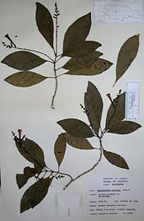
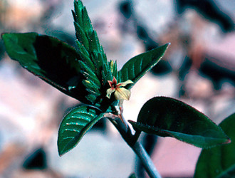
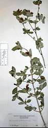
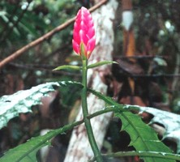

---
aliases:
- Stenandrium
- стенандриум
- ذات الخصلة الهلبية
- ذات الخصلة الهلبيه
title: Stenandrium Clade
has_id_wikidata: Q629836
dv_has_:
  name_:
    an: Stenandrium
    ar: ذات الخصلة الهلبية
    arz: ذات الخصلة الهلبيه
    ast: Stenandrium
    be: Stenandrium
    bg: стенандриум
    ca: Stenandrium
    ceb: Stenandrium
    de: Stenandrium
    en: Stenandrium
    eo: Stenandrium
    es: Stenandrium
    eu: Stenandrium
    ext: Stenandrium
    fi: Stenandrium
    fr: Stenandrium
    ga: Stenandrium
    gl: Stenandrium
    hr: Stenandrium
    ia: Stenandrium
    ie: Stenandrium
    io: Stenandrium
    it: Stenandrium
    la: Stenandrium
    mul: Stenandrium
    nl: Stenandrium
    oc: Stenandrium
    pl: Stenandrium
    pt: Stenandrium
    pt_br: Stenandrium
    ro: Stenandrium
    ru: Стенандриум
    sq: Stenandrium
    sv: Stenandrium
    tr: Stenandrium
    uk: Stenandrium
    vi: Stenandrium
    vo: Stenandrium
    war: Stenandrium
---
## Phylogeny 

-   « Ancestral Groups  
    -   [Acantheae](../Acantheae.md)
    -   [Acanthaceae](../../Acanthaceae.md)
    -   [Lamiales](../../../Lamiales.md)
    -   [Asterids](../../../../Asterids.md)
    -  [Core Eudicots](../../../../../Core_Eudicots.md) 
    -   [Eudicots](../../../../../../Eudicots.md)
    -   [Flowering_Plant](../../../../../../../Flowering_Plant.md)
    -   [Seed_Plant](../../../../../../../../Seed_Plant.md)
    -   [Land_Plant](../../../../../../../../../Land_Plant.md)
    -  [Green plants](../../../../../../../../../../Plant.md) 
    -  [Eukarya](../../../../../../../../../../../Eukarya.md) 
    -   [Tree of Life](../../../../../../../../../../../Tree_of_Life.md)

-   ◊ Sibling Groups of  Acantheae
    -   [Acanthus Clade](Acanthus_Clade)
    -   [Acanthopsis](Acanthopsis.md)
    -   [Blepharis](Blepharis.md)
    -   [Cynarospermum         asperrimum](Cynarospermum_asperrimum)
    -   [Crossandrella dusenii](Crossandrella_dusenii)
    -   [Streptosiphon hirsutus](Streptosiphon_hirsutus)
    -   [Sclerochiton](Sclerochiton.md)
    -   [Crossandra](Crossandra.md)
    -   [Stenandriopsis Clade](Stenandriopsis_Clade)
    -   Stenandrium Clade
    -   [Other New World         Acantheae](Other_New_World_Acantheae)

-   » Sub-Groups 

	-   *Aphelandra verticillata* [ Nees]
	-   *Holographis ehrenbergiana* [ Nees]
	-   *Holographis pallida* [ Leonard & Gentry]
	-   *Holographis velutifolia*[ (House) T. F. Daniel]
	-   *Neriacanthus purdieanus* [ Benth.]
	-   *Salpixantha coccinea* [ Hook.]
	-   *Stenandrium mandioccanum* [ Nees]
	-   *Stenandrium pilosulum*[ (S. F. Blake) T. F. Daniel]
# [[Stenandrium]] 

     

## #has_/text_of_/abstract 

> **Stenandrium**  is a genus of flowering plants in the family Acanthaceae native to the Americas, with 50 species of perennial herbs ranging from the southern United States to northern Argentina and central Chile.
>
> [Wikipedia](https://en.wikipedia.org/wiki/Stenandrium) 

## Introduction

[Lucinda A. McDade and Carrie Kiel]() 

The *Stenandrium* clade includes the New World genera *Stenandrium* and
*Holographis* plus three surprises: the two Jamaican Acantheae,
*Salpixantha* (with a single species) and *Neriacanthus* *purdieanus*
(one of five species, the others occur in mainly South America and
Panama) are part of the *Stenandrium* clade as is at least one species
of *Aphelandra*, *A. verticillata* (so far as we know, the other species
of *Aphelandra* are part of the \"Other New World Acantheae\" clade).
Interestingly, so far as is known, plants belonging to this clade share
a base chromosome number of 13 which appears to be a synapomorphy and
distinguishes these plants from other New World Acantheae which (again,
so far as is known) have x = 14. Chromosome numbers are not known for
*Salpixantha*, *N. purdieanus* or *A. verticillata* but we predict x =
13 for these taxa. This clade is remarkable for its diversity of corolla
morphologies, presumably associated with adaptation for different
pollinators although empirical studies are few.

## Title Illustrations

-------------------------------------------------------------------------- 
 
scientific_name ::     Salpixantha coccinea Hook.
Reference            British Museum (BM)
specimen_condition ::  Dead Specimen
Collection           BM
Collector            George R. Procter 11046
copyright ::            © [Lucinda A. McDade](mailto:lucinda.mcdade@cgu.edu) 

--------------------------------------------------------------------------

scientific_name ::     Holographis argyrea (Leonard) T.F. Daniel
specimen_condition ::  Live Specimen
copyright ::            © [Lucinda A. McDade](mailto:lucinda.mcdade@cgu.edu) 

--------------------------------------------------------------------------- 
 
scientific_name ::     Holographis ehrenbergiana Nees
location ::           Mexico
Reference            Kew Botanical Gardens (KEW)
specimen_condition ::  Dead Specimen
Collection           K
Collector            C. A. Purpose
copyright ::            © 2006 [Lucinda A. McDade](mailto:lucinda.mcdade@cgu.edu) 

## Confidential Links & Embeds: 

### #is_/same_as :: [[/_Standards/bio/bio~Domain/Eukarya/Plant/Land_Plant/Seed_Plant/Flowering_Plant/Eudicots/Core_Eudicots/Asterids/Lamiales/Acanthaceae/Acantheae/Stenandrium|Stenandrium]] 

### #is_/same_as :: [[/_public/bio/bio~Domain/Eukarya/Plant/Land_Plant/Seed_Plant/Flowering_Plant/Eudicots/Core_Eudicots/Asterids/Lamiales/Acanthaceae/Acantheae/Stenandrium.public|Stenandrium.public]] 

### #is_/same_as :: [[/_internal/bio/bio~Domain/Eukarya/Plant/Land_Plant/Seed_Plant/Flowering_Plant/Eudicots/Core_Eudicots/Asterids/Lamiales/Acanthaceae/Acantheae/Stenandrium.internal|Stenandrium.internal]] 

### #is_/same_as :: [[/_protect/bio/bio~Domain/Eukarya/Plant/Land_Plant/Seed_Plant/Flowering_Plant/Eudicots/Core_Eudicots/Asterids/Lamiales/Acanthaceae/Acantheae/Stenandrium.protect|Stenandrium.protect]] 

### #is_/same_as :: [[/_private/bio/bio~Domain/Eukarya/Plant/Land_Plant/Seed_Plant/Flowering_Plant/Eudicots/Core_Eudicots/Asterids/Lamiales/Acanthaceae/Acantheae/Stenandrium.private|Stenandrium.private]] 

### #is_/same_as :: [[/_personal/bio/bio~Domain/Eukarya/Plant/Land_Plant/Seed_Plant/Flowering_Plant/Eudicots/Core_Eudicots/Asterids/Lamiales/Acanthaceae/Acantheae/Stenandrium.personal|Stenandrium.personal]] 

### #is_/same_as :: [[/_secret/bio/bio~Domain/Eukarya/Plant/Land_Plant/Seed_Plant/Flowering_Plant/Eudicots/Core_Eudicots/Asterids/Lamiales/Acanthaceae/Acantheae/Stenandrium.secret|Stenandrium.secret]] 

