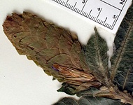
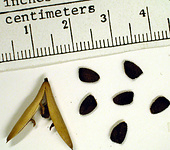
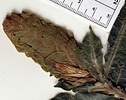
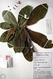

---
aliases:
  - Streptosiphon
title: Streptosiphon hirsutus
---

## [[Streptosiphon]] 

 

## #has_/text_of_/abstract 

> **Streptosiphon** hirsutus is a species of flowering plant belonging to the family Acanthaceae. 
> It is a shrub endemic to Tanzania. It is the sole species in genus Streptosiphon.
>
> [Wikipedia](https://en.wikipedia.org/wiki/Streptosiphon) 

## Phylogeny 

-   « Ancestral Groups  
    -   [Acantheae](../Acantheae.md)
    -   [Acanthaceae](../../Acanthaceae.md)
    -   [Lamiales](../../../Lamiales.md)
    -   [Asterids](../../../../Asterids.md)
    -  [Core Eudicots](../../../../../Core_Eudicots.md))
    -   [Eudicots](../../../../../../Eudicots.md)
    -   [Flowering_Plant](../../../../../../../Flowering_Plant.md)
    -   [Seed_Plant](../../../../../../../../Seed_Plant.md)
    -   [Land_Plant](../../../../../../../../../Land_Plant.md)
    -  [Green plants](../../../../../../../../../../Plant.md))
    -  [Eukarya](../../../../../../../../../../../Eukarya.md))
    -   [Tree of Life](../../../../../../../../../../../Tree_of_Life.md)

-   ◊ Sibling Groups of  Acantheae
    -   [Acanthus Clade](Acanthus_Clade)
    -   [Acanthopsis](Acanthopsis.md)
    -   [Blepharis](Blepharis.md)
    -   [Cynarospermum         asperrimum](Cynarospermum_asperrimum)
    -   [Crossandrella dusenii](Crossandrella_dusenii)
    -   [Streptosiphon hirsutus](Streptosiphon_hirsutus)
    -   [Sclerochiton](Sclerochiton.md)
    -   [Crossandra](Crossandra.md)
    -   [Stenandriopsis Clade](Stenandriopsis_Clade)
    -   [Stenandrium Clade](Stenandrium_Clade)
    -   [Other New World         Acantheae](Other_New_World_Acantheae)

-   » Sub-Groups 
	- *Streptosiphon hirsutus* [Mildbr.] 

## Introduction

[Lucinda A. McDade and Carrie Kiel]()

*Streptosiphon* is a genus of a single species that occurs in Tanzania.
This plant is unique among Acantheae in having corollas that are
resupinate (i.e., upside down) via twisting of the tube through 180
degrees.   Although our molecular data place *Streptosiphon* as part of
the *Schlerochiton* clade, other characters suggest other affinities. 
For example, like *Crossandrella* and some species of *Crossandra*,
these plants have remarkable pollen that is shaped rather like a
Toblerone chocolate bar:  triangular in polar view, elongate in
equatorial view, and with open areas (caveae) at the \'points\' of the
triangle.  Our molecular data, as well as other morphological
characters, strongly suggest that this pollen type has evolved several
times in Acantheae.

## Title Illustrations

---------------------------------------------------------------------------

Scientific Name ::     Streptosiphon hirsutus Mildbr.
Location ::           Tanzania
Specimen Condition   Dead Specimen
Copyright ::            © 2006 [Lucinda A. McDade](mailto:lucinda.mcdade@cgu.edu) 

---------------------------------------------------------------------------

Scientific Name ::     Streptosiphon hirsutus Mildbr.
Location ::           Tanzania
Reference            Copenhagen Herbarum (C)
Specimen Condition   Dead Specimen
Collection           \(C\)
Collector            Mwasumbi & Clarke
Copyright ::            © 2006 [Lucinda A. McDade](mailto:lucinda.mcdade@cgu.edu) 

---------------------------------------------------------------------------)
Scientific Name ::     Streptosiphon hirsutus Mildbr.
Location ::           Tanzania
Specimen Condition   Dead Specimen
Copyright ::            © 2006 [Lucinda A. McDade](mailto:lucinda.mcdade@cgu.edu) 

## Confidential Links & Embeds: 

### #is_/same_as :: [Streptosiphon](/_Standards/bio/bio~Domain/Eukarya/Plant/Land_Plant/Seed_Plant/Flowering_Plant/Eudicots/Core_Eudicots/Asterids/Lamiales/Acanthaceae/Acantheae/Streptosiphon.md) 

### #is_/same_as :: [Streptosiphon.public](/_public/bio/bio~Domain/Eukarya/Plant/Land_Plant/Seed_Plant/Flowering_Plant/Eudicots/Core_Eudicots/Asterids/Lamiales/Acanthaceae/Acantheae/Streptosiphon.public.md) 

### #is_/same_as :: [Streptosiphon.internal](/_internal/bio/bio~Domain/Eukarya/Plant/Land_Plant/Seed_Plant/Flowering_Plant/Eudicots/Core_Eudicots/Asterids/Lamiales/Acanthaceae/Acantheae/Streptosiphon.internal.md) 

### #is_/same_as :: [Streptosiphon.protect](/_protect/bio/bio~Domain/Eukarya/Plant/Land_Plant/Seed_Plant/Flowering_Plant/Eudicots/Core_Eudicots/Asterids/Lamiales/Acanthaceae/Acantheae/Streptosiphon.protect.md) 

### #is_/same_as :: [Streptosiphon.private](/_private/bio/bio~Domain/Eukarya/Plant/Land_Plant/Seed_Plant/Flowering_Plant/Eudicots/Core_Eudicots/Asterids/Lamiales/Acanthaceae/Acantheae/Streptosiphon.private.md) 

### #is_/same_as :: [Streptosiphon.personal](/_personal/bio/bio~Domain/Eukarya/Plant/Land_Plant/Seed_Plant/Flowering_Plant/Eudicots/Core_Eudicots/Asterids/Lamiales/Acanthaceae/Acantheae/Streptosiphon.personal.md) 

### #is_/same_as :: [Streptosiphon.secret](/_secret/bio/bio~Domain/Eukarya/Plant/Land_Plant/Seed_Plant/Flowering_Plant/Eudicots/Core_Eudicots/Asterids/Lamiales/Acanthaceae/Acantheae/Streptosiphon.secret.md)

