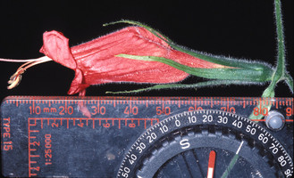
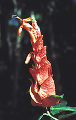

---
aliases:
  - Ruellieae
title: Ruellieae
---

# [[Ruellieae]] 

 
 
 

## #has_/text_of_/abstract 

> Acanthoideae is a subfamily of plants in the family Acanthaceae.
>
> [Wikipedia](https://en.wikipedia.org/wiki/Acanthoideae) 

## Phylogeny 

-   « Ancestral Groups  
    -   [Acanthaceae](../Acanthaceae.md)
    -   [Lamiales](../../Lamiales.md)
    -   [Asterids](../../../Asterids.md)
    -  [Core Eudicots](../../../../Core_Eudicots.md) 
    -   [Eudicots](../../../../../Eudicots.md)
    -   [Flowering_Plant](../../../../../../Flowering_Plant.md)
    -   [Seed_Plant](../../../../../../../Seed_Plant.md)
    -   [Land_Plant](../../../../../../../../Land_Plant.md)
    -  [Green plants](../../../../../../../../../Plant.md) 
    -  [Eukarya](../../../../../../../../../../Eukarya.md) 
    -   [Tree of Life](../../../../../../../../../../Tree_of_Life.md)

-   ◊ Sibling Groups of  Acanthaceae
    -   Ruellieae
    -   [Acantheae](Acantheae.md)

-   » Sub-Groups
    -   [Ruellia s. l.](Ruellia_s._l.)
    -   [Acanthopale](Ruellieae/Acanthopale.md)
    -   [Brillantaisia](Ruellieae/Brillantaisia.md)
    -   [Hemigraphis + Strobilanthes +         relatives](Hemigraphis_%2B_Strobilanthes_%2B_relatives)
    -   [Bravaisia](Ruellieae/Bravaisia.md)
    -   [Suessenguthia](Ruellieae/Suessenguthia.md)
    -   [Sanchezia](Ruellieae/Sanchezia.md)
    -   [Louteridium](Ruellieae/Louteridium.md)
    -   [Dyschoriste](Ruellieae/Dyschoriste.md)
    -   [Phaulopsis](Ruellieae/Phaulopsis.md)

## Introduction

[Erin Tripp]()

The Ruellieae lineage consists of some 750+ species (ca. 50 genera) that
are distributed throughout the tropics, New and Old World, and also
extend into temperate latitudes.  It includes several diverse genera
such as *Ruellia, Strobilanthes, Sanchezia, Hygrophila,* and
*Dyschoriste* among others.  Pollination syndromes and floral
morphologies are wildly diverse in the group.  The genus *Ruellia* alone
is known to be pollinated by bees, hummingbirds, sunbirds, hawkmoths,
butterflies, and bats.  Cleistogamy, or the production of closed (thus
obligately self-fertilizing) flowers, is also widespread in Ruellieae.

### Characteristics

Synapomorphies that distinguish Ruellieae from other Acanthaceae clades
are poorly studied but may include left-contort corolla aestivation,
seeds with mucilaginous hygroscopic trichomes, unequal stigma lobes,
presence of a \"filament curtain\" (see Manktelow 2000), or combinations
of the above characters. The filament curtain is a barrier formed by the
fusion of four filaments that partition the corolla tube longitudinally.
This structure deserves further study because of its potential taxonomic
utility as well as ecological importance.

### Discussion of Phylogenetic Relationships

The phylogenetic hypothesis above is based on preliminary data and only
a fraction of the generic diversity is represented. To date, little is
known about evolutionary relationships within Ruellieae. Additional
research will improve our understanding of this species-rich and
morphologically diverse lineage.

## Title Illustrations

--------------------------------------------------- 
 
scientific_name ::     Eremomastax polysperma (Benth.) Dandy
location ::           Jardin Botanique de Lyon
specimen_condition ::  Live Specimen
copyright ::            © 2006 [Gaïa du Rivau](http://www.jardin-botanique-lyon.com/jbot/sections/fr/les_plantes_du_jardi/le_coin_des_artistes/zoom/photos_de_gaia_du_ri/)

-----------

scientific_name ::     Ruellia inflata
location ::           Bolivia
specimen_condition ::  Live Specimen
copyright ::            © 2002 John L. Clark

----------------------------------------------------------------------- 
 
scientific_name ::     Blechum pyramidatum (Lam.) Urb.
location ::           Tabasco, Mexico
specimen_condition ::  Live Specimen
Collector            E. Tripp
copyright ::            © [Erin Tripp](mailto:erin.tripp@duke.edu) 

-----------------------------------------------------------------------

scientific_name ::     Bravaisia integerrima Standl.
location ::           La Selva, Costa Rica
specimen_condition ::  Live Specimen
copyright ::            © [Erin Tripp](mailto:erin.tripp@duke.edu) 

## Confidential Links & Embeds: 

### #is_/same_as :: [[/_Standards/bio/bio~Domain/Eukarya/Plant/Land_Plant/Seed_Plant/Flowering_Plant/Eudicots/Core_Eudicots/Asterids/Lamiales/Acanthaceae/Ruellieae|Ruellieae]] 

### #is_/same_as :: [[/_public/bio/bio~Domain/Eukarya/Plant/Land_Plant/Seed_Plant/Flowering_Plant/Eudicots/Core_Eudicots/Asterids/Lamiales/Acanthaceae/Ruellieae.public|Ruellieae.public]] 

### #is_/same_as :: [[/_internal/bio/bio~Domain/Eukarya/Plant/Land_Plant/Seed_Plant/Flowering_Plant/Eudicots/Core_Eudicots/Asterids/Lamiales/Acanthaceae/Ruellieae.internal|Ruellieae.internal]] 

### #is_/same_as :: [[/_protect/bio/bio~Domain/Eukarya/Plant/Land_Plant/Seed_Plant/Flowering_Plant/Eudicots/Core_Eudicots/Asterids/Lamiales/Acanthaceae/Ruellieae.protect|Ruellieae.protect]] 

### #is_/same_as :: [[/_private/bio/bio~Domain/Eukarya/Plant/Land_Plant/Seed_Plant/Flowering_Plant/Eudicots/Core_Eudicots/Asterids/Lamiales/Acanthaceae/Ruellieae.private|Ruellieae.private]] 

### #is_/same_as :: [[/_personal/bio/bio~Domain/Eukarya/Plant/Land_Plant/Seed_Plant/Flowering_Plant/Eudicots/Core_Eudicots/Asterids/Lamiales/Acanthaceae/Ruellieae.personal|Ruellieae.personal]] 

### #is_/same_as :: [[/_secret/bio/bio~Domain/Eukarya/Plant/Land_Plant/Seed_Plant/Flowering_Plant/Eudicots/Core_Eudicots/Asterids/Lamiales/Acanthaceae/Ruellieae.secret|Ruellieae.secret]] 

