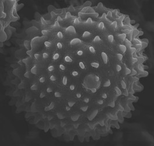

---
aliases:
- Acanthopale
- akantopala
- акантопале
- 鵑蘆莉屬
- 鹃芦莉属
title: Acanthopale
has_id_wikidata: Q2065116
dv_has_:
  name_:
    an: Acanthopale
    ast: Acanthopale
    bg: акантопале
    ca: Acanthopale
    ceb: Acanthopale
    de: Acanthopale
    en: Acanthopale
    eo: Acanthopale
    es: Acanthopale
    eu: Acanthopale
    ext: Acanthopale
    fi: Acanthopale
    fr: Acanthopale
    ga: Acanthopale
    gl: Acanthopale
    hr: Acanthopale
    ia: Acanthopale
    ie: Acanthopale
    io: Acanthopale
    it: Acanthopale
    la: Acanthopale
    mul: Acanthopale
    nl: Acanthopale
    oc: Acanthopale
    pl: Acanthopale
    pt: Acanthopale
    pt_br: Acanthopale
    ro: Acanthopale
    ru: Акантопале
    sk: akantopala
    sq: Acanthopale
    uk: Acanthopale
    vi: Acanthopale
    vo: Acanthopale
    war: Acanthopale
    zh: 鹃芦莉属
    zh_cn: 鹃芦莉属
    zh_hans: 鹃芦莉属
    zh_tw: 鵑蘆莉屬
---
# [[Acanthopale]] 

 

## #has_/text_of_/abstract 

> **Acanthopale** is a plant genus of shrubs or subshrubs  in the Acanthaceae plant family. 
> The genus name is based on the classic Greek words for thorn ákantha and stake palum. 
> Some species in the genus are cultivated as ornamental plants.
>
> [Wikipedia](https://en.wikipedia.org/wiki/Acanthopale) 

## Phylogeny 

-   « Ancestral Groups  
    -   [Ruellieae](../Ruellieae.md)
    -   [Acanthaceae](../../Acanthaceae.md)
    -   [Lamiales](../../../Lamiales.md)
    -   [Asterids](../../../../Asterids.md)
    -  [Core Eudicots](../../../../../Core_Eudicots.md) 
    -   [Eudicots](../../../../../../Eudicots.md)
    -   [Flowering_Plant](../../../../../../../Flowering_Plant.md)
    -   [Seed_Plant](../../../../../../../../Seed_Plant.md)
    -   [Land_Plant](../../../../../../../../../Land_Plant.md)
    -  [Green plants](../../../../../../../../../../Plant.md) 
    -  [Eukarya](../../../../../../../../../../../Eukarya.md) 
    -   [Tree of Life](../../../../../../../../../../../Tree_of_Life.md)

-   ◊ Sibling Groups of  Ruellieae
    -   [Ruellia s. l.](Ruellia_s._l.)
    -   Acanthopale
    -   [Brillantaisia](Brillantaisia.md)
    -   [Hemigraphis + Strobilanthes +         relatives](Hemigraphis_%2B_Strobilanthes_%2B_relatives)
    -   [Bravaisia](Bravaisia.md)
    -   [Suessenguthia](Suessenguthia.md)
    -   [Sanchezia](Sanchezia.md)
    -   [Louteridium](Louteridium.md)
    -   [Dyschoriste](Dyschoriste.md)
    -   [Phaulopsis](Phaulopsis.md)

-   » Sub-Groups 
	-   *Acanthopale albosetulosa*[ C. B. Clarke]
	-   *Acanthopale azaleoides*[ C. B. Clarke]
	-   *Acanthopale buchholzii*[ C. B. Clarke]
	-   *Acanthopale confertiflora*[ C. B. Clarke]
	-   *Acanothpale decempedalis*[ C. B. Clarke]
	-   *Acanthopale laxiflora*[ C. B. Clarke]
	-   *Acanthopale pubescens*[ C. B. Clarke ]

## Title Illustrations

----------------------------------------------------------------------- 
 
scientific_name ::     Acanthopale decempedalis C. B. Clarke
specimen_condition ::  Dead Specimen
Identified By        Erin A. Tripp
Life Cycle Stage ::     pollen
copyright ::            © [Erin Tripp](mailto:erin.tripp@duke.edu) 

## Confidential Links & Embeds: 

### #is_/same_as :: [[/_Standards/bio/bio~Domain/Eukarya/Plant/Land_Plant/Seed_Plant/Flowering_Plant/Eudicots/Core_Eudicots/Asterids/Lamiales/Acanthaceae/Ruellieae/Acanthopale|Acanthopale]] 

### #is_/same_as :: [[/_public/bio/bio~Domain/Eukarya/Plant/Land_Plant/Seed_Plant/Flowering_Plant/Eudicots/Core_Eudicots/Asterids/Lamiales/Acanthaceae/Ruellieae/Acanthopale.public|Acanthopale.public]] 

### #is_/same_as :: [[/_internal/bio/bio~Domain/Eukarya/Plant/Land_Plant/Seed_Plant/Flowering_Plant/Eudicots/Core_Eudicots/Asterids/Lamiales/Acanthaceae/Ruellieae/Acanthopale.internal|Acanthopale.internal]] 

### #is_/same_as :: [[/_protect/bio/bio~Domain/Eukarya/Plant/Land_Plant/Seed_Plant/Flowering_Plant/Eudicots/Core_Eudicots/Asterids/Lamiales/Acanthaceae/Ruellieae/Acanthopale.protect|Acanthopale.protect]] 

### #is_/same_as :: [[/_private/bio/bio~Domain/Eukarya/Plant/Land_Plant/Seed_Plant/Flowering_Plant/Eudicots/Core_Eudicots/Asterids/Lamiales/Acanthaceae/Ruellieae/Acanthopale.private|Acanthopale.private]] 

### #is_/same_as :: [[/_personal/bio/bio~Domain/Eukarya/Plant/Land_Plant/Seed_Plant/Flowering_Plant/Eudicots/Core_Eudicots/Asterids/Lamiales/Acanthaceae/Ruellieae/Acanthopale.personal|Acanthopale.personal]] 

### #is_/same_as :: [[/_secret/bio/bio~Domain/Eukarya/Plant/Land_Plant/Seed_Plant/Flowering_Plant/Eudicots/Core_Eudicots/Asterids/Lamiales/Acanthaceae/Ruellieae/Acanthopale.secret|Acanthopale.secret]] 

