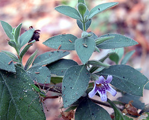
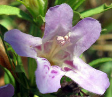
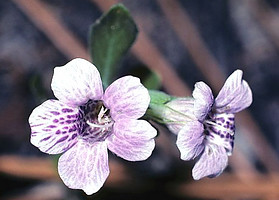
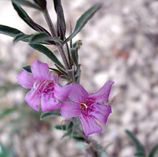

---
aliases:
- Dyschoriste
- snakeherb
- ضيفد
- திசுகோரிசுட்டே
- 距药蓝属
title: Dyschoriste
has_id_wikidata: Q5319367
dv_has_:
  name_:
    an: Dyschoriste
    ar: ضيفد
    ast: Dyschoriste
    bg: Dyschoriste
    ca: Dyschoriste
    ceb: Dyschoriste
    de: Dyschoriste
    en: Dyschoriste
    eo: Dyschoriste
    es: Dyschoriste
    eu: Dyschoriste
    ext: Dyschoriste
    fi: Dyschoriste
    fr: Dyschoriste
    ga: Dyschoriste
    gl: Dyschoriste
    hr: Dyschoriste
    ia: Dyschoriste
    ie: Dyschoriste
    io: Dyschoriste
    it: Dyschoriste
    la: Dyschoriste
    mul: Dyschoriste
    mwl: Dyschoriste
    nl: Dyschoriste
    oc: Dyschoriste
    pl: Dyschoriste
    pt: Dyschoriste
    pt_br: Dyschoriste
    ro: Dyschoriste
    ru: Dyschoriste
    sq: Dyschoriste
    sv: Dyschoriste
    ta: திசுகோரிசுட்டே
    tr: Dyschoriste
    uk: Dyschoriste
    vi: Dyschoriste
    vo: Dyschoriste
    war: Dyschoriste
    zh: 距药蓝属
    zh_cn: 距药蓝属
    zh_hans: 距药蓝属
---

# [[Dyschoriste]] 

       

## #has_/text_of_/abstract 

> **Dyschoriste** is a genus of flowering plants in the family Acanthaceae. 
> It includes 98 species native to the tropics and subtropics of the Americas, sub-Saharan Africa, and southern Asia. 
> Members of the genus are commonly known as snakeherb.
>
> [Wikipedia](https://en.wikipedia.org/wiki/Dyschoriste) 

## Phylogeny 

-   « Ancestral Groups  
    -   [Ruellieae](../Ruellieae.md)
    -   [Acanthaceae](../../Acanthaceae.md)
    -   [Lamiales](../../../Lamiales.md)
    -   [Asterids](../../../../Asterids.md)
    -  [Core Eudicots](../../../../../Core_Eudicots.md) 
    -   [Eudicots](../../../../../../Eudicots.md)
    -   [Flowering_Plant](../../../../../../../Flowering_Plant.md)
    -   [Seed_Plant](../../../../../../../../Seed_Plant.md)
    -   [Land_Plant](../../../../../../../../../Land_Plant.md)
    -  [Green plants](../../../../../../../../../../Plant.md) 
    -  [Eukarya](../../../../../../../../../../../Eukarya.md) 
    -   [Tree of Life](../../../../../../../../../../../Tree_of_Life.md)

-   ◊ Sibling Groups of  Ruellieae
    -   [Ruellia s. l.](Ruellia_s._l.)
    -   [Acanthopale](Acanthopale.md)
    -   [Brillantaisia](Brillantaisia.md)
    -   [Hemigraphis + Strobilanthes +         relatives](Hemigraphis_%2B_Strobilanthes_%2B_relatives)
    -   [Bravaisia](Bravaisia.md)
    -   [Suessenguthia](Suessenguthia.md)
    -   [Sanchezia](Sanchezia.md)
    -   [Louteridium](Louteridium.md)
    -   Dyschoriste
    -   [Phaulopsis](Phaulopsis.md)

-   » Sub-Groups 

## Introduction

[Erin Tripp]()

*Dyschoriste* is a pantropical genus of perhaps 50 species. Taxa have
four, fertile stamens with anther appendages. Several species have a
region of hyaline tissue between calyx lobes, a trait also found in some
*Duosperma, Petalidium*, and *Suessenguthia*.

## Title Illustrations

----------------------------------------------------------------------- 
 
scientific_name ::     Dyschoriste hirsutissima (Nees) Kuntze
location ::           Oaxaca, Mexico
specimen_condition ::  Live Specimen
Collector            E. Tripp
copyright ::            © [Erin Tripp](mailto:erin.tripp@duke.edu) 

---------------------------------- 
 
scientific_name ::     Dyschoriste linearis (Torr. & A.Gray) Kuntze
location ::           Taylor County, Texas
specimen_condition ::  Live Specimen
copyright ::            © 2005 [Catnapin](http://www.catnapin.com/WildWeeds/Flowers-B/PurpleBlueBilateralAcanthus.htm)

-------------------------- 
 
scientific_name ::     Dyschoriste oblongifolia Kuntze
specimen_condition ::  Live Specimen
copyright ::            © [Peter G. May](http://www.stetson.edu/%7Epmay/stock%20flora.htm)

---------------------------------- 
 
scientific_name ::     Dyschoriste linearis (Torr. & A.Gray) Kuntze
specimen_condition ::  Live Specimen
copyright ::            © 2003 [Texas Tech University](http://www.depts.ttu.edu/hillcountry/research/wildflowers.htm)

## Confidential Links & Embeds: 

### #is_/same_as :: [[/_Standards/bio/bio~Domain/Eukarya/Plant/Land_Plant/Seed_Plant/Flowering_Plant/Eudicots/Core_Eudicots/Asterids/Lamiales/Acanthaceae/Ruellieae/Dyschoriste|Dyschoriste]] 

### #is_/same_as :: [[/_public/bio/bio~Domain/Eukarya/Plant/Land_Plant/Seed_Plant/Flowering_Plant/Eudicots/Core_Eudicots/Asterids/Lamiales/Acanthaceae/Ruellieae/Dyschoriste.public|Dyschoriste.public]] 

### #is_/same_as :: [[/_internal/bio/bio~Domain/Eukarya/Plant/Land_Plant/Seed_Plant/Flowering_Plant/Eudicots/Core_Eudicots/Asterids/Lamiales/Acanthaceae/Ruellieae/Dyschoriste.internal|Dyschoriste.internal]] 

### #is_/same_as :: [[/_protect/bio/bio~Domain/Eukarya/Plant/Land_Plant/Seed_Plant/Flowering_Plant/Eudicots/Core_Eudicots/Asterids/Lamiales/Acanthaceae/Ruellieae/Dyschoriste.protect|Dyschoriste.protect]] 

### #is_/same_as :: [[/_private/bio/bio~Domain/Eukarya/Plant/Land_Plant/Seed_Plant/Flowering_Plant/Eudicots/Core_Eudicots/Asterids/Lamiales/Acanthaceae/Ruellieae/Dyschoriste.private|Dyschoriste.private]] 

### #is_/same_as :: [[/_personal/bio/bio~Domain/Eukarya/Plant/Land_Plant/Seed_Plant/Flowering_Plant/Eudicots/Core_Eudicots/Asterids/Lamiales/Acanthaceae/Ruellieae/Dyschoriste.personal|Dyschoriste.personal]] 

### #is_/same_as :: [[/_secret/bio/bio~Domain/Eukarya/Plant/Land_Plant/Seed_Plant/Flowering_Plant/Eudicots/Core_Eudicots/Asterids/Lamiales/Acanthaceae/Ruellieae/Dyschoriste.secret|Dyschoriste.secret]] 

