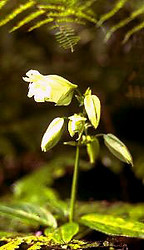

---
aliases:
  - Louteridium
title: Louteridium
---

# [[Louteridium]] 

 

## #has_/text_of_/abstract 

> **Louteridium** is a genus of flowering plants belonging to the family Acanthaceae.
>
> Its native range is Mexico to Central America.
>
> Species:
> - Louteridium brevicalyx A.T.Richardson
> - Louteridium chartaceum Leonard
> - Louteridium costaricense Radlk. & Donn.Sm.
> - Louteridium dendropilosum T.F.Daniel
> - Louteridium donnell-smithii S.Watson
> - Louteridium koelzii Miranda & McVaugh
> - Louteridium mexicanum (Baill.) Standl.
> - Louteridium parayi Miranda
> - Louteridium purpusii Brandegee
> - Louteridium rzedowskianum T.F.Daniel
> - Louteridium tamaulipense A.T.Richardson
>
> [Wikipedia](https://en.wikipedia.org/wiki/Louteridium) 

## Phylogeny 

-   « Ancestral Groups  
    -   [Ruellieae](../Ruellieae.md)
    -   [Acanthaceae](../../Acanthaceae.md)
    -   [Lamiales](../../../Lamiales.md)
    -   [Asterids](../../../../Asterids.md)
    -  [Core Eudicots](../../../../../Core_Eudicots.md) 
    -   [Eudicots](../../../../../../Eudicots.md)
    -   [Flowering_Plant](../../../../../../../Flowering_Plant.md)
    -   [Seed_Plant](../../../../../../../../Seed_Plant.md)
    -   [Land_Plant](../../../../../../../../../Land_Plant.md)
    -  [Green plants](../../../../../../../../../../Plant.md) 
    -  [Eukarya](../../../../../../../../../../../Eukarya.md) 
    -   [Tree of Life](../../../../../../../../../../../Tree_of_Life.md)

-   ◊ Sibling Groups of  Ruellieae
    -   [Ruellia s. l.](Ruellia_s._l.)
    -   [Acanthopale](Acanthopale.md)
    -   [Brillantaisia](Brillantaisia.md)
    -   [Hemigraphis + Strobilanthes +         relatives](Hemigraphis_%2B_Strobilanthes_%2B_relatives)
    -   [Bravaisia](Bravaisia.md)
    -   [Suessenguthia](Suessenguthia.md)
    -   [Sanchezia](Sanchezia.md)
    -   Louteridium
    -   [Dyschoriste](Dyschoriste.md)
    -   [Phaulopsis](Phaulopsis.md)

-   » Sub-Groups 

## Introduction

[Erin Tripp]() 

*Louteridium* is a poorly known genus of ca. 10 species. Mexico is its
center of distribution, and representatives also occur in moist regions
south to Panama. Within Ruellieae, *Louteridium* is distinct in having a
three-lobed calyx (vs. five in all other genera). *Louteridium* species
are shrubs or small trees with pale colored, gibbous flowers, and two
fertile stamens (plus two staminodes). The stamens and style are
exserted far beyond the corolla mouth. These and other characters
suggest that Louteridium might be bat pollinated, but little to nothing
is known about reproductive biology of the species.

## Title Illustrations

  ---------------------------------------
  Scientific Name ::     Louteridium costaricense Radlk. & Donn.Sm.
  Specimen Condition   Live Specimen
  Copyright ::            © 2006 [www.sagan-gea.org](http://www.sagan-gea.org/hojared_biodiversidad/paginas/hoja2_flora_amenazada.html)
  ---------------------------------------

## Confidential Links & Embeds: 

### #is_/same_as :: [[/_Standards/bio/bio~Domain/Eukarya/Plant/Land_Plant/Seed_Plant/Flowering_Plant/Eudicots/Core_Eudicots/Asterids/Lamiales/Acanthaceae/Ruellieae/Louteridium|Louteridium]] 

### #is_/same_as :: [[/_public/bio/bio~Domain/Eukarya/Plant/Land_Plant/Seed_Plant/Flowering_Plant/Eudicots/Core_Eudicots/Asterids/Lamiales/Acanthaceae/Ruellieae/Louteridium.public|Louteridium.public]] 

### #is_/same_as :: [[/_internal/bio/bio~Domain/Eukarya/Plant/Land_Plant/Seed_Plant/Flowering_Plant/Eudicots/Core_Eudicots/Asterids/Lamiales/Acanthaceae/Ruellieae/Louteridium.internal|Louteridium.internal]] 

### #is_/same_as :: [[/_protect/bio/bio~Domain/Eukarya/Plant/Land_Plant/Seed_Plant/Flowering_Plant/Eudicots/Core_Eudicots/Asterids/Lamiales/Acanthaceae/Ruellieae/Louteridium.protect|Louteridium.protect]] 

### #is_/same_as :: [[/_private/bio/bio~Domain/Eukarya/Plant/Land_Plant/Seed_Plant/Flowering_Plant/Eudicots/Core_Eudicots/Asterids/Lamiales/Acanthaceae/Ruellieae/Louteridium.private|Louteridium.private]] 

### #is_/same_as :: [[/_personal/bio/bio~Domain/Eukarya/Plant/Land_Plant/Seed_Plant/Flowering_Plant/Eudicots/Core_Eudicots/Asterids/Lamiales/Acanthaceae/Ruellieae/Louteridium.personal|Louteridium.personal]] 

### #is_/same_as :: [[/_secret/bio/bio~Domain/Eukarya/Plant/Land_Plant/Seed_Plant/Flowering_Plant/Eudicots/Core_Eudicots/Asterids/Lamiales/Acanthaceae/Ruellieae/Louteridium.secret|Louteridium.secret]] 

