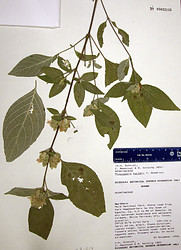
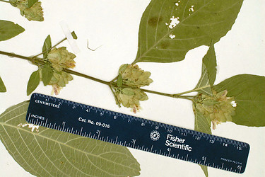

---
aliases:
  - Phaulopsis
title: Phaulopsis
---

## Phylogeny 

-   « Ancestral Groups  
    -   [Ruellieae](../Ruellieae.md)
    -   [Acanthaceae](../../Acanthaceae.md)
    -   [Lamiales](../../../Lamiales.md)
    -   [Asterids](../../../../Asterids.md)
    -  [Core Eudicots](../../../../../Core_Eudicots.md) 
    -   [Eudicots](../../../../../../Eudicots.md)
    -   [Flowering_Plant](../../../../../../../Flowering_Plant.md)
    -   [Seed_Plant](../../../../../../../../Seed_Plant.md)
    -   [Land_Plant](../../../../../../../../../Land_Plant.md)
    -  [Green plants](../../../../../../../../../../Plant.md) 
    -  [Eukarya](../../../../../../../../../../../Eukarya.md) 
    -   [Tree of Life](../../../../../../../../../../../Tree_of_Life.md)

-   ◊ Sibling Groups of  Ruellieae
    -   [Ruellia s. l.](Ruellia_s._l.)
    -   [Acanthopale](Acanthopale.md)
    -   [Brillantaisia](Brillantaisia.md)
    -   [Hemigraphis + Strobilanthes +         relatives](Hemigraphis_%2B_Strobilanthes_%2B_relatives)
    -   [Bravaisia](Bravaisia.md)
    -   [Suessenguthia](Suessenguthia.md)
    -   [Sanchezia](Sanchezia.md)
    -   [Louteridium](Louteridium.md)
    -   [Dyschoriste](Dyschoriste.md)
    -   Phaulopsis

-   » Sub-Groups 

# *Phaulopsis* 

Containing group: [Ruellieae](../Ruellieae.md)

## Introduction

[Erin Tripp]() 

*Phaulopsis* is predominantly an African genus with a center of diversity in southern Zaire. 
Most species occur within 10 degrees of the northern and southern parallels. 

Manktelow (1996) treated 22 species (plus a few intraspecific names) 
in her monograph of the genus. 
Species are mostly insect pollinated or autogamous.
Some have medicinal, cultural, or nutritional uses.

## Title Illustrations

------------------------------------------------------------------------ 
)
Scientific Name ::     Phaulopsis barteri T. Anderson
Location ::           Ghana
Specimen Condition   Dead Specimen
Collector            Schmidt
Copyright ::            © 2006 [Erin Tripp](mailto:erin.tripp@duke.edu) 

------------------------------------------------------------------------ 
)
Scientific Name ::     Phaulopsis barteri T. Anderson
Location ::           Ghana
Specimen Condition   Dead Specimen
Collector            Schmidt
Copyright ::            © 2006 [Erin Tripp](mailto:erin.tripp@duke.edu) 

## Confidential Links & Embeds: 

### #is_/same_as :: [[/_Standards/bio/bio~Domain/Eukarya/Plant/Land_Plant/Seed_Plant/Flowering_Plant/Eudicots/Core_Eudicots/Asterids/Lamiales/Acanthaceae/Ruellieae/Phaulopsis|Phaulopsis]] 

### #is_/same_as :: [[/_public/bio/bio~Domain/Eukarya/Plant/Land_Plant/Seed_Plant/Flowering_Plant/Eudicots/Core_Eudicots/Asterids/Lamiales/Acanthaceae/Ruellieae/Phaulopsis.public|Phaulopsis.public]] 

### #is_/same_as :: [[/_internal/bio/bio~Domain/Eukarya/Plant/Land_Plant/Seed_Plant/Flowering_Plant/Eudicots/Core_Eudicots/Asterids/Lamiales/Acanthaceae/Ruellieae/Phaulopsis.internal|Phaulopsis.internal]] 

### #is_/same_as :: [[/_protect/bio/bio~Domain/Eukarya/Plant/Land_Plant/Seed_Plant/Flowering_Plant/Eudicots/Core_Eudicots/Asterids/Lamiales/Acanthaceae/Ruellieae/Phaulopsis.protect|Phaulopsis.protect]] 

### #is_/same_as :: [[/_private/bio/bio~Domain/Eukarya/Plant/Land_Plant/Seed_Plant/Flowering_Plant/Eudicots/Core_Eudicots/Asterids/Lamiales/Acanthaceae/Ruellieae/Phaulopsis.private|Phaulopsis.private]] 

### #is_/same_as :: [[/_personal/bio/bio~Domain/Eukarya/Plant/Land_Plant/Seed_Plant/Flowering_Plant/Eudicots/Core_Eudicots/Asterids/Lamiales/Acanthaceae/Ruellieae/Phaulopsis.personal|Phaulopsis.personal]] 

### #is_/same_as :: [[/_secret/bio/bio~Domain/Eukarya/Plant/Land_Plant/Seed_Plant/Flowering_Plant/Eudicots/Core_Eudicots/Asterids/Lamiales/Acanthaceae/Ruellieae/Phaulopsis.secret|Phaulopsis.secret]] 

