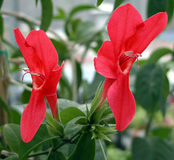
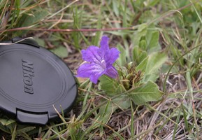
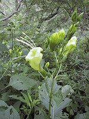
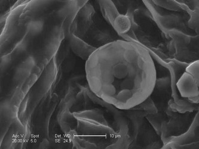
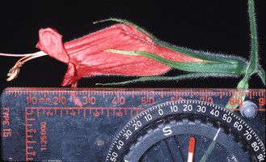

---
aliases:
- Ruellia
- ruelliat
- Ruellien
- Ruelliya
- Rujelija
- Руэлли
- Руэллия
- رولیا
- قصيف
- உரூல்லியா
- ルイラソウ属
- 芦莉草属
- 蘆莉草屬
title: Ruellia s. l.
has_id_wikidata: Q1280862
dv_has_:
  name_:
    an: Ruellia
    ar: قصيف
    arz: قصيف
    ast: Ruellia
    az: Ruelliya
    bg: Ruellia
    ca: Ruellia
    ceb: Ruellia
    de: Ruellien
    en: Ruellia
    eo: Ruellia
    es: Ruellia
    eu: Ruellia
    ext: Ruellia
    fa: رولیا
    fi: ruelliat
    fr: Ruellia
    ga: Ruellia
    gl: Ruellia
    hr: Rujelija
    ia: Ruellia
    id: Ruellia
    ie: Ruellia
    io: Ruellia
    it: Ruellia
    ja: ルイラソウ属
    koi: Руэллия
    kv: Руэллия
    la: Ruellia
    mrj: Руэлли
    mul: Ruellia
    nl: Ruellia
    oc: Ruellia
    pl: Ruellia
    pt: Ruellia
    pt_br: Ruellia
    ro: Ruellia
    ru: Руэллия
    sq: Ruellia
    sv: Ruellia
    ta: உரூல்லியா
    tr: Ruellia
    udm: Руэллия
    uk: Ruellia
    vi: Ruellia
    vo: Ruellia
    war: Ruellia
    zh: 芦莉草属
    zh_cn: 芦莉草属
    zh_hans: 芦莉草属
    zh_tw: 蘆莉草屬
---
# *Ruellia s. l.* 

       

## #has_/text_of_/abstract 

> **Ruellia** is a genus of flowering plants commonly known as ruellias or wild petunias. 
> They are not closely related to petunias (Petunia) 
> although both genera belong to the same euasterid clade. 
> The genus was named in honor of Jean Ruelle (1474–1537), 
> herbalist and physician to Francis I of France and translator of several works of Dioscorides.
>
> Numerous formerly independent genera are nowadays considered synonymous with Ruellia, 
> including Blechum, Eusiphon,  and Ulleria. Acanthopale and Polylychnis are considered a distinct genera.
>
> Ruellias are popular ornamental plants. 
> Some are used as medicinal plants, but many are known or suspected to be poisonous. 
> Their leaves are food for the caterpillars of several Lepidoptera (butterflies and moths), 
> typically Nymphalinae and in particular members of their tribe Junoniini, 
> such as the larvae of the banded peacock (Anartia fatima). 
> Nymphalinae using Ruellia as host plants include 
> - the common buckeye (Junonia coenia), recorded on R. nodiflora, 
> - the lemon pansy (Junonia lemonias), recorded on R. tuberosa, and 
> - the malachite butterfly (Siproeta stelenes) and Australian lurcher (Yoma sabina), 
>   which are recorded on several species.
>
> [Wikipedia](https://en.wikipedia.org/wiki/Ruellia) 

## Phylogeny 

-   « Ancestral Groups  
    -   [Ruellieae](../Ruellieae.md)
    -   [Acanthaceae](../../Acanthaceae.md)
    -   [Lamiales](../../../Lamiales.md)
    -   [Asterids](../../../../Asterids.md)
    -  [Core Eudicots](../../../../../Core_Eudicots.md) 
    -   [Eudicots](../../../../../../Eudicots.md)
    -   [Flowering_Plant](../../../../../../../Flowering_Plant.md)
    -   [Seed_Plant](../../../../../../../../Seed_Plant.md)
    -   [Land_Plant](../../../../../../../../../Land_Plant.md)
    -  [Green plants](../../../../../../../../../../Plant.md) 
    -  [Eukarya](../../../../../../../../../../../Eukarya.md) 
    -   [Tree of Life](../../../../../../../../../../../Tree_of_Life.md)

-   ◊ Sibling Groups of  Ruellieae
    -   Ruellia s. l.
    -   [Acanthopale](Acanthopale.md)
    -   [Brillantaisia](Brillantaisia.md)
    -   [Hemigraphis + Strobilanthes +         relatives](Hemigraphis_%2B_Strobilanthes_%2B_relatives)
    -   [Bravaisia](Bravaisia.md)
    -   [Suessenguthia](Suessenguthia.md)
    -   [Sanchezia](Sanchezia.md)
    -   [Louteridium](Louteridium.md)
    -   [Dyschoriste](Dyschoriste.md)
    -   [Phaulopsis](Phaulopsis.md)

-   » Sub-Groups
    -   [Physiruellia clade](Physiruellia_clade)
    -   [Blechum clade](Blechum_clade)
    -   [Ruellia inundata clade](Ruellia_inundata_clade)
    -   [Ebracteolate clade](Ebracteolate_clade)
    -   [Euruellia clade](Euruellia_clade)
    -   [Ruellia inflata clade](Ruellia_inflata_clade)
    -   [Ruellia jaliscana clade](Ruellia_jaliscana_clade)
    -   [Ruellia harveyana clade](Ruellia_harveyana_clade)
    -   [Ruellia humilis clade](Ruellia_humilis_clade)
    -   [African Ruellia](African_Ruellia)

## Introduction

[Erin Tripp]() 

*Ruellia* is a large genus of ca. 300 species. Mexico and Brazil are
centers of diversity, but the genus is common elsewhere throughout the
neotropics, Madagascar, and mainland Africa. A few species also occur in
southeast Asia, Australia, and temperate regions of North America and
South America.

Recent molecular work (E. Tripp, in press) indicates *Ruellia* is
monophyletic, though bootstrap support is weak, and early diverging
lineages are poorly resolved. *Ruellia* s. l. encompasses a small number
of related genera: *Blechum, Eusiphon*, and *Polylychnis*. Old World
species form a basal grade, and New World taxa are monophyletic and
nested within this grade. The New World clade is composed of several
lineages, three of them quite large in size (*Euruellia*,
*Physiruellia*, and *Ebracteolate*), and six somewhat smaller in size
(the *Ruellia inundata*, *R. inflata*, *R. jaliscana*, *R. humilis*, *R.
harveyana* and *Blechum* clades). Floral morphology is diverse within
*Ruellia*. Putatitve pollination syndromes (e. g. bee, hummingbird, bat,
hawkmoth) have evolved multiple times suggesting that pollinators have
played an important role in the overall diversification of the genus.
Pollen morphology (3-porate, spheroidal, coarsely reticulate) represents
perhaps the best-known synapomorphy for the genus. Also, a haploid
chromosome count of x = 17 has been found for nearly all *Ruellia*
species (over 50 spp.; Daniel & Chuang 1998).

Left: SEM of *Ruellia petiolaris* pollen. Right: SEM of *Ruellia
norvegigratiosa* leaf glands. Images © Erin Tripp.

Species of *Ruellia* can be found in a wide variety of habitats
including understory rainforest, desert, swamp, tropical montane, and
temperate grassland environments. Most are herbaceous but some are
shrubs, small trees, or lianas. A majority of species of *Ruellia*
produce cleistogamous flowers in addition to open (chasmogamous)
flowers. The seeds of *Ruellia*, like other Ruellieae, are covered by
hygroscopic trichomes that become mucilaginous when wet. These traits
aid in successful reproduction and dispersal, and may help explain the
widespread distribution of the genus. Several species of *Ruellia* are
ornamentals, and others have been noted for their local, medicinal uses
(e. g., for the treatment of headaches, dizziness, used to make teas,
eye drops, and leaves smoked to induce hallucinations; see Daniel 2004
and Wasshausen 2005).

Many (if not most) species of *Ruellia* possess sessile, inconspicuous
leaf glands. These are generally only visible with a dissecting scope.
Despite their commonality, these glands have never been systematically
studied. It is also not known whether similar structures occur in other,
closely related genera. Published images of these glands can be seen in
Ezcurra (1993), Daniel (1990), and McDade & Tripp (in press), as well as
in the above photo. Research is needed to determine the taxonomic
breadth, morphological diversity, and perhaps functional significance of
these glands.

## Title Illustrations

------------------------------------------------------------------------ 
 
scientific_name ::     Ruellia affinis Lindau
location ::           Duke Greenhouses
Reference            Duke Greenhouses
specimen_condition ::  Live Specimen
copyright ::            © 2006 [Erin Tripp](mailto:erin.tripp@duke.edu) 

----------------------------------------------------------------------- 
 
scientific_name ::     Ruellia cf. lactea Cav.
location ::           Estado de Mexico
specimen_condition ::  Live Specimen
Identified By        Erin A. Tripp & Tom Daniel
Collector            Tripp, Acosta, & Blanco
copyright ::            © [Erin Tripp](mailto:erin.tripp@duke.edu) 
 
------------------------
scientific_name ::     Ruellia bourgaei Hemsl.
location ::           Ixtlahuacán del Río, Jalisco, Mexico
specimen_condition ::  Live Specimen
Identified By        E. Tripp
Life Cycle Stage ::     Flowering
Body Part            Flower and Habit
Collection           Ruellia bourgaei Hemsl.
Collector            P.C. Reyes
copyright ::            © 2001 [Pablo Carrillo Reyes](mailto:crassulaceae@gmail.com)

------------------------

scientific_name ::     Ruellia chartacea (T. Anders.) Wassh.
location ::           Vicinity of Jatun Sacha, Napo, Ecuador
specimen_condition ::  Live Specimen
Identified By        L. A. McDade
copyright ::            © 2006 [Lucinda A. McDade](mailto:lucinda.mcdade@cgu.edu) 

## Confidential Links & Embeds: 

### #is_/same_as :: [[/_Standards/bio/bio~Domain/Eukarya/Plant/Land_Plant/Seed_Plant/Flowering_Plant/Eudicots/Core_Eudicots/Asterids/Lamiales/Acanthaceae/Ruellieae/Ruellia|Ruellia]] 

### #is_/same_as :: [[/_public/bio/bio~Domain/Eukarya/Plant/Land_Plant/Seed_Plant/Flowering_Plant/Eudicots/Core_Eudicots/Asterids/Lamiales/Acanthaceae/Ruellieae/Ruellia.public|Ruellia.public]] 

### #is_/same_as :: [[/_internal/bio/bio~Domain/Eukarya/Plant/Land_Plant/Seed_Plant/Flowering_Plant/Eudicots/Core_Eudicots/Asterids/Lamiales/Acanthaceae/Ruellieae/Ruellia.internal|Ruellia.internal]] 

### #is_/same_as :: [[/_protect/bio/bio~Domain/Eukarya/Plant/Land_Plant/Seed_Plant/Flowering_Plant/Eudicots/Core_Eudicots/Asterids/Lamiales/Acanthaceae/Ruellieae/Ruellia.protect|Ruellia.protect]] 

### #is_/same_as :: [[/_private/bio/bio~Domain/Eukarya/Plant/Land_Plant/Seed_Plant/Flowering_Plant/Eudicots/Core_Eudicots/Asterids/Lamiales/Acanthaceae/Ruellieae/Ruellia.private|Ruellia.private]] 

### #is_/same_as :: [[/_personal/bio/bio~Domain/Eukarya/Plant/Land_Plant/Seed_Plant/Flowering_Plant/Eudicots/Core_Eudicots/Asterids/Lamiales/Acanthaceae/Ruellieae/Ruellia.personal|Ruellia.personal]] 

### #is_/same_as :: [[/_secret/bio/bio~Domain/Eukarya/Plant/Land_Plant/Seed_Plant/Flowering_Plant/Eudicots/Core_Eudicots/Asterids/Lamiales/Acanthaceae/Ruellieae/Ruellia.secret|Ruellia.secret]] 

