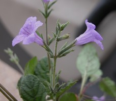
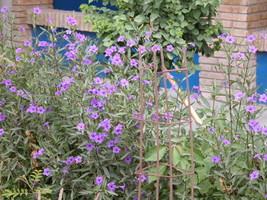
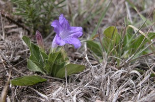

---
title: "Euruellia clade"
---

## Phylogeny 

-   « Ancestral Groups  
    -   [Ruellia s. l.](Ruellia_s._l.)
    -   [Ruellieae](../../Ruellieae.md)
    -   [Acanthaceae](../../../Acanthaceae.md)
    -   [Lamiales](../../../../Lamiales.md)
    -   [Asterids](../../../../../Asterids.md)
    -  [Core Eudicots](../../../../../../Core_Eudicots.md))
    -   [Eudicots](../../../../../../../Eudicots.md)
    -   [Flowering_Plant](../../../../../../../../Flowering_Plant.md)
    -   [Seed_Plant](../../../../../../../../../Seed_Plant.md)
    -   [Land_Plant](../../../../../../../../../../Land_Plant.md)
    -  [Green plants](../../../../../../../../../../../Plant.md))
    -  [Eukarya](../../../../../../../../../../../../Eukarya.md))
    -   [Tree of Life](../../../../../../../../../../../../Tree_of_Life.md)

-   ◊ Sibling Groups of  Ruellia s. l.
    -   [Physiruellia clade](Physiruellia_clade)
    -   [Blechum clade](Blechum_clade)
    -   [Ruellia inundata clade](Ruellia_inundata_clade)
    -   [Ebracteolate clade](Ebracteolate_clade)
    -   Euruellia clade
    -   [Ruellia inflata clade](Ruellia_inflata_clade)
    -   [Ruellia jaliscana clade](Ruellia_jaliscana_clade)
    -   [Ruellia harveyana clade](Ruellia_harveyana_clade)
    -   [Ruellia humilis clade](Ruellia_humilis_clade)
    -   [African Ruellia](African_Ruellia)

-   » Sub-Groups 

	-   *Ruellia brittoniana*[ Leonard]
	-   *Ruellia ciliatiflora*[ Hook.]
	-   *Ruellia coerulea*[ Morong]
	-   *Ruellia drummondiana*[ (Nees) A. Gray]
	-   *Ruellia edwardsae*[ Tharp & F. A. Barkley]
	-   *Ruellia hygrophila*[ Mart.]
	-   *Ruellia jimulcensis*
	-   *Ruellia lactea*[ Cav.]
	-   *Ruellia macrosolen*[ Lillo ex. C. Ezcurra]
	-   *Ruellia malaca*[ Leonard]
	-   *Ruellia metzae*[ Tharp]
	-   *Ruellia morongii*[ Britton]
	-   *Ruellia nudiflora*[ (Englem & A. Gray) Urb.]
	-   *Ruellia runyonii*[ Tharp & F. A. Barkley]
	-   *Ruellia tuberosa*[ L.]
# [[Euruellia]]  

 
 
 

## Introduction

[Erin Tripp]() 

Like *Physiruellia*, species in the *Euruellia* clade are characterized
by having dichasial, highly branched inflorescences with flowers that
are generally long-pedunculate. In contrast to *Physiruellia*, fruits of
species in this group are ellipitical in shape (with seeds borne nearly
all the way to the base), and seeds have hygroscopic trichomes that
cover their entire surface. Fruits contain many ovules, generally 14-28.

Most although not all species in *Euruellia* have purple, actinomorphic
corollas (functionally zygomorphic) with well-developed landing
platforms, suggestive of bee pollination. Species in this group often
inhabit open areas and display somewhat of a disjunct distribution: most
occur in either temperate to subtropical areas of southern South America
or in the USA and central Mexico.

*Euruellia* contains a difficult species complex centered around
*Ruellia nudiflora* (which is a non-monophyletic species based on Tripp,
in press). It also contains the type species of *Ruellia*, *R.
tuberosa*.

### References

Ezcurra, C. 1993. Systematics of Ruellia (Acanthaceae) in southern South
America. Ann. Mo. Bot. Gard. 80: 787-845.

Tripp, E. A. Evolutionary relationships within the species-rich genus
Ruellia (Acanthaceae). Systematic Botany, in press.

## Title Illustrations

-----------------------------------------------------------------------)
Scientific Name ::     Ruellia nudiflora (Engelm. & A. Gray) Urban
Location ::           Tabasco, Mexico
Specimen Condition   Live Specimen
Identified By        Erin A. Tripp
Collector            Tripp & Dexter
Copyright ::            © [Erin Tripp](mailto:erin.tripp@duke.edu) 

-----------------------------------------------------------------------)
Scientific Name ::     Ruellia malacosperma Greenm.
Location ::           Oaxaca, Mexico
Comments             plants cultivated outside a restaurant
Specimen Condition   Live Specimen
Identified By        Erin A. Tripp
Copyright ::            © [Erin Tripp](mailto:erin.tripp@duke.edu) 

-----------------------------------------------------------------------) 
Scientific Name ::     Ruellia lactea Cav.
Location ::           Puebla, Mexico
Specimen Condition   Live Specimen
Identified By        Erin A. Tripp
Collector            Tripp & Acosta
Copyright ::            © [Erin Tripp](mailto:erin.tripp@duke.edu) 

## Confidential Links & Embeds: 

### #is_/same_as ::[Euruellia](Euruellia.md)) 

### #is_/same_as :: [Euruellia.public](/_public/bio/bio~Domain/Eukarya/Plants/Land_Plant/Seed_Plant/Flowering_Plant/Eudicots/Core_Eudicots/Asterids/Lamiales/Acanthaceae/Ruellieae/Ruellia/Euruellia.public.md) 

### #is_/same_as :: [Euruellia.internal](/_internal/bio/bio~Domain/Eukarya/Plants/Land_Plant/Seed_Plant/Flowering_Plant/Eudicots/Core_Eudicots/Asterids/Lamiales/Acanthaceae/Ruellieae/Ruellia/Euruellia.internal.md) 

### #is_/same_as :: [Euruellia.protect](/_protect/bio/bio~Domain/Eukarya/Plants/Land_Plant/Seed_Plant/Flowering_Plant/Eudicots/Core_Eudicots/Asterids/Lamiales/Acanthaceae/Ruellieae/Ruellia/Euruellia.protect.md) 

### #is_/same_as :: [Euruellia.private](/_private/bio/bio~Domain/Eukarya/Plants/Land_Plant/Seed_Plant/Flowering_Plant/Eudicots/Core_Eudicots/Asterids/Lamiales/Acanthaceae/Ruellieae/Ruellia/Euruellia.private.md) 

### #is_/same_as :: [Euruellia.personal](/_personal/bio/bio~Domain/Eukarya/Plants/Land_Plant/Seed_Plant/Flowering_Plant/Eudicots/Core_Eudicots/Asterids/Lamiales/Acanthaceae/Ruellieae/Ruellia/Euruellia.personal.md) 

### #is_/same_as :: [Euruellia.secret](/_secret/bio/bio~Domain/Eukarya/Plants/Land_Plant/Seed_Plant/Flowering_Plant/Eudicots/Core_Eudicots/Asterids/Lamiales/Acanthaceae/Ruellieae/Ruellia/Euruellia.secret.md)

