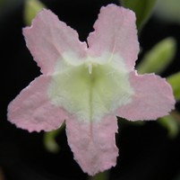
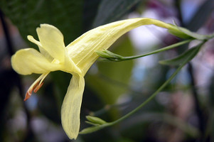
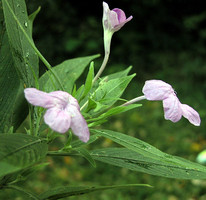
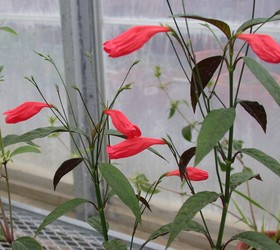
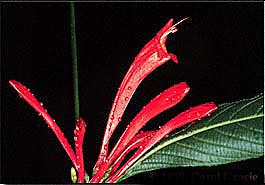

---
title: "Physiruellia clade"
---

# Physiruellia  

 
 
 

## Introduction

[Erin Tripp]() 

The Physiruellia clade is a large group characterized by plants with
dichasial inflorescences that are often profusely branched and
long-pedunculate (see photo below). Species in this clade have fruits
that are clavate in shape and seeds with hygroscopic trichomes
restricted to the margins (vs. the symplesiomorphic state of covering
the entire surface\... see
*[Euruellia](Euruellia_clade)*). Fruits generally contain
betwen 8 and 14 ovules.

Inflorescences of *Ruellia brevifolia*. © [Erin Tripp](mailto:erin.tripp@duke.edu)

The group is particularly diverse in tropical and subtropical regions of
western South America, and also occurs in tropical Mexico and Central to
N. South America. Most species occupy forest understory environments.
Floral morphology is diverse in *Physiruellia*, with several beautiful,
red-flowered taxa likely great candidates for the horticultural industry
(gardeners and growers take note!). Some are already in cultivation.
Unlike other clades in *Ruellia* (see
*[Euruellia](Euruellia_clade)*), purple-flowered taxa are
in the minority.\

*Polylychnis* is a monotypic genus endemic to the Guiana Shield. Results
from Tripp (in press) place the genus as highly nested within *Ruellia*.
Morphologically, it is very similar to *Ruellia*, and indeed shares a
similar pollen sculpturing. It differs perhaps only by having small
projections on the nectary that surrounds the ovary base. However,
*Ruellia* ovaries have never been systematically surveyed to an extent
that permits a thorough examination of this potential difference. Based
on molecular data and morphological similarity, the new combination
*Ruellia fulgens* (Bremek.) E. Tripp was recently made.

{width="265"}

Flowers of *Ruellia fulgens* (Bremek.) E. Tripp (= *Polylychnis fulgens*
Bremek.) © 1999 [Carol Gracie](http://www.nybg.org/bsci/french_guiana/ruelliagal.html)

Flowers of *Ruellia fulgens* are long-tubed and red, and are visited by
hummingbirds (Gracie 1991). During anthesis, copious, dilute nectar is
secreted from the annular ovary disc (11-24 % sugar concentration, \>10
µL). After corollas fall, these discs continue secreting nectar, to
which ants are attracted and which they consume. However, post-floral
nectar is substantially higher in sugar content, ranging from 41-51 %.
These ants may serve to guard and protect young, developing fruits.

## Phylogeny 

-   « Ancestral Groups  
    -   [Ruellia s. l.](Ruellia_s._l.)
    -   [Ruellieae](../../Ruellieae.md)
    -   [Acanthaceae](../../../Acanthaceae.md)
    -   [Lamiales](../../../../Lamiales.md)
    -   [Asterids](../../../../../Asterids.md)
    -  [Core Eudicots](../../../../../../Core_Eudicots.md))
    -   [Eudicots](../../../../../../../Eudicots.md)
    -   [Flowering_Plant](../../../../../../../../Flowering_Plant.md)
    -   [Seed_Plant](../../../../../../../../../Seed_Plant.md)
    -   [Land_Plant](../../../../../../../../../../Land_Plant.md)
    -  [Green plants](../../../../../../../../../../../Plant.md))
    -  [Eukarya](../../../../../../../../../../../../Eukarya.md))
    -   [Tree of Life](../../../../../../../../../../../../Tree_of_Life.md)

-   ◊ Sibling Groups of  Ruellia s. l.
    -   Physiruellia clade
    -   [Blechum clade](Blechum_clade)
    -   [Ruellia inundata clade](Ruellia_inundata_clade)
    -   [Ebracteolate clade](Ebracteolate_clade)
    -   [Euruellia clade](Euruellia_clade)
    -   [Ruellia inflata clade](Ruellia_inflata_clade)
    -   [Ruellia jaliscana clade](Ruellia_jaliscana_clade)
    -   [Ruellia harveyana clade](Ruellia_harveyana_clade)
    -   [Ruellia humilis clade](Ruellia_humilis_clade)
    -   [African Ruellia](African_Ruellia)

-   » Sub-Groups 
	-   *Ruellia amplexicaulis*[ (Nees) Lindau]
	-   *Ruellia angustiflora*[ (Nees) Lindau]
	-   *Ruellia biolleyi*[ Lindau]
	-   *Ruellia breedlovei*[ T. F. Daniel]
	-   *Ruellia brevifolia*[ (Pohl) C. Ezcurra]
	-   *Ruellia chartacea*[ (T. Anders.) Wassh.]
	-   *Ruellia costata*[ (Nees) Lindau]
	-   *Ruellia eumorphantha*[ Lindau]
	-   *Ruellia fulgens*[ (Bremek.) E. Tripp ] [(=
	    Polylychnis fulgens Bremek.)]
	-   *Ruellia fulgida*[ Andr.]
	-   *Ruellia gracilis*[ Rusby]
	-   *Ruellia grantii*[ Leonard]
	-   *Ruellia haenkeana*[ (Nees) Wassh.]
	-   *Ruellia ischnopoda*[ Leonard]
	-   *Ruellia jussieuoides*[ Schltdl. & Cham.]
	-   *Ruellia longipedunculata*[ Lindau]
	-   *Ruellia macrophylla*[ Vahl var. lutea Leonard]
	-   *Ruellia matudae*[ Leonard]
	-   *Ruellia menthoides*[ Leonard]
	-   *Ruellia nitida*[ (Nees) Wassh. & J.R.I. Wood]
	-   *Ruellia oaxacana*[ Leonard]
	-   *Ruellia pearcei*[ Rusby]
	-   *Ruellia pedunculosa*[ (Nees) Lindau]
	-   *Ruellia pennellii*[ Leonard]
	-   *Ruellia proxima*[ Lindau]
	-   *Ruellia puri*[ (Nees) Mart. ex Jackson]
	-   *Ruellia pygmea*[ Donn. Sm.]
	-   *Ruellia riopalenquensis*[ Wassh.]
	-   *Ruellia rubra*[ Aubl.]
	-   *Ruellia ruiziana*[ (Nees) Lindau]
	-   *Ruellia sanguiea*[ Griseb.]
	-   *Ruellia saulensis*[ Wassh.]
	-   *Ruellia stemonacanthoides*[ (Oerst.) Hemsl.]
	-   *Ruellia terminale*[ (Nees) Wassh.]

## Title Illustrations

-----------------------------------------------------------------------)
Scientific Name ::     Ruellia biolleyi Lindau
Location ::           La Selva Biological Station, Costa Rica
Acknowledgements     Erin A. Tripp
Specimen Condition   Live Specimen
Identified By        Erin A. Tripp
Body Part            flower
Collector            Tripp & McDade
Copyright ::            © [Erin Tripp](mailto:erin.tripp@duke.edu) 

-----------------------------------------------------------------------)
Scientific Name ::     Ruellia macrophylla var. lutea Leonard
Location ::           Cultivated in DUKE Greenhouses
Specimen Condition   Live Specimen
Body Part            flower
Copyright ::            © [Erin Tripp](mailto:erin.tripp@duke.edu) 

-----------------------------------------------------------------------)
Scientific Name ::     Ruellia jussieuoides Schltdl. & Cham.
Location ::           Chiapas, Mexico
Specimen Condition   Live Specimen
Body Part            flower
Collector            Tripp
Copyright ::            © [Erin Tripp](mailto:erin.tripp@duke.edu) 

## Confidential Links & Embeds: 

### #is_/same_as ::[Physiruellia](Physiruellia.md)) 

### #is_/same_as :: [Physiruellia.public](/_public/bio/bio~Domain/Eukarya/Plants/Land_Plant/Seed_Plant/Flowering_Plant/Eudicots/Core_Eudicots/Asterids/Lamiales/Acanthaceae/Ruellieae/Ruellia/Physiruellia.public.md) 

### #is_/same_as :: [Physiruellia.internal](/_internal/bio/bio~Domain/Eukarya/Plants/Land_Plant/Seed_Plant/Flowering_Plant/Eudicots/Core_Eudicots/Asterids/Lamiales/Acanthaceae/Ruellieae/Ruellia/Physiruellia.internal.md) 

### #is_/same_as :: [Physiruellia.protect](/_protect/bio/bio~Domain/Eukarya/Plants/Land_Plant/Seed_Plant/Flowering_Plant/Eudicots/Core_Eudicots/Asterids/Lamiales/Acanthaceae/Ruellieae/Ruellia/Physiruellia.protect.md) 

### #is_/same_as :: [Physiruellia.private](/_private/bio/bio~Domain/Eukarya/Plants/Land_Plant/Seed_Plant/Flowering_Plant/Eudicots/Core_Eudicots/Asterids/Lamiales/Acanthaceae/Ruellieae/Ruellia/Physiruellia.private.md) 

### #is_/same_as :: [Physiruellia.personal](/_personal/bio/bio~Domain/Eukarya/Plants/Land_Plant/Seed_Plant/Flowering_Plant/Eudicots/Core_Eudicots/Asterids/Lamiales/Acanthaceae/Ruellieae/Ruellia/Physiruellia.personal.md) 

### #is_/same_as :: [Physiruellia.secret](/_secret/bio/bio~Domain/Eukarya/Plants/Land_Plant/Seed_Plant/Flowering_Plant/Eudicots/Core_Eudicots/Asterids/Lamiales/Acanthaceae/Ruellieae/Ruellia/Physiruellia.secret.md)

