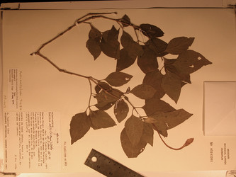

---
aliases:
  - harveyana
title: Ruellia harveyana clade
---

# Ruellia harveyana  

 

Note: this taxon list is still under construction. It does not yet
contain all known Ruellia harveyana clade subgroups.

Containing group: *[Ruellia s. l.](../Ruellia.md)*

## Introduction

[Erin Tripp]() 

Phylogenetic analyses from Tripp (in press) revealed a small, moderately
supported lineage, the Ruellia harveyana clade, that contains four
species. There are surely other species that belong to this group, but
these were not included in taxon sampling for the study. There are no
known synapormorphies to unite these species. *Ruellia nobilis*, a rare
and endemic species of the Chaco in S. South America, has very long,
white corolla tubes--the narrow, unexpanded portion of the tube is
approximately 10 cm long. Other species in this group have purple
flowers and occur in S. South America, Central America, and Mexico.

## Phylogeny 

-   « Ancestral Groups  
    -   [Ruellia s. l.](Ruellia_s._l.)
    -   [Ruellieae](../../Ruellieae.md)
    -   [Acanthaceae](../../../Acanthaceae.md)
    -   [Lamiales](../../../../Lamiales.md)
    -   [Asterids](../../../../../Asterids.md)
    -  [Core Eudicots](../../../../../../Core_Eudicots.md) 
    -   [Eudicots](../../../../../../../Eudicots.md)
    -   [Flowering_Plant](../../../../../../../../Flowering_Plant.md)
    -   [Seed_Plant](../../../../../../../../../Seed_Plant.md)
    -   [Land_Plant](../../../../../../../../../../Land_Plant.md)
    -  [Green plants](../../../../../../../../../../../Plant.md) 
    -  [Eukarya](../../../../../../../../../../../../Eukarya.md) 
    -   [Tree of Life](../../../../../../../../../../../../Tree_of_Life.md)

-   ◊ Sibling Groups of  Ruellia s. l.
    -   [Physiruellia clade](Physiruellia_clade)
    -   [Blechum clade](Blechum_clade)
    -   [Ruellia inundata clade](Ruellia_inundata_clade)
    -   [Ebracteolate clade](Ebracteolate_clade)
    -   [Euruellia clade](Euruellia_clade)
    -   [Ruellia inflata clade](Ruellia_inflata_clade)
    -   [Ruellia jaliscana clade](Ruellia_jaliscana_clade)
    -   Ruellia harveyana clade
    -   [Ruellia humilis clade](Ruellia_humilis_clade)
    -   [African Ruellia](African_Ruellia)

-   » Sub-Groups 
	-   *Ruellia harveyana*[ Stapf]
	-   *Ruellia multifolia*[ (Nees) Lindau]
	-   *Ruellia nobilis*[ Lindau]
	-   *Ruellia pilosa*[ (Nees) Pav. ex Nees]

## Title Illustrations

----------------------------------------------------------------------- 
) 
Scientific Name ::     Ruellia nobilis (S. Moore) Lindau
Specimen Condition   Dead Specimen
Identified By        Erin A. Tripp
Copyright ::            © [Erin Tripp](mailto:erin.tripp@duke.edu) 

## Confidential Links & Embeds: 

### #is_/same_as :: [harveyana](/_Standards/bio/bio~Domain/Eukarya/Plant/Land_Plant/Seed_Plant/Flowering_Plant/Eudicots/Core_Eudicots/Asterids/Lamiales/Acanthaceae/Ruellieae/Ruellia/harveyana.md) 

### #is_/same_as :: [harveyana.public](/_public/bio/bio~Domain/Eukarya/Plant/Land_Plant/Seed_Plant/Flowering_Plant/Eudicots/Core_Eudicots/Asterids/Lamiales/Acanthaceae/Ruellieae/Ruellia/harveyana.public.md) 

### #is_/same_as :: [harveyana.internal](/_internal/bio/bio~Domain/Eukarya/Plant/Land_Plant/Seed_Plant/Flowering_Plant/Eudicots/Core_Eudicots/Asterids/Lamiales/Acanthaceae/Ruellieae/Ruellia/harveyana.internal.md) 

### #is_/same_as :: [harveyana.protect](/_protect/bio/bio~Domain/Eukarya/Plant/Land_Plant/Seed_Plant/Flowering_Plant/Eudicots/Core_Eudicots/Asterids/Lamiales/Acanthaceae/Ruellieae/Ruellia/harveyana.protect.md) 

### #is_/same_as :: [harveyana.private](/_private/bio/bio~Domain/Eukarya/Plant/Land_Plant/Seed_Plant/Flowering_Plant/Eudicots/Core_Eudicots/Asterids/Lamiales/Acanthaceae/Ruellieae/Ruellia/harveyana.private.md) 

### #is_/same_as :: [harveyana.personal](/_personal/bio/bio~Domain/Eukarya/Plant/Land_Plant/Seed_Plant/Flowering_Plant/Eudicots/Core_Eudicots/Asterids/Lamiales/Acanthaceae/Ruellieae/Ruellia/harveyana.personal.md) 

### #is_/same_as :: [harveyana.secret](/_secret/bio/bio~Domain/Eukarya/Plant/Land_Plant/Seed_Plant/Flowering_Plant/Eudicots/Core_Eudicots/Asterids/Lamiales/Acanthaceae/Ruellieae/Ruellia/harveyana.secret.md)

