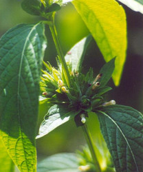
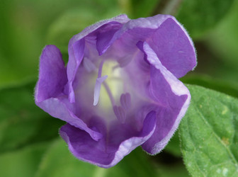

---
aliases:
- Behaarte Ruellie
- humilis
- Ruellia humilis
title: Ruellia humilis clade
has_id_wikidata: Q814412
dv_has_:
  name_:
    an: Ruellia humilis
    ast: Ruellia humilis
    az: Ruellia humilis
    bg: Ruellia humilis
    ca: Ruellia humilis
    ceb: Ruellia humilis
    de: Behaarte Ruellie
    en: Ruellia humilis
    eo: Ruellia humilis
    es: Ruellia humilis
    eu: Ruellia humilis
    ext: Ruellia humilis
    fi: Ruellia humilis
    fr: Ruellia humilis
    ga: Ruellia humilis
    gl: Ruellia humilis
    ia: Ruellia humilis
    ie: Ruellia humilis
    io: Ruellia humilis
    it: Ruellia humilis
    la: Ruellia humilis
    mul: Ruellia humilis
    nl: Ruellia humilis
    oc: Ruellia humilis
    pl: Ruellia humilis
    pt: Ruellia humilis
    pt_br: Ruellia humilis
    ro: Ruellia humilis
    ru: Ruellia humilis
    sq: Ruellia humilis
    sv: Ruellia humilis
    uk: Ruellia humilis
    vi: Ruellia humilis
    vo: Ruellia humilis
    war: Ruellia humilis
---
# Ruellia humilis  

 
 
 

## #has_/text_of_/abstract 

> **Ruellia humilis** (wild petunia, fringeleaf wild petunia, hairy petunia, low wild petunia) 
> is a species of flowering plant in the family Acanthaceae. 
> It is native to the eastern United States. It is grown as an ornamental plant.
>
> Ruellia humilis is native to the U.S. from the northeastern/northern central 
> to the southeastern/southern central regions. 
> According to the Germplasm Resources Information Network 
> of the United States Department of Agriculture, Ruellia humilis is native to the following states:
>
> Alabama, Arkansas, Georgia, Illinois, Indiana, Iowa, (eastern) Kansas, Kentucky, Louisiana, Maryland, 
> Michigan, (southeastern) Minnesota, Mississippi, Missouri, Nebraska, (western) North Carolina, 
> Ohio, Oklahoma, Pennsylvania, Tennessee, (eastern) Texas, West Virginia, Wisconsin, and Virginia.
>
> It is not well-known or used much in conventional nurseries or gardens, 
> but use in gardens has been increasing as native plants become more popular. 
> 
> It is usually about one foot high, but can get to two feet high. 
> Its leaves are oppositely arranged, around 2.5 inches long by 1 inch wide, 
> and are light green to medium green with entire margins. 
> The stems and leaves are covered with soft white hairs. 
> The funnel-shaped 5-lobed flowers are about 1.5 to 2.5 inches in diameter 
> and resemble petunias, as does the rest of the plant. 
> 
> The lavender flowers bloom in July into September and open in the morning and fall off in the evening.
>
> [Wikipedia](https://en.wikipedia.org/wiki/Ruellia%20humilis) 

## Introduction

[Erin Tripp]() 

The *Ruellia humilis* clade is has been resolved as sister to
*Euruellia*, but this relationships is still tentative and thus is not
depicted on the Ruellia s.l. tree. Species in this group differ from
those in *Euruellia* by having reduced inflorescences with subsessile
flowers in axillary cymes. They also have slightly clavate capsules (vs.
elliptical in *Euruellia*) that contain fewer ovules. Plants in the *R.
humilis* clade are distributed in the eastern United States, reaching
their northernmost limits in Pennsylvania and Wisconsin. The latter
state represents the northernmost distribution of the genus in the
western hemisphere, and perhaps the northernmost globally.\

Most if not all species in this clade produce cleistogamous (see photo
above) in addition to open flowers, either after the regular flowering
season, or concurrently. Species sampled in Tripp\'s study (in press)
are listed above, though the group likely includes other species such as
*Ruellia ciliosa* Pursh, and the white-flowered, night blooming *Ruellia
noctiflora* (Nees) A. Gray.\

## Phylogeny 

-   « Ancestral Groups  
    -   [Ruellia s. l.](Ruellia_s._l.)
    -   [Ruellieae](../../Ruellieae.md)
    -   [Acanthaceae](../../../Acanthaceae.md)
    -   [Lamiales](../../../../Lamiales.md)
    -   [Asterids](../../../../../Asterids.md)
    -  [Core Eudicots](../../../../../../Core_Eudicots.md) 
    -   [Eudicots](../../../../../../../Eudicots.md)
    -   [Flowering_Plant](../../../../../../../../Flowering_Plant.md)
    -   [Seed_Plant](../../../../../../../../../Seed_Plant.md)
    -   [Land_Plant](../../../../../../../../../../Land_Plant.md)
    -  [Green plants](../../../../../../../../../../../Plant.md) 
    -  [Eukarya](../../../../../../../../../../../../Eukarya.md) 
    -   [Tree of Life](../../../../../../../../../../../../Tree_of_Life.md)

-   ◊ Sibling Groups of  Ruellia s. l.
    -   [Physiruellia clade](Physiruellia_clade)
    -   [Blechum clade](Blechum_clade)
    -   [Ruellia inundata clade](Ruellia_inundata_clade)
    -   [Ebracteolate clade](Ebracteolate_clade)
    -   [Euruellia clade](Euruellia_clade)
    -   [Ruellia inflata clade](Ruellia_inflata_clade)
    -   [Ruellia jaliscana clade](Ruellia_jaliscana_clade)
    -   [Ruellia harveyana clade](Ruellia_harveyana_clade)
    -   Ruellia humilis clade
    -   [African Ruellia](African_Ruellia)

-   » Sub-Groups 

	-   *Ruellia caroliniensis*[ (Walt.) Steud.]
	-   *Ruellia humilis*[ Nutt.]
	-   *Ruellia purshiana*[ Fernald]
	-   *Ruellia strepens*[ L.]

## Title Illustrations

----------------------------------------------------------------------- 
 
scientific_name ::     Ruellia strepens L.
specimen_condition ::  Live Specimen
Identified By        Erin A. Tripp
Collector            Tripp
copyright ::            © [Erin Tripp](mailto:erin.tripp@duke.edu) 

--------------------------- 
) 
scientific_name ::     Ruellia caroliniensis
specimen_condition ::  Live Specimen
Body Part            flower
Source               [Ruellia just opening](http://www.flickr.com/photos/pcoin/525594153/)
Source Collection    [Flickr](http://flickr.com/)
copyright ::            © 2007 [Patrick Coin](http://flickr.com/people/42264328@N00)

----------------------------------------------------------------------- 
) 
scientific_name ::     Ruellia humilis Nutt.
location ::           Williamson County, Pennsylvania
specimen_condition ::  Live Specimen
Identified By        Erin A. Tripp
Collector            Tripp
copyright ::            © [Erin Tripp](mailto:erin.tripp@duke.edu) 

## Confidential Links & Embeds: 

### #is_/same_as :: [[/_Standards/bio/bio~Domain/Eukarya/Plant/Land_Plant/Seed_Plant/Flowering_Plant/Eudicots/Core_Eudicots/Asterids/Lamiales/Acanthaceae/Ruellieae/Ruellia/humilis|humilis]] 

### #is_/same_as :: [[/_public/bio/bio~Domain/Eukarya/Plant/Land_Plant/Seed_Plant/Flowering_Plant/Eudicots/Core_Eudicots/Asterids/Lamiales/Acanthaceae/Ruellieae/Ruellia/humilis.public|humilis.public]] 

### #is_/same_as :: [[/_internal/bio/bio~Domain/Eukarya/Plant/Land_Plant/Seed_Plant/Flowering_Plant/Eudicots/Core_Eudicots/Asterids/Lamiales/Acanthaceae/Ruellieae/Ruellia/humilis.internal|humilis.internal]] 

### #is_/same_as :: [[/_protect/bio/bio~Domain/Eukarya/Plant/Land_Plant/Seed_Plant/Flowering_Plant/Eudicots/Core_Eudicots/Asterids/Lamiales/Acanthaceae/Ruellieae/Ruellia/humilis.protect|humilis.protect]] 

### #is_/same_as :: [[/_private/bio/bio~Domain/Eukarya/Plant/Land_Plant/Seed_Plant/Flowering_Plant/Eudicots/Core_Eudicots/Asterids/Lamiales/Acanthaceae/Ruellieae/Ruellia/humilis.private|humilis.private]] 

### #is_/same_as :: [[/_personal/bio/bio~Domain/Eukarya/Plant/Land_Plant/Seed_Plant/Flowering_Plant/Eudicots/Core_Eudicots/Asterids/Lamiales/Acanthaceae/Ruellieae/Ruellia/humilis.personal|humilis.personal]] 

### #is_/same_as :: [[/_secret/bio/bio~Domain/Eukarya/Plant/Land_Plant/Seed_Plant/Flowering_Plant/Eudicots/Core_Eudicots/Asterids/Lamiales/Acanthaceae/Ruellieae/Ruellia/humilis.secret|humilis.secret]] 

