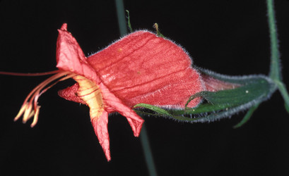

---
aliases:
  - inflata
title: Ruellia inflata clade
---

# Ruellia inflata  

 
 

## Introduction

[Erin Tripp]() 

The *Ruellia inflata* clade contains species having red or greenish-yellow flowers. 
Those with the latter have floral morphologies
suggestive of bat-pollination, though next to nothing is known about their pollination biology.

Members of this group occur in South America, especially in Brazil and Venezuela. 
Three species in this clade are also scrambling vines or lianas 
which is an unusual habit in *Ruellia*.

## Phylogeny 

-   « Ancestral Groups  
    -   [Ruellia s. l.](Ruellia_s._l.)
    -   [Ruellieae](../../Ruellieae.md)
    -   [Acanthaceae](../../../Acanthaceae.md)
    -   [Lamiales](../../../../Lamiales.md)
    -   [Asterids](../../../../../Asterids.md)
    -  [Core Eudicots](../../../../../../Core_Eudicots.md) 
    -   [Eudicots](../../../../../../../Eudicots.md)
    -   [Flowering_Plant](../../../../../../../../Flowering_Plant.md)
    -   [Seed_Plant](../../../../../../../../../Seed_Plant.md)
    -   [Land_Plant](../../../../../../../../../../Land_Plant.md)
    -  [Green plants](../../../../../../../../../../../Plant.md) 
    -  [Eukarya](../../../../../../../../../../../../Eukarya.md) 
    -   [Tree of Life](../../../../../../../../../../../../Tree_of_Life.md)

-   ◊ Sibling Groups of  Ruellia s. l.
    -   [Physiruellia clade](Physiruellia_clade)
    -   [Blechum clade](Blechum_clade)
    -   [Ruellia inundata clade](Ruellia_inundata_clade)
    -   [Ebracteolate clade](Ebracteolate_clade)
    -   [Euruellia clade](Euruellia_clade)
    -   Ruellia inflata clade
    -   [Ruellia jaliscana clade](Ruellia_jaliscana_clade)
    -   [Ruellia harveyana clade](Ruellia_harveyana_clade)
    -   [Ruellia humilis clade](Ruellia_humilis_clade)
    -   [African Ruellia](African_Ruellia)

-   » Sub-Groups 

	-   *Ruellia acutangula*[ (Nees) Lindau]
	-   *Ruellia elegans*[ Poir.]
	-   *Ruellia eurycodon*[ Lindau]
	-   *Ruellia exserta*[ Wassh.]
	-   *Ruellia inflata*[ Rich.]
	-   *Ruellia steyermarkii*[ Wassh.]
	-   *Ruellia subsessilis*[ (Mart.) Lindau]

## Title Illustrations

--------------------------------------------------------------------- 
 
Scientific Name ::     Ruellia elegans
Specimen Condition   Live Specimen
Copyright ::            © [Kurt Stüber](http://www.biolib.de/) 

----------- 
) 
Scientific Name ::     Ruellia inflata
Location ::           Bolivia
Specimen Condition   Live Specimen
Collector            John L. Clark
Copyright ::            © 2002 John L. Clark

## Confidential Links & Embeds: 

### #is_/same_as :: [[/_Standards/bio/bio~Domain/Eukarya/Plant/Land_Plant/Seed_Plant/Flowering_Plant/Eudicots/Core_Eudicots/Asterids/Lamiales/Acanthaceae/Ruellieae/Ruellia/inflata|inflata]] 

### #is_/same_as :: [[/_public/bio/bio~Domain/Eukarya/Plant/Land_Plant/Seed_Plant/Flowering_Plant/Eudicots/Core_Eudicots/Asterids/Lamiales/Acanthaceae/Ruellieae/Ruellia/inflata.public|inflata.public]] 

### #is_/same_as :: [[/_internal/bio/bio~Domain/Eukarya/Plant/Land_Plant/Seed_Plant/Flowering_Plant/Eudicots/Core_Eudicots/Asterids/Lamiales/Acanthaceae/Ruellieae/Ruellia/inflata.internal|inflata.internal]] 

### #is_/same_as :: [[/_protect/bio/bio~Domain/Eukarya/Plant/Land_Plant/Seed_Plant/Flowering_Plant/Eudicots/Core_Eudicots/Asterids/Lamiales/Acanthaceae/Ruellieae/Ruellia/inflata.protect|inflata.protect]] 

### #is_/same_as :: [[/_private/bio/bio~Domain/Eukarya/Plant/Land_Plant/Seed_Plant/Flowering_Plant/Eudicots/Core_Eudicots/Asterids/Lamiales/Acanthaceae/Ruellieae/Ruellia/inflata.private|inflata.private]] 

### #is_/same_as :: [[/_personal/bio/bio~Domain/Eukarya/Plant/Land_Plant/Seed_Plant/Flowering_Plant/Eudicots/Core_Eudicots/Asterids/Lamiales/Acanthaceae/Ruellieae/Ruellia/inflata.personal|inflata.personal]] 

### #is_/same_as :: [[/_secret/bio/bio~Domain/Eukarya/Plant/Land_Plant/Seed_Plant/Flowering_Plant/Eudicots/Core_Eudicots/Asterids/Lamiales/Acanthaceae/Ruellieae/Ruellia/inflata.secret|inflata.secret]] 

