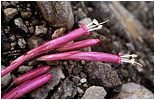

---
aliases:
  - Sanchezia
title: Sanchezia
has_id_wikidata: Q2492116
---
# [[Sanchezia]] 

      

## #has_/text_of_/abstract 

> **Sanchezia** is a genus of the plant family Acanthaceae. It contains 45 species. Members of this genus are shrubs, rarely small trees or herbs, occurring in the lowlands of tropical South and Central America. A close relative is Suessenguthia, which looks quite similar.
>
> Because they have large, colorful bracts and flowers, and sometimes even colorful leaves, several species are cultivated as ornamental plants throughout the tropics and in botanical gardens of temperate areas. Examples for species well known from cultivation are S. nobilis, S. parvibracteata and S. speciosa. In some areas, ornamental species have become problematic as invasive weeds. On the other hand, S. lampra from Ecuador is almost extinct.
>
> Sanchezia is named for José Sánchez, a nineteenth-century professor of botany at Cádiz, Spain.
>
> [Wikipedia](https://en.wikipedia.org/wiki/Sanchezia) 

## Phylogeny 

-   « Ancestral Groups  
    -   [Ruellieae](../Ruellieae.md)
    -   [Acanthaceae](../../Acanthaceae.md)
    -   [Lamiales](../../../Lamiales.md)
    -   [Asterids](../../../../Asterids.md)
    -  [Core Eudicots](../../../../../Core_Eudicots.md) 
    -   [Eudicots](../../../../../../Eudicots.md)
    -   [Flowering_Plant](../../../../../../../Flowering_Plant.md)
    -   [Seed_Plant](../../../../../../../../Seed_Plant.md)
    -   [Land_Plant](../../../../../../../../../Land_Plant.md)
    -  [Green plants](../../../../../../../../../../Plant.md) 
    -  [Eukarya](../../../../../../../../../../../Eukarya.md) 
    -   [Tree of Life](../../../../../../../../../../../Tree_of_Life.md)

-   ◊ Sibling Groups of  Ruellieae
    -   [Ruellia s. l.](Ruellia_s._l.)
    -   [Acanthopale](Acanthopale.md)
    -   [Brillantaisia](Brillantaisia.md)
    -   [Hemigraphis + Strobilanthes +         relatives](Hemigraphis_%2B_Strobilanthes_%2B_relatives)
    -   [Bravaisia](Bravaisia.md)
    -   [Suessenguthia](Suessenguthia.md)
    -   Sanchezia
    -   [Louteridium](Louteridium.md)
    -   [Dyschoriste](Dyschoriste.md)
    -   [Phaulopsis](Phaulopsis.md)

-   » Sub-Groups 

## Introduction

[Erin Tripp]() 

Species of *Sanchezia* are herbs or shrubs with brightly colored
flowers. In *Sanchezia*, fertile stamens have been reduced from four to
two, which are generally exserted (two staminodes also present within
corolla). The most comprehensive taxonomic investigation (Leonard and
Smith 1964) treats ca. 60 species, these centered in Peru, Ecuador,
Bolivia, and western Brazil. A few *Sanchezia* species are found in the
horticultural industry.

## Title Illustrations

--------------------- 
 
scientific_name ::  Sanchezia sp. Leonard
copyright ::         © [Alexander Schmidt-LeBuhn](mailto:schmidtleb@yahoo.de)

---------------------------

scientific_name ::     Sanchezia speciosa Leonard
specimen_condition ::  Live Specimen
copyright ::            © [Gerald D. Carr](http://www.botany.hawaii.edu/faculty/carr/acanth.htm)

------------------------------------------------------------------------ 
 
scientific_name ::     Sanchezia parvibracteata Sprague & Hutch.
location ::           Limón Province, Costa Rica
specimen_condition ::  Live Specimen
Collector            E. Tripp
copyright ::            © 2006 [Erin Tripp](mailto:erin.tripp@duke.edu) 

---------------------------------------------------------------------------

scientific_name ::     Sanchezia parviflora Leonard
location ::           Pastaza, Ecuador
specimen_condition ::  Live Specimen
Collection           DUKE
Collector            L. A. McDade
copyright ::            © 2006 [Lucinda A. McDade](mailto:lucinda.mcdade@cgu.edu) 

--------------------------------------------------------------------------- 
 

scientific_name ::     Sanchezia oblonga Ruiz & Pav.
location ::           Las Cruces Botanical Garden, Costa Rica, cultivated
specimen_condition ::  Live Specimen
copyright ::            © 2006 [Lucinda A. McDade](mailto:lucinda.mcdade@cgu.edu) 

## Confidential Links & Embeds: 

### #is_/same_as :: [[/_Standards/bio/bio~Domain/Eukarya/Plant/Land_Plant/Seed_Plant/Flowering_Plant/Eudicots/Core_Eudicots/Asterids/Lamiales/Acanthaceae/Ruellieae/Sanchezia|Sanchezia]] 

### #is_/same_as :: [[/_public/bio/bio~Domain/Eukarya/Plant/Land_Plant/Seed_Plant/Flowering_Plant/Eudicots/Core_Eudicots/Asterids/Lamiales/Acanthaceae/Ruellieae/Sanchezia.public|Sanchezia.public]] 

### #is_/same_as :: [[/_internal/bio/bio~Domain/Eukarya/Plant/Land_Plant/Seed_Plant/Flowering_Plant/Eudicots/Core_Eudicots/Asterids/Lamiales/Acanthaceae/Ruellieae/Sanchezia.internal|Sanchezia.internal]] 

### #is_/same_as :: [[/_protect/bio/bio~Domain/Eukarya/Plant/Land_Plant/Seed_Plant/Flowering_Plant/Eudicots/Core_Eudicots/Asterids/Lamiales/Acanthaceae/Ruellieae/Sanchezia.protect|Sanchezia.protect]] 

### #is_/same_as :: [[/_private/bio/bio~Domain/Eukarya/Plant/Land_Plant/Seed_Plant/Flowering_Plant/Eudicots/Core_Eudicots/Asterids/Lamiales/Acanthaceae/Ruellieae/Sanchezia.private|Sanchezia.private]] 

### #is_/same_as :: [[/_personal/bio/bio~Domain/Eukarya/Plant/Land_Plant/Seed_Plant/Flowering_Plant/Eudicots/Core_Eudicots/Asterids/Lamiales/Acanthaceae/Ruellieae/Sanchezia.personal|Sanchezia.personal]] 

### #is_/same_as :: [[/_secret/bio/bio~Domain/Eukarya/Plant/Land_Plant/Seed_Plant/Flowering_Plant/Eudicots/Core_Eudicots/Asterids/Lamiales/Acanthaceae/Ruellieae/Sanchezia.secret|Sanchezia.secret]] 

