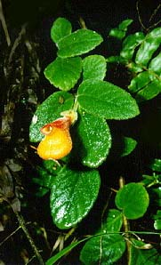
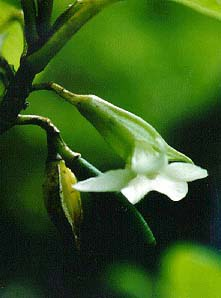
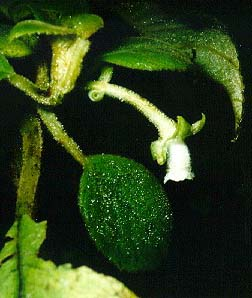
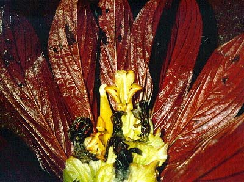
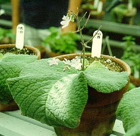

---
aliases:
  - Gesneriaceae
title: Gesneriaceae
---

# [[Gesneriaceae]] 

## #has_/text_of_/abstract 

> **Gesneriaceae**, the gesneriad family, is a family of flowering plants consisting of about 152 genera and ca. 3,540 species in the tropics and subtropics of the Old World (almost all Didymocarpoideae) and the New World (most Gesnerioideae), with a very small number extending to temperate areas. Many species have colorful and showy flowers and are cultivated as ornamental plants.
>
> [Wikipedia](https://en.wikipedia.org/wiki/Gesneriaceae) 

## Phylogeny 

-   « Ancestral Groups  
    -   [Lamiales](../Lamiales.md)
    -   [Asterids](../../Asterids.md)
    -  [Core Eudicots](../../../Core_Eudicots.md))
    -   [Eudicots](../../../../Eudicots.md)
    -   [Flowering_Plant](../../../../../Flowering_Plant.md)
    -   [Seed_Plant](../../../../../../Seed_Plant.md)
    -   [Land_Plant](../../../../../../../Land_Plant.md)
    -  [Green plants](../../../../../../../../Plant.md))
    -  [Eukarya](../../../../../../../../../Eukarya.md))
    -   [Tree of Life](../../../../../../../../../Tree_of_Life.md)

-   ◊ Sibling Groups of  Lamiales
    -   [Oleaceae](Oleaceae.md)
    -   [Acanthaceae](Acanthaceae.md)
    -   Gesneriaceae

-   » Sub-Groups 

## Introduction

[James F. Smith]() 

The Gesneriaceae are a mid-sized to large plant family comprising
approximately 2500-3500 species in 120-135 genera, distributed primarily
in the tropics with a few temperate species in Europe, China and Japan.
The majority of species are herbaceous perennials, but they also can be
annuals, shrubs, lianas, and trees. Many species (20%) are epiphytic,
and the Gesneriaceae ranks among the top ten plant families in terms of
absolute numbers of epiphytic taxa.

The Gesneriaceae are often referred to as tropical Scrophulariaceae and
are closely related to this plant family. They are also closely related
to Bignoniaceae and Acanthaceae but are distinguished from these
families by the combination of five-lobed corollas, parietal
placentation, and presence of endosperm in most species.

Figure 1. Cyrtandra hawaiiensis X Cyrtandra calpidicarpa from Hawai\'i.
The Hawaiian species of Cyrtandra represent an intriguing evolutionary
story in that all 54 species are found only on the Hawaiian islands and
have resulted in 75 interspecific, naturally occurring hybrids.

The Gesneriaceae are primarily a tropical family found in both New and
Old World tropics, although there are some temperate representatives in
Europe and Asia. For the most part, the subfamily Gesnerioideae is found
in the New World, the exceptions being members of the tribe
Coronanthereae which are also found in Australia and the South Pacific.
Cyrtandroideae are restricted to the Old World. Members of the tribe
Klugieae, which has traditionally been placed within the subfamily
Cyrtandroideae, are also found exclusively in the Old world, the one
exception being Rhynchoglossum azureum from Central America.

Figure 2. Cyrtandra oxybapha from Hawai\'i, a representative of the
Cyrtandroideae.

### Characteristics

Leaves are opposite in the majority of the Gesneriaceae but in many
species anisophylly where the leaves are unequal in size occurs. This is
sometimes so extreme that the smaller leaf is either inconspicuous or
even falls off early creating an alternate leaf arrangement. Members of
the Gesneriaceae have 5-lobed corollas with fused petals. In the
majority of species these corollas are long and tubular, however in some
the corolla tube is shortened and flattened. The shorter corolla tube is
found in the most widely known and cultivated member of this family, the
African violet (Saintpaulia).

Figure 4. Columnea densibracteata from Ecuador. The brightly colored
undersides of the leaves are believed to act as an additional signal to
attract pollinators to the contrasting yellow flowers.

Another interesting feature of the Gesneriaceae is that the cotyledons
do not expand equally upon germination in nearly all members of the
subfamily Cyrtandroideae. In most instances the plant will develop
normally, but in Streptocarpus and Monophyllaea, the single cotyedon may
become the entire vegetative portion of the plant with flower stalks
arising from the cotyledon (Figure 3).

Figure 3. Unequal cotyledon expansion becomes extreme in some members of
the Gesneriaceae as shown here with Streptocarpus. The cotyledon is the
entire vegetative portion of the plant.

### Discussion of Phylogenetic Relationships

Classifications of the Gesneriaceae traditionally recognize two
subfamilies (Gesnerioideae and Cyrtandroideae). The division of the
family is largely based on the uniform (Gesnerioideae), or uneven
(Cyrtandroideae) enlargement of the cotyledons after germination
(Burtt,1962). Another character that has been useful in separating the
subfamilies is the presence (Gesnerioideae) or absence (Cyrtandroideae)
of endosperm in the seed. The two subfamilies have been divided further
into 9-17 tribes. The tree presented here is based on a cladistic
analysis of DNA sequences. The aim of this work was to resolve more
clearly the phylogenetic relationships among taxa and to propose a more
stable classification scheme. The two subfamilies have been identified
as monophyletic and the tribe Klugieae (Cyrtandroideae) appears to be
separate and sister to the remainder of the family.

The traditionally recognized tribes Trichosporeae and Didymocarpeae are
not monophyletic in this analysis and are represented here by several
different lineages. The Trichosporeae are monophyletic in an analysis of
morphological data whereas the Didymocarpeae were also polyphyletic
(Smith 1996). These two tribes will need further investigation although
the Didymocarpeae is such a large heterogenous group that dividing it
into smaller groups is probably the best solution.

The relationships presented here are comparable to studies based on
morphological data (Smith 1996), the main exception being that the
subfamily Cyrtandroideae was found to be paraphyletic. The Klugieae were
also found to be the sister to the remainder of the family in this
analysis. A combined analysis of morphology, ndhF gene sequences and
rbcL gene sequences differs in the placement of the Klugieae, however;
rather than being the sister of the remainder of the family, this group
is in its traditional place as a member of the Cyrtandroideae.

## Title Illustrations

---------------------------------------------------------------------------)
Scientific Name ::     Neomortonia
Location ::           Peru
Comments             This plant demonstrates the long, brightly colored corolla common in the neotropical members of the Gesneriaceae.
Specimen Condition   Live Specimen
Copyright ::            © 1998 [James F. Smith](mailto:jfsmith@boisestate.edu) 

## Confidential Links & Embeds: 

### #is_/same_as :: [Gesneriaceae](/_Standards/bio/bio~Domain/Eukarya/Plant/Land_Plant/Seed_Plant/Flowering_Plant/Eudicots/Core_Eudicots/Asterids/Lamiales/Gesneriaceae.md) 

### #is_/same_as :: [Gesneriaceae.public](/_public/bio/bio~Domain/Eukarya/Plant/Land_Plant/Seed_Plant/Flowering_Plant/Eudicots/Core_Eudicots/Asterids/Lamiales/Gesneriaceae.public.md) 

### #is_/same_as :: [Gesneriaceae.internal](/_internal/bio/bio~Domain/Eukarya/Plant/Land_Plant/Seed_Plant/Flowering_Plant/Eudicots/Core_Eudicots/Asterids/Lamiales/Gesneriaceae.internal.md) 

### #is_/same_as :: [Gesneriaceae.protect](/_protect/bio/bio~Domain/Eukarya/Plant/Land_Plant/Seed_Plant/Flowering_Plant/Eudicots/Core_Eudicots/Asterids/Lamiales/Gesneriaceae.protect.md) 

### #is_/same_as :: [Gesneriaceae.private](/_private/bio/bio~Domain/Eukarya/Plant/Land_Plant/Seed_Plant/Flowering_Plant/Eudicots/Core_Eudicots/Asterids/Lamiales/Gesneriaceae.private.md) 

### #is_/same_as :: [Gesneriaceae.personal](/_personal/bio/bio~Domain/Eukarya/Plant/Land_Plant/Seed_Plant/Flowering_Plant/Eudicots/Core_Eudicots/Asterids/Lamiales/Gesneriaceae.personal.md) 

### #is_/same_as :: [Gesneriaceae.secret](/_secret/bio/bio~Domain/Eukarya/Plant/Land_Plant/Seed_Plant/Flowering_Plant/Eudicots/Core_Eudicots/Asterids/Lamiales/Gesneriaceae.secret.md)

